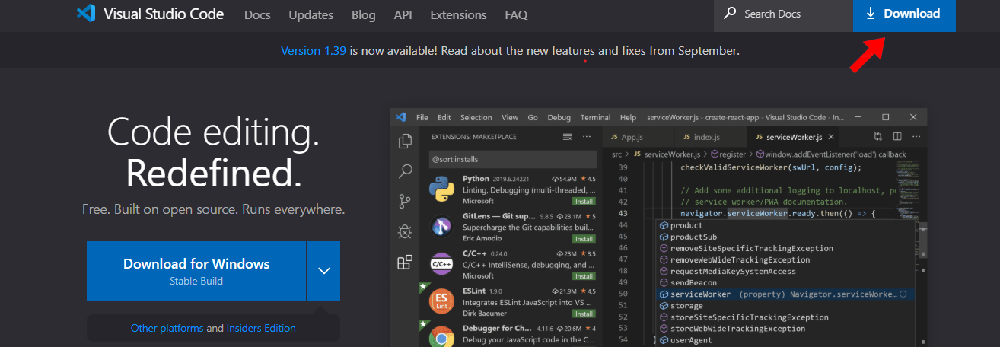
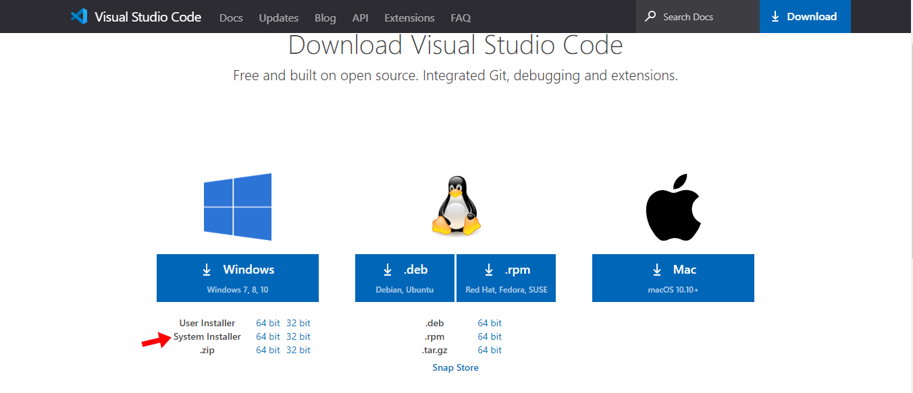
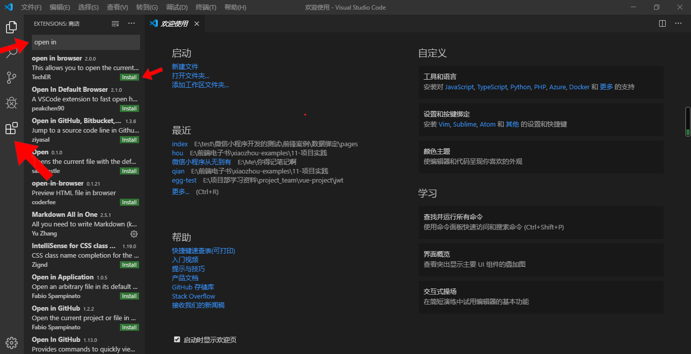

# 第03节：开发工具

### 一、开发工具

开始学习之前，需要先安装开发工具。这里推荐使用vscode编辑器和chrome浏览器，下载地址如下所示：

#### vscode编辑器

整套教程的所有学习内容都推荐使用vscode进行开发，这是一个功能强大，又轻便的免费软件。

#### chrome浏览器

前端新手不推荐处理任何浏览器兼容问题，只要一个浏览器重头学到尾就可以了，这里推荐使用chrome浏览器。

[chrome浏览器下载地址](https://chrome.en.softonic.com/)

把前端知识体系整体学习之后，再去专项查阅一些浏览器兼容问题，这样的学习效率更高。

#### Vscode安装教程

[vscode官网](https://code.visualstudio.com/)

进入官网后，点击右上角的Download按钮

之后会进入到这样的一个页面，是根据电脑的系统选择安装包的，如果你是苹果电脑那么直接点击右面的Mac即可;如果是windows系统电脑，根据你电脑系统是32位还是64位选择安装包,32位系统就点击32bit，64位系统就点击64bit。推荐选择System Installer

下载好安装包后直接一直点击Next即可。

安装完成之后，推荐下载几个常用的插件：

* open in browser：在HTML文件之上点击右键，可以用默认浏览器预览网页。
* Markdown Preview Enhanced：格式化和预览md文件，还可以把md格式文件导出为网页（推荐初学者使用md格式制作学习笔记）。
* Vetur：Vue项目开发必备插件。

#### Vscode插件的安装教程

打开Vscode编辑后，点击左下角的图标，之后上面会出现一个搜索框，在搜索框中输入你想要使用的插件，然后点击install就可以了，下载后的插件，需要重启Vscode才可以使用。