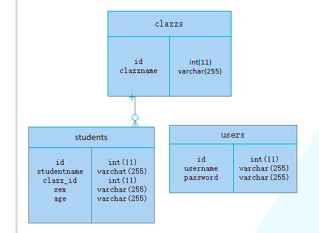

# 第01节：开发流程

### 一、需求分析

1. 有登陆的功能
2. 可以对班级的信息进行增、删、改的操作
3. 可以对学生的信息进行增、删、改的操作
4. 班级中存在学生时，不可删除
5. 退出登录时，要返回到登录页

### 二、原型设计

1. 需要有学生管理和班级管理的切换菜单栏
2. 需要有增加学生和增加班级的添加按钮
3. 需要有注销登录的按钮
4. 学生和班级的基本信息要渲染在页面上
5. 学生和班级要有删除和修改的按钮

### 三、技术选型

* 前端页面：用Vue来写，网页的尺寸用px，
* 后台编程：用Egg来写后台，Cortonter与service来实现功能，
* 数据库：用的Mysql，建了一个库，然后库里建了User,Clazz,Student表等,　　
* 另外用到的技术：
    1. Ajax(前后台数据交互,局部刷新)，
    2. Squlize(Egg链接Mysql从而实现数据传输)),
    3. Element-ui(增加页面效果),
    4. Md5(密码加密),

### 四、确定接口

1. 登陆接口：/login
2. 班级查询：/getclazz
3. 添加班级：/insertclazz
4. 删除班级: /deleteclazz
5. 修改班级：/putclazz
6. 学生查询：/getstudent
7. 添加学生：/insertstudent
8. 删除学生：/deletestudent
9. 修改学生：/putstudent

### 五、数据库建模

数据库的模型如下所示：



### 六、编码

**前端项目重要文件**

前端的vue项目结构中，有部分是项目自带的文件，都是不需要掌握的，其中src文件是很重要的开发文件，需要掌握。

```
|--src
    |--assets(静态资源，如css，以及一些外部的引入文件)
    |--components(公共文件)
    |--router(路由，配置项目路由)
    |--App.vue(根组件)
    |--main.js(入口文件)
```

* 前端具体代码解析请看第05节：前端代码讲解

**后台项目重要文件**

后台的egg项目中，也有多很的项目配置文件，了解即可，其中app文件夹是重要文件，需要掌握

```
|--app
    |--controller(控制文件用于解析用户的输入，处理后返回相应的结果)
    |--service(用于编辑逻辑层，例如操作数据库等)
    |--middleware(用于编写中间件)
    |--model(用于编写数据库的模型
    |--router.js(主要用来描述请求 URL 和具体承担执行动作的 Controller 的对应关系， 框架约定了 app/router.js 文件用于统一所有路由规则。)
```

* 后台具体代码解析请看第06节：后台代码讲解