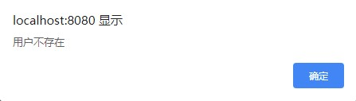
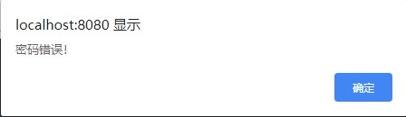
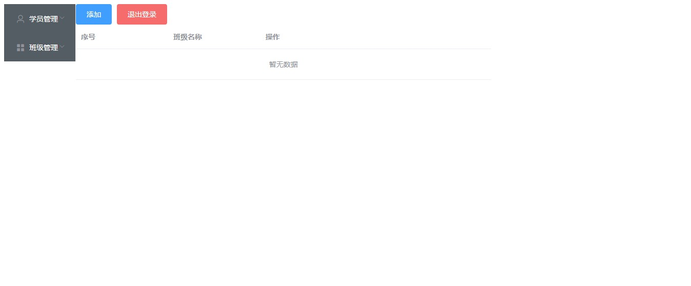
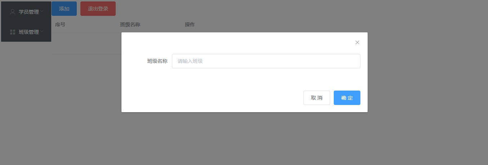
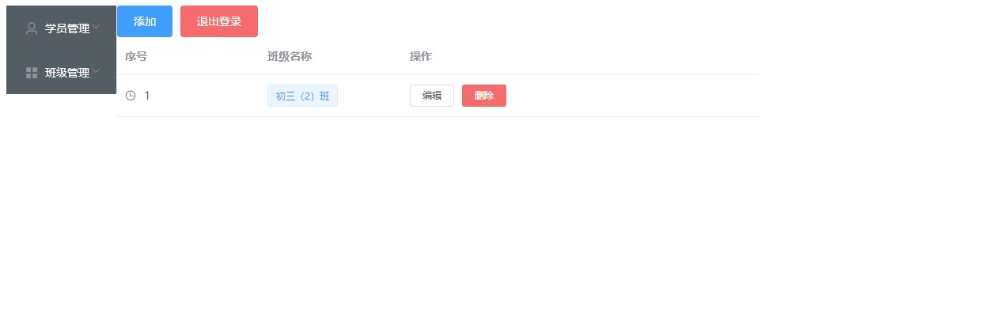
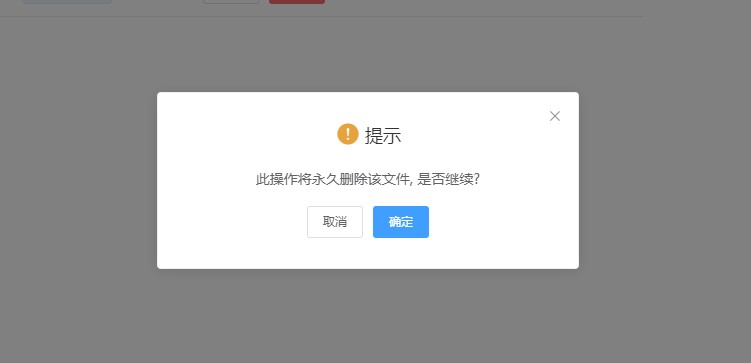
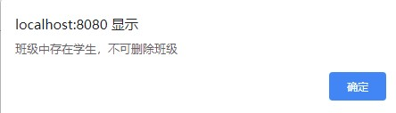
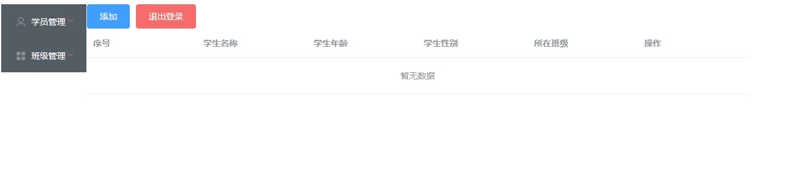
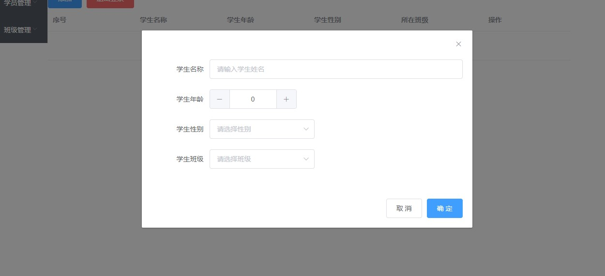
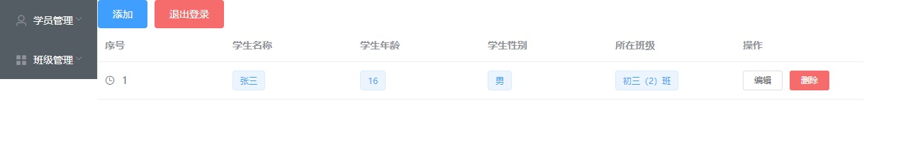

# 第02节：UI图展示

### 一、登录页

登录页有用户名输入框和密码输入框和登录按钮，当用户输入正确的用户名和密码时，会跳转到班级管理页，当用户输错用户名和密码时，会有对应的弹框，如下所示。

### 二、班级管理页

如上所示，班级管理页在左侧有切换的按钮菜单，上方有添加和退出登录按钮。

在点击添加时，会有一个弹框弹出，如下所示。

在弹框中，输入添加班级的名字，再点击确定即可完成班级的添加，这时候添加的班级就会在网页上显示出来，如下所示。

在班级信息的后面有两个操作按钮，分别是“编辑”和“删除”，当点击编辑时，会出现一个弹框，如下所示。

在输入框中，输入想要修改的名字，在点击确定，即可完成修改的班级名称的效果。

当点击删除时，会有一个提醒弹框，如下所示。

点击确定即可完成删除班级的效果，但是，如果班级内存在学生的时候，就会出现一个提示弹框，如下所示。

### 三、学生管理页

如上所示，学生管理页在左侧有切换的按钮菜单，上方有添加和退出登录按钮。

在点击添加时，会有一个弹框弹出，如下所示。

在弹框中，填上学生的基本信息后，点击确定即可完成，添加学生的操作，这时候学生的信息，就会在网页上渲染出来，如下所示。

在学生信息的后面有两个操作按钮，分别是“编辑”和“删除”，当点击编辑时，会出现一个弹框，如下所示。

在输入框中，输入想要修改的信息，在点击确定，即可完成修改的学生信息的效果。

当点击删除时，会有一个提醒弹框，如下所示。

点击确定即可完成删除。

### 四、账号注册页