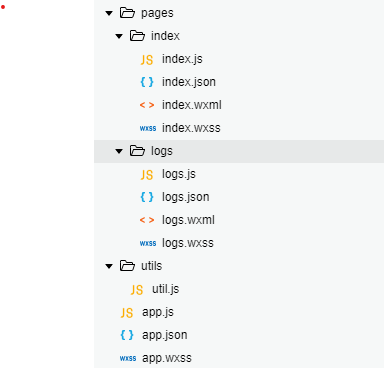

# 第03节：目录结构介绍

### 一、项目目录

当我们创建好一个项目时，项目的目录如下所示：

可以看出小程序根目录下，有三个app开头的文件(app.js/app.json/app.wxss)，和两个文件目录pages、utils.

其中，utils文件下存放工具类文件，后续用到了，我们再做进一步的介绍。下面我们对其他文件的作用进行介绍

根目录下的三个文件app.js/app.json/app.wxss是对小程序全局的设置。

其中,pages文件下存放的小程序的每个页面

### 二、项目页面

所有的项目页面都是存放在pages文件夹下面的，小程序的初始项目为我们创建了两个文件夹，也就是两个页面。文件结构如下所示：

|文件|必填|作用|
|------|------|------|
|页面的名称.js|是|本页面的逻辑|
|页面的名称.wxml|是|本页面的结构|
|页面的名称.wxss|否|本页面的样式表|
|页面的名称.json|否|本页面的配置|

**注意:为了方便开发者减少配置项，描述页面的四个文件必须具有相同的路径与文件名。**

### 三、文件拓展名解释 

* .json为配置文件
* .wxml 为模板文件，相当于HTML模板
* .wxss 为样式文件，相当于HTML的CSS样式表
* .js 为JS 脚本逻辑文件，相当于HTML的js脚本

