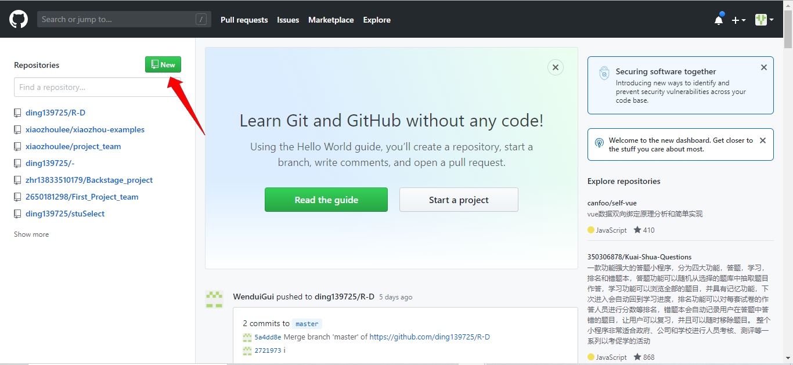
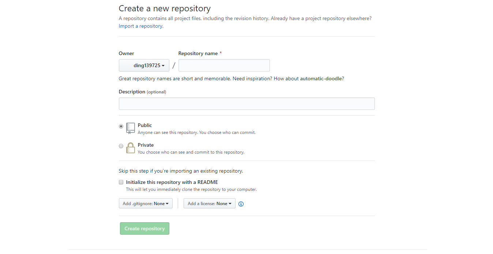
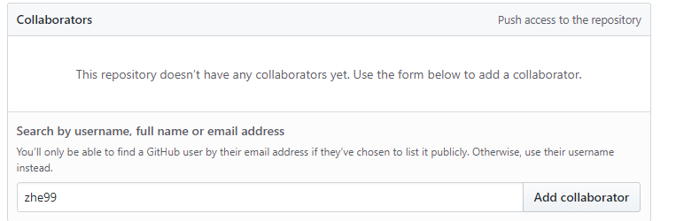
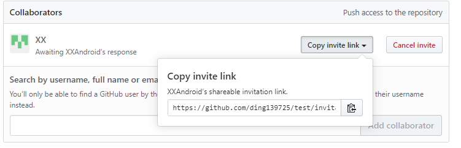

# Github使用教程

### 一、Github简介

github是一个基于git的代码托管平台，付费用户可以建私人仓库，我们一般的免费用户只能使用公共仓库，也就是代码要公开，可以非常方便帮助我们管理和保存代码，也非常方便我们的项目开发。

### 二、注册账户

要想使用github第一步当然是注册github账号了， [github官网](https://github.com/)，打开官网后，右上角有一个 Sign up的按钮是注册，点击按照步骤就可以一步一步的进行了。

### 三、创建远程存储库

进入github主页面后，在左边会有一个绿色写着New的按钮，点击按钮就可以创建我们自己的远程存储库了。

点击之后，会进入到这样的一个页面。
* Owner是所有者
* Repository name是存储库名称
* Description是说明（可以选择不填）
下面有两个按钮
* Public是公开（任何人都可以看到你的文件）
* Private是私人（你可以选择人看到你的文件）
* Initialize this repository with a README是否添加README文件

填好这些之后点击Create repository就好了。

### 四、上传文件
我们的远程存储库已经建立好了，按照下面的步骤就可以上传文件到这个存储库了。
先在你想要上传的文件中，右键打开Git Bush Here。如果没有，说明你没有安装Git 关于Git的安装教程在这里：[Git的安装](https://github.com/ding139725/R-D/blob/master/%E9%99%84%E5%BD%95/Git%E4%BD%BF%E7%94%A8%E6%95%99%E7%A8%8B.md)

然后按照建好存储库的后的那张网页的步骤，一步一步的打就可以了。

关于更多Git的使用教程在这里：[Git的使用教程](https://github.com/ding139725/R-D/blob/master/%E9%99%84%E5%BD%95/Git%E4%BD%BF%E7%94%A8%E6%95%99%E7%A8%8B.md)

### 五、添加合作者
当我们利用Github来存储团队项目时，会出现多人使用一个存储库的情况，那么如何添加合作者呢，下面就介绍如何添加合作者。

首先访问github官网网站，输入用户名和密码登录上之后，在代码仓库中选择你需要邀请合作者一起开发的项目，点击进入之后，可以看到有Settings设置标签。

点击进入Settings设置，左侧菜单栏选择Collaborators

选择之后，在右侧输入框中输入需要加入的合作者的用户名或邮箱地址，如何记不住全称，可以输入关键字，这里是可以模糊匹配的，会出现匹配到的列表，然后选择对应需要添加的合作者。然后点击右侧的Add collaborator按钮

上方会出现合作者的信息，Awaiting xxx's response，等待某某人的响应，还有个Copy invite like按钮（可以复制邀请链接，如果对应没有收到要求通知，可以将此邀请连接直接发送给对方，对方通过这个链接就可以直接同意了），还有个Cancel invite按钮，这个按钮是取消邀请

最后等待合作者同意，就完成添加合作者了。