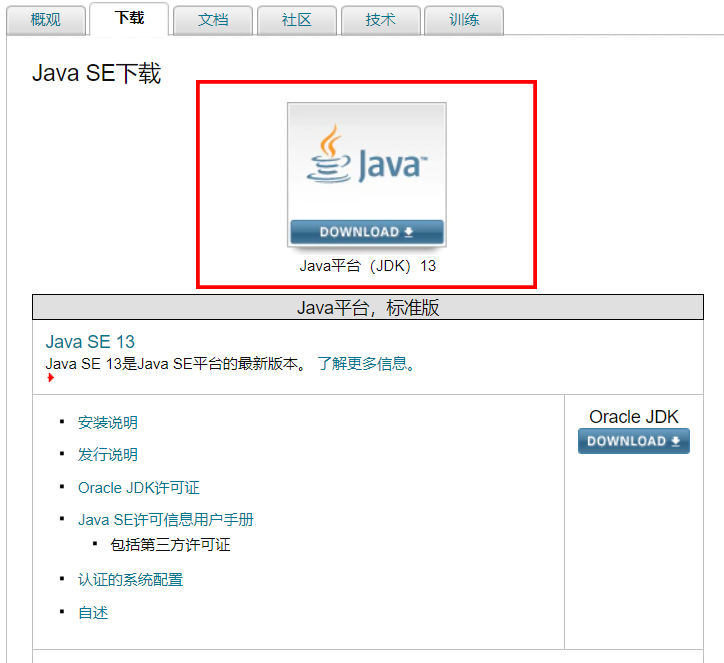
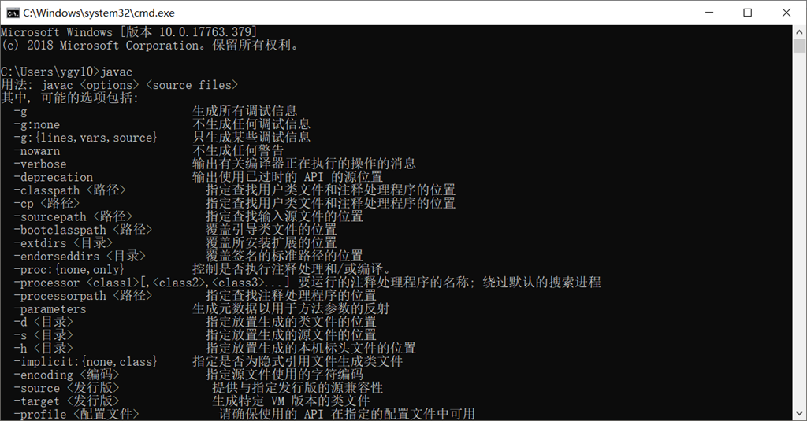

# 第02节：JDK下载与安装

### 一、为什么要安装JDK

上节课我们了解了Java的基本概念，也是说过编写Java需要安装JDK，否则Java项目无法启动，所以说本节我们来学习JDK安装。

### 二、JDK的介绍

JDK（Java开发套件）是java开发工具包
JRE（Java Runtime Environment）是Java运行环境
JRE在JDK之内，JVM在JRE之内。

Jre是java运行时环境，是java程序的运行环境。既然是运行，当然要包含jvm，也就是大家熟悉的虚拟机啦，还有所有java类库的类文件，都在lib目录下打包成jar。  

安装JDK之后，就已经安装了JRE

### 三、JDK的下载

[JDK的下载地址](https://www.oracle.com/technetwork/java/javase/downloads/index.html)

点击进入下载页面


点击下载按钮（注不用在意大小只需根据自己系统需求下载即可，推荐下载exe文件）：


### 四、JDK的安装

#### 运行安装包

直接双击，一直下一步即可。

#### 配置环境变量

* 这里用的是win7的配置方法(其他系统配置方法差异不大)
  
1.安装完成后，右击"我的电脑"，点击"属性"，选择"高级系统设置"；  
  

2.选择"高级"选项卡，点击"环境变量"；  
  

在 "系统变量" 中设置 3 项属性，JAVA_HOME、PATH、CLASSPATH(大小写无所谓),若已存在则点击"编辑"，不存在则点击"新建"。  

* 变量名：JAVA_HOME
* 变量值：C:\Program Files (x86)\Java\jdk        // 要根据自己的实际路径配置
* 变量名：CLASSPATH                                 （环境变量是java运行时默认去找的路径，java基本的jar包在里面。配置后可执行cmd中的java命令）
* 变量值：.;%JAVA_HOME%\lib\dt.jar;%JAVA_HOME%\lib\tools.jar;         //记得前面有个"."

* 变量名：Path      （path环境变量--帮助系统操作java）
* 变量值：%JAVA_HOME%\bin;%JAVA_HOME%\jre\bin;

在win10中Path 变量里是分条显示的，我们需要将 %JAVA_HOME%\bin;和%JAVA_HOME%\jre\bin; 分开添加，否则无法识别

``` html
%JAVA_HOME%\bin
%JAVA_HOME%\jre\bin
```

注:配置完可能需要重启电脑

### 五、JDK的运行

在安装的JDK目录中：bin是存放java可执行文件的目录。  

在cmd控制台输入  

``` js
java -version //查询版本
java //执行你编译的class文件。
javac //将java文件编译成class文件
```

出现以下信息则安装成功


### 六、总结JDK

通过本节，我们了解了，JDK让java项目启动的方法。当我们编写好一个java文件的时候可以在文件对应的目录中启动cmd并且通过在cmd中输入下面的命令执行java文件。

``` java
java //执行你编译的class文件。
javac //将java文件编译成class文件
```

那么Java文件是使用什么来编写的呢？我们电脑自带的.txt记事本文档就支持编写Java代码。但是如果Java代码用记事本来写的话，会很影响效率。  
所以说开发都是使用软件来开发的，所以说下一节我们来下载一个Java编写软件