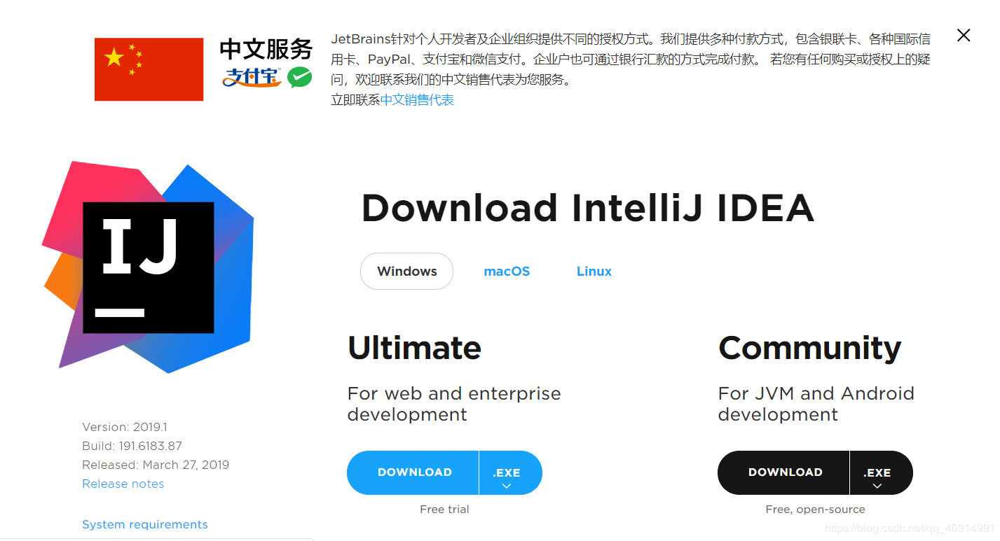
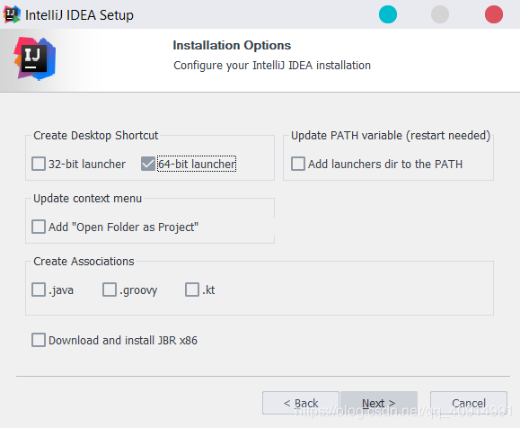
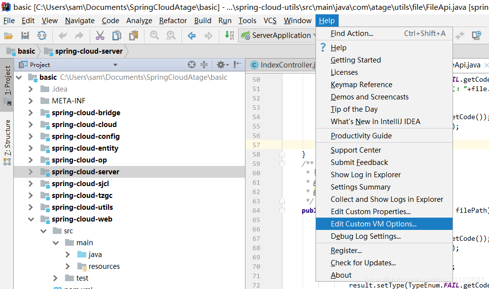
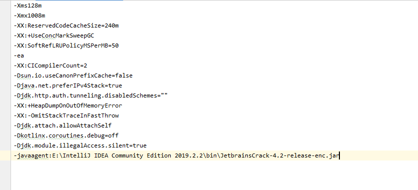

# 第03节：Java开发工具

### 一、为什么使用Java开发工具？

上一节的总结中我们提到，使用Java开发工具可以提高效率。  
有一些教程最开始都会用记事本演示如何开发Java程序，这里不建议使用记事本演示开发java程序。  
记事本的优点是可以更直观的表达出java项目从创建到启动的流程，不过相对于编辑器而言编辑器更加易懂方便。  

### 二、说说常见的Java编辑器

#### eclipse

免费的Java开发编辑器,是一个比较原始的编辑器，这里不推荐使用。

#### myeclipse

myeclipse是在eclipse的基础上做了一些扩展，让Java程序员更方便地开发web应用程序。

#### idea

IDEA 全称 IntelliJ IDEA，是java编程语言开发的集成环境。IntelliJ在业界被公认为最好的java开发工具之一，尤其在智能代码助手、代码自动提示、重构、J2EE支持、各类版本工具(git、svn等)、JUnit、CVS整合、代码分析、 创新的GUI设计等方面的功能可以说是超常的。

#### vscode

VS Code中的Java支持是通过扩展提供的，并通过简单，现代的工作流程针对轻量级Java项目进行了优化，大型项目不推荐使用VS Code。

### 三、我们推荐使用idea

idea是当前最受欢迎Java 编辑软件，本电子书的所有代码都是推荐使用idea开发。

本电子书的所有操作都是基于英文版的idea讲解，所以不推荐大家去安装配置中文版插件。

### 四、如何安装idea

 1. 下载
 进入官网下载适合自己系统的版本，[下载地址](https://www.jetbrains.com/idea/download/#section=windows)。  
 
 2. 安装中选择适合本机的64位（32位）版本，其他一直next即可
 
 
### 五、破解idea

 正版的idea软件是需要收费的，首先强调一遍：各位有能力的请尽量支持正版！  

 1. 先下载jar包JetbrainsCrack-4.2-release-enc.jar，把它放到你认为合适的文件夹内，我直接放在了安装目录C:\Program Files\JetBrains\IntelliJ IDEA 2019.1\bin。  
 [JetbrainsCrack-4.2-release-enc.jar下载地址](https://zhile.io/2018/08/25/jetbrains-license-server-crack.html)
 2. 划重点，修改配置文件：不能直接在bin目录下直接修改，先打开idea试用30天，然后点击你要注册的IDE菜单：“Help” -> “Edit Custom VM Options …”，如果提示是否要创建文件，请点"是|create"。  
 
 3. 在打开的vmoptions编辑窗口末行添加：-javaagent:JetbrainsCrack-4.2-release-enc.jar文件的绝对路径（一定要自己确认好路径，填错会导致IDE打不开！！！）  

    如我的路径: -javaagent:E:\IntelliJ IDEA Community Edition 2019.2.2\bin\JetbrainsCrack-4.2-release-enc.jar  
   

4. 重新启动你的IDEA。  
注册"Help" -> “Register”，选择License server方式，地址填入：http://jetbrains-license-server （应该会自动填上）确定后重启IDEA，看到Licensed to 用户名，即激活成功。  

### 六、IDEA主题切换
### 六、总结

到现在为止我们已经安装好了idea软件，配置了jdk环境。环境搭建完成，已经可以写java代码了，下一节我们将会学习创建一个java案例。