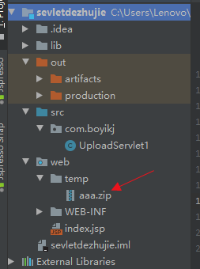

# 第09节：servlet文件下载


### 一、Servlet实现文件下载理论
下载资源我们在日常中也很常用，它是怎么做到的呢？要能够给别人下载，服务器就应该有这个资源

  

浏览器发送所有的请求都是去找Servlet的话，那么我就写一个Servlet，当访问这个Servlet的时候，就可以下载我这个图片资源了！

### 二、代码示例
1、java的文件上传下载都是通过io流来完成的，既然要下载图片，首先要能够读取到它。（我这里是指定了具体了存储路径，然后从前端文件列表中将要下载文件的文件名传到ServletDownload,拿到文件具体路径，文件输入流读取资源）

``` java

    //获取资源路径
        String name= req.getParameter("fName");
        System.out.println("name: "+name);//比如name=1.jpg
        String path = this.getServletContext().getRealPath("/resource/"+name);
        //文件输入流读取资源
        FileInputStream fileInputStream = new FileInputStream(path);
        //获取文件名
        //substring() 方法返回字符串的子字符串。
        //lastIndexOf() 方法可返回一个指定的字符串值最后出现的位置，
        // 在一个字符串中的指定位置从后向前搜索
        String fileName = path.substring(path.lastIndexOf("\\")+1);
```
2、告诉浏览器，我要下载这个文件
```java
 //设置消息头，告诉浏览器，我要下载1.png这个图片
 response.setHeader("Content-Disposition", "attachment; filename="+fileName);
```
3、将读取到的内容回送给浏览器
``` java
fileInputStream.read(byte [] b )
```
从(来源)输入流中(读取内容)读取的一定数量字节数,并将它们存储到(去处)缓冲区数组b中,返回值为实际读取的字节数,运行一次读取一定的数量的字节数.java会尽可能的读取b个字节,但也有可能读取少于b的字节数.至少读取一个字节第一个字节存储读入元素b[0],下一个b[1],等等。读取的字节数是最多等于b的长度.如果没有可用的字节,因为已经到达流的末尾, -1返回的值
``` java
        int len = 0;
        byte[] bytes = new byte[1024];
        ServletOutputStream  servletOutputStream = resp.getOutputStream();
        while((len=fileInputStream.read(bytes))>0){
            servletOutputStream.write(bytes, 0, len);
        }
        //关闭资源
        servletOutputStream.close();
        fileInputStream.close();
```
