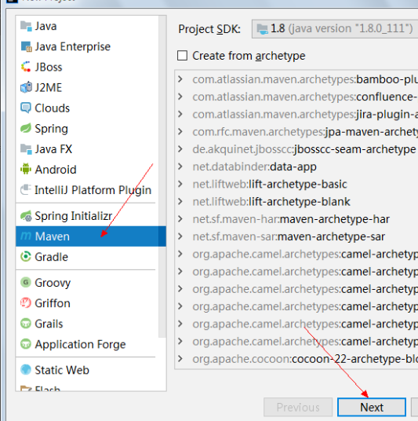
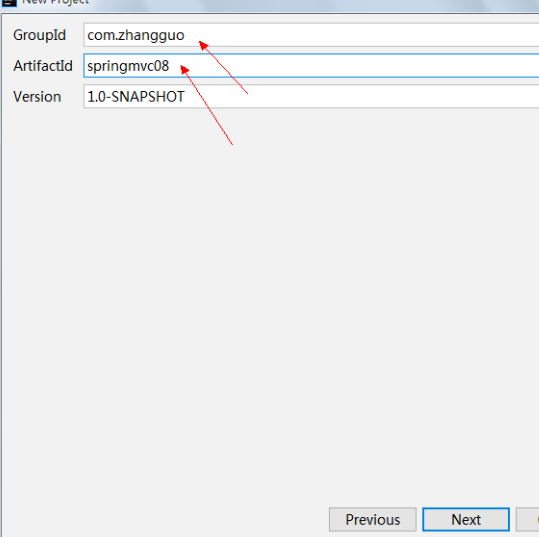
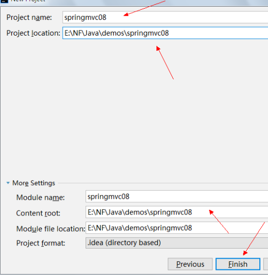
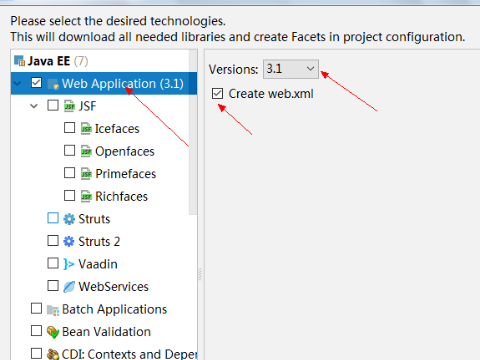
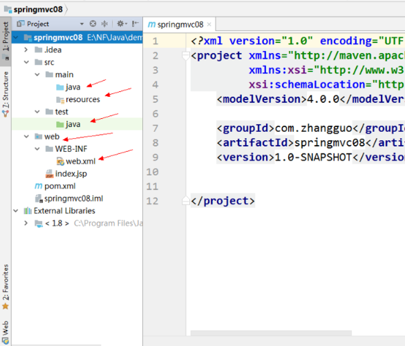

# 第02节：IDEA创建maven项目

### 一、准备工作
创建maven项目需要提前在电脑上安装maven的安装包，配置MAVEN_HOME环境

也就是我们上一节的内容。

### 二、创建普通的maven项目

在IntelliJ IDEA中新建Maven项目，选择“File->New->Project”，创建一个简单项目，不选择模板，如下图所示：  
  
选择“Maven”，不需要使用内置结构（模板），如下图所示：  
  
填写包名与项目名，如下图所示:  
  
选择项目位置，尽量不要有中文、空格或特殊字符，点击完成，如下图所示:  
  
完成后点击右下角弹出的“Enable-Auto import”，下载依赖（取决于网速，本人下载时间大概是10分钟）  
添加Web项目支持，前面我们创建好了一个普通的Java项目，现在需要将普通项目转换成Web项目，如下图所示：  
  
选择“Web Application”，如下图所示：  
  
点击OK后项目就变成Web项目了，且根据Maven风格创建了不同类型的文件夹，如下图所示：  
  

以上就是创建maven项目的方法了，下一节我们学习maven的应用

