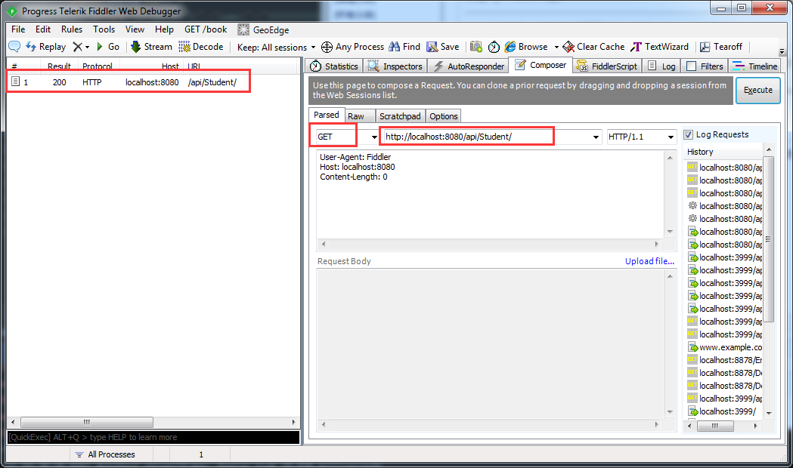
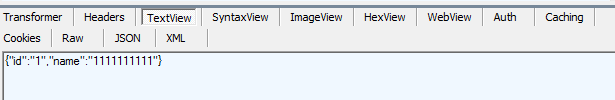
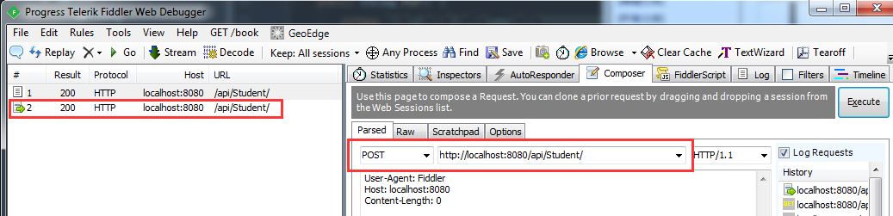
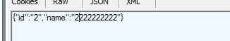
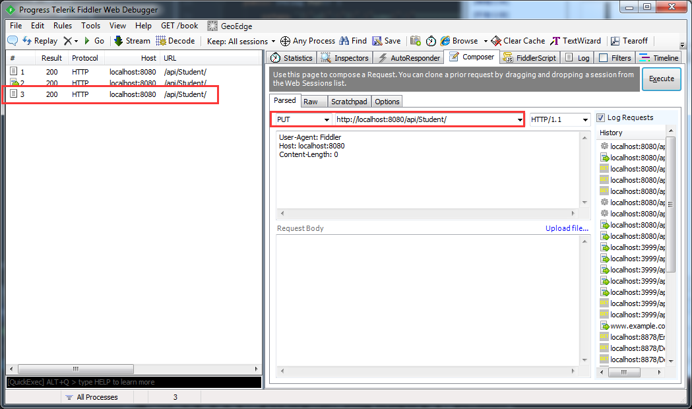
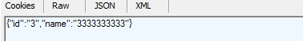
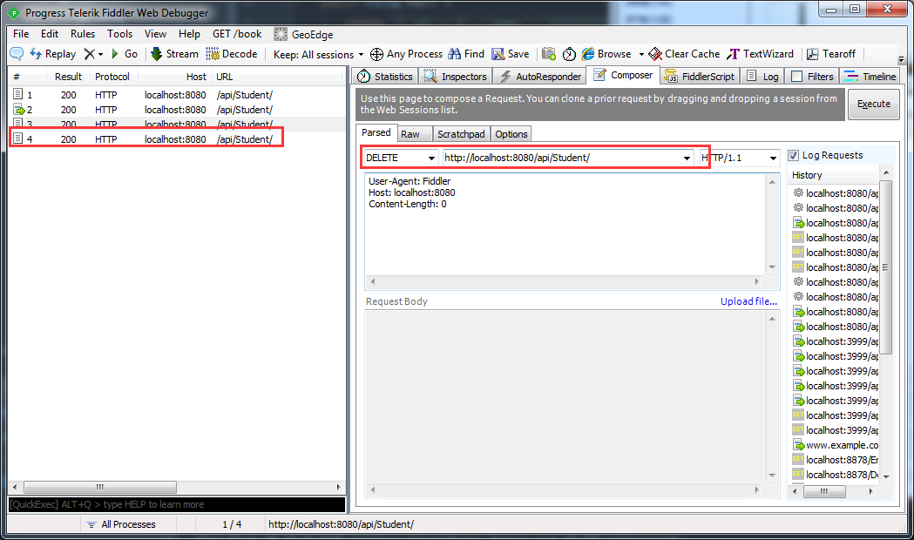
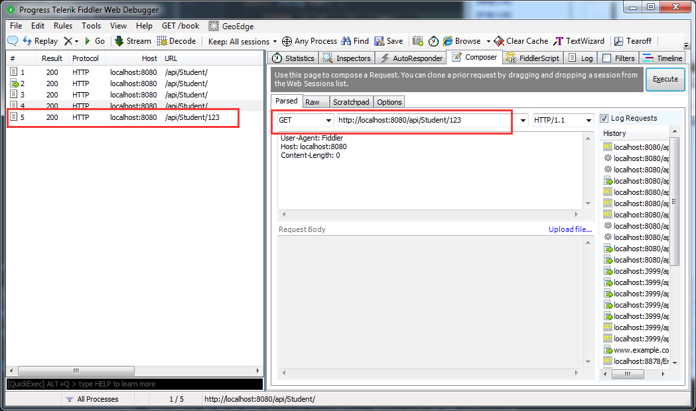
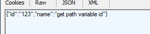

# 第05节：Restfule接口
之前一节我们讲解了拦截器的作用及应用,这一节我们使用restfule接口来进行实践操作

### 一、Restfule接口概述
面向资源的 Restful 风格的 api 接口本着简洁，资源，便于扩展，便于理解等等各项优势，在如今的系统服务中越来越受欢迎。

　　.net平台有WebAPi项目是专门用来实现Restful api的，其良好的系统封装，简洁优雅的代码实现，深受.net平台开发人员所青睐，在后台服务api接口中，已经逐步取代了辉煌一时MVC Controller，更准确地说，合适的项目使用更加合适的工具，开发效率将会更加高效。

　　python平台有tornado框架，也是原生支持了Restful api，在使用上有了很大的便利。

　　Java平台的SpringMVC主键在Web开发中取代了Struts2而占据了更加有力的地位，我们今天着重讲解如何在Java SpringMVC项目中实现Restful api。

### 二、实现思路
Restful api的实现脱离不了路由，这里我们的Restful api路由,由spring mvc的controller来实现。

### 实现过程

#### 1、搭建spring mvc maven项目
这里的搭建步骤不再赘述，如有需要参考请复习前几章
#### 2、新建控制器 StudentController
为了体现Restful api 我们采用注解，RequestMapping("/api/Student")

具体代码如下：
``` java
package Controllers;

import org.springframework.web.bind.annotation.*;

@RestController
@RequestMapping("/api/Student")
public class StudentController {

    @RequestMapping(method = RequestMethod.GET)
    public String Get() {
        return "{\"id\":\"1\",\"name\":\"1111111111\"}";
    }

    @RequestMapping(method = RequestMethod.POST)
    public String Post() {
        return "{\"id\":\"2\",\"name\":\"2222222222\"}";
    }

    @RequestMapping(method = RequestMethod.PUT)
    public String Put() {
        return "{\"id\":\"3\",\"name\":\"3333333333\"}";
    }

    @RequestMapping(method = RequestMethod.DELETE)
    public String DELETE() {
        return "{\"id\":\"4\",\"name\":\"4444444444\"}";
    }

    @RequestMapping(value = "/{id}",method = RequestMethod.GET)
    public String Get(@PathVariable("id") Integer id) {
        return "{\"id\":\""+id+"\",\"name\":\"get path variable id\"}";
    }
}
```
这里有Get，Post，Put，Delete分别对应 查询，添加，修改，删除四种对资源的操作，即通常所说的CRUD。

spring mvc可实现restful的方式有@Controller和@RestController两种方式，两种方式的区别如下：
@Controller的方式实现如果要返回json，xml等文本，方法体上需要额外添加@ResponseBody注解，例如：　

``` java
@ResponseBody    //用于返回json数据或者text格式文本
2     @RequestMapping(value = "/TestJson", method = RequestMethod.GET)
3     public String TestJson() {
4         return "{\"id\":\"1001\",\"name\":\"zhangsan\"}";
5     }
```

@RestController方式不需要写@ResponseBody，但是不能返回模型绑定数据和jsp视图，只能返回json，xml文本，仅仅是为了更加方便返回json资源而已。

上述的Rest方法中多写了个Get方法:
```java
@RequestMapping(value = "/{id}",method = RequestMethod.GET)
2     public String Get(@PathVariable("id") Integer id) {
3         return "{\"id\":\""+id+"\",\"name\":\"get path variable id\"}";
4     }
```
该方法可以直接在url拼接一个参数，更加方便对资源的定向访问，例如查一个student list 可以默认空参数，而查询对应的某一个student详情信息，可以id=studentId 定向查询单条，使得我们对资源的访问更加快捷方便。

还有一种更加简洁的写法，Spring4.3中引进了｛@GetMapping、@PostMapping、@PutMapping、@DeleteMapping、@PatchMapping｝几种写法，让接口的声明更加地简洁。下面代码展示了用这种注解方式进行Rest接口的定义：

``` java
package Controllers;

import org.springframework.web.bind.annotation.*;

@RestController
@RequestMapping("/api/Student")
public class StudentController {

    @GetMapping()
    public String Get() {
        return "{\"id\":\"1\",\"name\":\"1111111111\"}";
    }

    @PostMapping()
    public String Post() {
        return "{\"id\":\"2\",\"name\":\"2222222222\"}";
    }

    @PutMapping()
    public String Put() {
        return "{\"id\":\"3\",\"name\":\"3333333333\"}";
    }

    @DeleteMapping()
    public String DELETE() {
        return "{\"id\":\"4\",\"name\":\"4444444444\"}";
    }

    @GetMapping(value = "/{id}")
    public String Get(@PathVariable("id") Integer id) {
        return "{\"id\":\"" + id + "\",\"name\":\"get path variable id\"}";
    }
}
```

### 系统测试
运行系统，使用fiddler调用restful api接口：
#### 1.Get方式


#### 2.Post方式



#### 3.Put方式



#### 4.Delete方式



#### 5.Get/id方式



至此，可见我们的spring mvc Restful api接口已经全部通过测试！