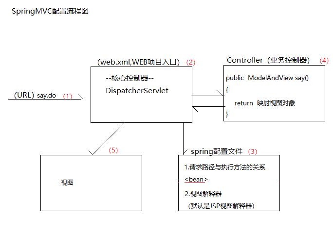

# 第01节：spring_mvc概述

本章节主要讲解springMVC的概述

### 一、SpringMVC是什么？

SpringMVC 是 Spring 框架内置的 MVC 的实现。SpringMVC 就是一个 Spring 内置的 MVC 子框架

Spring 子框架：意味着 SpringMVC 的包都在 Spring 框架里面。

MVC：Model-View-Control（模型--视图--控制器），这是一个解决页面代码（视图代码）和后台代码分离的设计思想。

### 二、SpringMVC的作用

MVC 模式（Model-View-Controller）：为了解决页面代码和后台代码的分离。

既然 SpringMVC 是一个 MVC 框架，首先就要解决 MVC 理念提出的问题。页面代码和后台代码分离。

### 三、 为什么要学习 SpringMVC

问题：
我们知道，我们已经学习了 Servlet/JSP 了。为什么还要学习 SpringMVC 呢？
Servlet /JSP就是一套MVC模式的实现，SpringMVC也是MVC的实现，那么学SpringMVC的意义在哪里？

SpringMVC不仅仅是MVC的实现，它还是一个框架。这意味着，除了MVC的实现以外还提供了大量的辅助页面请求处理的功能组件。

* 支持直接一个方法对一个请求
* 支持数据的自动封装  
* 自动支持上传组件
* 自动支持JSON的转成

### 四、SpringMVC 配置流程图

* 学习任何框架，从配置流程图开始。所以我们必须要理解SpringMVC的配置流程。

因为一个框架有很多API，入门流程图告诉我们，我们必须要掌握的API（一般超过5个类）。这样，我们可以做到，简单入门，深入学习。

概念说明：

* 核心控制器：因为SpringMVC为了实现一个请求对一个方法这个功能，所以必须需要一个Web组件来拦截所有请求。这个拦截并且处理所有请求的Web组件称为核心控制器。
* 业务控制器（Controller），在SpringMVC经过核心控制器跳转到一个处理自身需求业务的普通类，这个类称为业务控制器。

配置流程图说明：

* 我们必须在网站的入口（web.xml,WEB描述符），配置一个核心控制器，拦截所有的的请求
* 核心控制器通过加载Spring配置文件，获得请求路径对应业务控制器的方法
* 业务控制器的方法返回一个ModelAndView的对象给核心控制器
* 核心控制器根据业务控制器再加载配置的视图解释器跳转到对应的返回视图

### 五、总结

我们对SpringMVC有个概念性了解了，接下来我们学习maven管理SpringMVC项目。