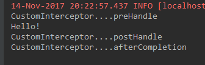
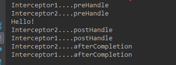
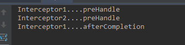

# 第04节：拦截器
之前一节我们具体的讲解了controller的使用本节我们主要讲解拦截器的应用

### 一、拦截器概述
#### 1.什么是拦截器？
Spring MVC中的拦截器（Interceptor）类似于Servlet中的过滤器（Filter），它主要用于拦截用户请求并作相应的处理。例如通过拦截器可以进行权限验证、记录请求信息的日志、判断用户是否登录等。
要使用Spring MVC中的拦截器，就需要对拦截器类进行定义和配置。通常拦截器类可以通过两种方式来定义。

1.通过实现HandlerInterceptor接口，或继承HandlerInterceptor接口的实现类（如HandlerInterceptorAdapter）来定义。

2.通过实现WebRequestInterceptor接口，或继承WebRequestInterceptor接口的实现类来定义。

创建一个CustomInterceptor类。以实现HandlerInterceptor接口方式为例，自定义拦截器类的代码如下：

``` java
public class CustomInterceptor implements HandlerInterceptor{
        public boolean preHandle(HttpServletRequest request, 
                                 HttpServletResponse response, Object handler)throws Exception {
            return false;
        }
        public void postHandle(HttpServletRequest request, 
                               HttpServletResponse response, Object handler,
                               ModelAndView modelAndView) throws Exception {
            
        }
        public void afterCompletion(HttpServletRequest request,
                                    HttpServletResponse response, Object handler,
                                    Exception ex) throws Exception {
        }
    }
```

上述代码中，自定义拦截器实现了HandlerInterceptor接口，并实现了接口中的三个方法：

* preHandle() 方法：该方法会在控制器方法前执行，其返回值表示是否中断后续操作。当其返回值为true时，表示继续向下执行；
当其返回值为false时，会中断后续的所有操作（包括调用下一个拦截器和控制器类中的方法执行等）。

* postHandle()方法：该方法会在控制器方法调用之后，且解析视图之前执行。可以通过此方法对请求域中的模型和视图做出进一步的修改。

* afterCompletion()方法：该方法会在整个请求完成，即视图渲染结束之后执行。可以通过此方法实现一些资源清理、记录日志信息等工作。

#### 2.拦截器的配置
开发拦截器就像开发servlet或者filter一样，都需要在配置文件进行配置，配置代码如下：

``` java
<!--配置拦截器-->
    <mvc:interceptors>
        <!--<bean class="com.ma.interceptor.CustomeInterceptor" />-->
        <!--拦截器1-->
        <mvc:interceptor>
            <!--配置拦截器的作用路径-->
            <mvc:mapping path="/**"/>
            <mvc:exclude-mapping path=""/>
            <!--定义在<mvc:interceptor>下面的表示匹配指定路径的请求才进行拦截-->
            <bean class="com.ma.interceptor.Intercptor1"/>
        </mvc:interceptor>
        <!--拦截器2-->
        <mvc:interceptor>
            <mvc:mapping path="/hello"/>
            <bean class="com.ma.interceptor.Interceptor2"/>
        </mvc:interceptor>
```

上面的代码中，<mvc:interceptors>元素用于配置一组拦截器，基子元素<bean.>中定义的是全局拦截器，它会拦截所有的请求；而<mvc:interceptor>元素中定义的是指定路径的拦截器，它会对指定路径下的请求生效。<mvc:interceptor>元素的子元素<mvc:mapping>用于配置拦截器作用的路径，该路径在其属性path 中定义。如上述代码中 path 的属性值“/**” 表示拦截所有路径，“/hello” 表示拦截所有以 “/hello” 结尾的路径。如果在请求路径中包含不需要拦截的内容，还可以通过<mvc:exclude-mapping>元素进行配置。
注意：<mvc:interceptor>中的子元素必须按照上述代码中的配置顺序进行编写，即<mvc:mapping> <mvc:exclude-mapping>,<bean/.>，否则文件会报错。

### 二、拦截器的执行流程
#### 1.单个拦截器的执行流程
在运行程序时，拦截器的执行是有一定顺序的，该顺序与配置文件中所定义的拦截器的顺序相关。
单个拦截器，在程序中的执行流程如下图所示：


* 1.程序先执行preHandle()方法，如果该方法的返回值为true，则程序会继续向下执行处理器中的方法，否则将不再向下执行。

* 2.在业务处理器（即控制器Controller类）处理完请求后，会执行postHandle()方法，然后会通过DispatcherServlet向客户端返回响应。

* 3.在DispatcherServlet处理完请求后，才会执行afterCompletion()方法。

测试案例：
通过一个测试程序来验证它的执行流程。
新建一个web项目，准备好SpringMVC程序运行所需要的JAR包，在web.xml中配置前端过虑器和初始化加载信息。
新建一个测试controller，代码如下：
``` java
/**
 * @author mz
 * @version V1.0
 * @Description: 拦截器测试
 */
@Controller
public class HelloController {

    @RequestMapping("/hello")
    public String Hello() {
        System.out.println("Hello!");
        return "success";
    }
}
```

然后，新建一个拦截器，实现HandlerInterceptor接口，并实现其中的方法。

``` java
/**
 * @author mz
 * @version V1.0
 * @Description: 实现了HandlerInterceptor接口的自定义拦截器类
 */
public class CustomeInterceptor implements HandlerInterceptor {
    @Override
    public boolean preHandle(HttpServletRequest httpServletRequest, HttpServletResponse httpServletResponse, Object o)
            throws Exception {
        System.out.println("CustomInterceptor....preHandle");
        //对浏览器的请求进行放行处理
        return true;
    }

    @Override
    public void postHandle(HttpServletRequest httpServletRequest, HttpServletResponse httpServletResponse, Object o, ModelAndView modelAndView)
            throws Exception {
        System.out.println("CustomInterceptor....postHandle");
    }

    @Override
    public void afterCompletion(HttpServletRequest httpServletRequest, HttpServletResponse httpServletResponse, Object o, Exception e)
            throws Exception {
        System.out.println("CustomInterceptor....afterCompletion");
    }
}
```

在配置文件中配置拦截器。

``` java
<beans xmlns="http://www.springframework.org/schema/beans"
       xmlns:xsi="http://www.w3.org/2001/XMLSchema-instance" xmlns:mvc="http://www.springframework.org/schema/mvc"
       xmlns:context="http://www.springframework.org/schema/context"
       xsi:schemaLocation="http://www.springframework.org/schema/beans
        http://www.springframework.org/schema/beans/spring-beans-4.3.xsd
        http://www.springframework.org/schema/mvc
        http://www.springframework.org/schema/mvc/spring-mvc-4.3.xsd
        http://www.springframework.org/schema/context
        http://www.springframework.org/schema/context/spring-context-4.3.xsd">

    <!--定义组件扫描器，指定需要扫描的包-->
    <context:component-scan base-package="com.ma.controller"/>

    <!-- 配置视图解析器 -->
    <bean class="org.springframework.web.servlet.view.InternalResourceViewResolver">
        <property name="prefix" value="/WEB-INF/jsp/"/>
        <property name="suffix" value=".jsp"/>
    </bean>

    <!--配置拦截器-->
    <mvc:interceptors>
        <bean class="com.ma.interceptor.CustomeInterceptor" />  
    </beans>
```

把项目发布到tomcat中，运行测试：


#### 2.多个拦截器的执行流程
多个拦截器（假设有两个拦截器Interceptor1和Interceptor2，并且在配置文件中， Interceptor1拦截器配置在前），在程序中的执行流程如下图所示：


从图可以看出，当有多个拦截器同时工作时，它们的preHandle()方法会按照配置文件中拦截器的配置顺序执行，而它们的postHandle()方法和afterCompletion()方法则会按照配置顺序的反序执行。
测试案例：
新建两个拦截器：

``` java
/**
 * @author mz
 * @version V1.0
 * @Description: 第一个拦截器
 */
public class Intercptor1 implements HandlerInterceptor {
    @Override
    public boolean preHandle(HttpServletRequest httpServletRequest,
                             HttpServletResponse httpServletResponse, Object o) throws Exception {
        System.out.println("Interceptor1....preHandle");
        return true;
    }

    @Override
    public void postHandle(HttpServletRequest httpServletRequest, HttpServletResponse httpServletResponse, Object o, ModelAndView modelAndView) throws Exception {
        System.out.println("Interceptor1....postHandle");
    }

    @Override
    public void afterCompletion(HttpServletRequest httpServletRequest, HttpServletResponse httpServletResponse, Object o, Exception e) throws Exception {
        System.out.println("Interceptor1....afterCompletion");
    }
```

``` java
/**
 * @author mz
 * @version V1.0
 * @Description: 第二个拦截器
 */
public class Interceptor2 implements HandlerInterceptor {
    @Override
    public boolean preHandle(HttpServletRequest httpServletRequest, HttpServletResponse httpServletResponse, Object o) throws Exception {
        System.out.println("Interceptor2....preHandle");
        return true;
    }

    @Override
    public void postHandle(HttpServletRequest httpServletRequest, HttpServletResponse httpServletResponse, Object o, ModelAndView modelAndView) throws Exception {
        System.out.println("Interceptor2....postHandle");
    }

    @Override
    public void afterCompletion(HttpServletRequest httpServletRequest, HttpServletResponse httpServletResponse, Object o, Exception e) throws Exception {
        System.out.println("Interceptor2....afterCompletion");
    }
}
```
添加配置信息：
``` java
<!--拦截器1-->
        <mvc:interceptor>
            <!--配置拦截器的作用路径-->
            <mvc:mapping path="/**"/>
            <!--定义在<mvc:interceptor>下面的表示匹配指定路径的请求才进行拦截-->
            <bean class="com.ma.interceptor.Intercptor1"/>
        </mvc:interceptor>
        <!--拦截器2-->
        <mvc:interceptor>
            <mvc:mapping path="/hello"/>
            <bean class="com.ma.interceptor.Interceptor2"/>
        </mvc:interceptor>
```
测试运行：


从结果可以看出，执行的顺序和图片中是一样的。

如果第一个拦截器return true; 而第二个拦截器 return false;结果如下：


#### 小结
首先学习如何在Spring MVC项目中定义和配置拦截器，然后了解单个拦截器和多个拦截器的执行流程。