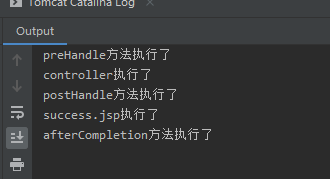

# 第04节：拦截器

上一节我们讲了异步ajax请求 ResponseBody响应json数据。本节我们主要讲解拦截器的应用。

### 一、拦截器是什么？

Spring MVC中的拦截器（Interceptor）类似于Servlet中的过滤器（Filter），它主要用于拦截用户请求并作相应的处理。例如通过拦截器可以进行权限验证、记录请求信息的日志、判断用户是否登录等。
要使用Spring MVC中的拦截器，就需要对拦截器类进行定义和配置。

1. 过滤器是Servlet规范的一部分，任何框架都可以使用过滤器技术。
2. 拦截器是SpringMVC框架独有的。
3. 过滤器配置了/*，可以拦截任何资源。
4. 拦截器只会对控制器中的方法进行拦截。
5. 拦截器也是AOP思想的一种实现方式
6. 想要自定义拦截器，需要实现HandlerInterceptor接口。

### 二、代码示例和执行流程介绍

#### 1.创建拦截器

创建一个interceptor包，专门用来写拦截器。  
编写MyInterceptor1类。以实现HandlerInterceptor接口方式，自定义拦截器类的代码如下：

``` java
package com.xiaozhoubg.interceptor;

import org.springframework.web.servlet.HandlerInterceptor;


public class MyInterceptor1 implements HandlerInterceptor {

}
```

上述代码中，自定义拦截器实现了HandlerInterceptor接口。

接下来按键盘ctrl+o快捷键快速生成接口方法  
如图，选择接口的三个方法


``` java
import org.springframework.web.servlet.HandlerInterceptor;
import org.springframework.web.servlet.ModelAndView;

import javax.servlet.http.HttpServletRequest;
import javax.servlet.http.HttpServletResponse;

public class MyInterceptor1 implements HandlerInterceptor {
        @Override
//    controller之前执行
    public boolean preHandle(HttpServletRequest request, HttpServletResponse response, Object handler) throws Exception {
        return true;
    }
//    controller之后执行
    @Override
    public void postHandle(HttpServletRequest request, HttpServletResponse response, Object handler, ModelAndView modelAndView) throws Exception {

    }
//    跳转页面后执行
    @Override
    public void afterCompletion(HttpServletRequest request, HttpServletResponse response, Object handler, Exception ex) throws Exception {

    }
}
```

* preHandle() 方法：该方法会在控制器方法前执行，其返回值表示是否中断后续操作。当其返回值为true时，表示继续向下执行；
当其返回值为false时，会中断后续的所有操作（包括调用下一个拦截器和控制器类中的方法执行等）。

* postHandle()方法：该方法会在控制器方法调用之后，且解析视图之前执行。可以通过此方法对请求域中的模型和视图做出进一步的修改。

* afterCompletion()方法：该方法会在整个请求完成，即视图渲染结束之后执行。可以通过此方法实现一些资源清理、记录日志信息等工作。

#### 2.拦截器的配置

我们写好拦截器之后需要通过配置来让拦截器生效。
开发拦截器就像开发servlet或者filter一样，都需要在配置文件进行配置，配置代码如下：

``` xml
         <!--配置拦截器-->
     <mvc:interceptors>
            <!-- 拦截器1 -->
         <mvc:interceptor>
                    <!--要拦截的内容(跳转地址中带有user的)↓-->
                 <mvc:mapping path="/user/*"/>
                     <!--不要拦截的内容↓-->
             <!--<mvc:exclude-mapping path=""/>-->

                          <!-- 定义使用哪个拦截器(填写拦截器的路径)↓ -->
                 <bean class="com.xiaozhoubg.interceptor.MyInterceptor1" />
        </mvc:interceptor>
            <!--拦截器2-->
        <mvc:interceptor>
            <mvc:mapping path="/**"/>
            <bean class="com.ma.interceptor.Interceptor2"/>
        </mvc:interceptor>
    </mvc:interceptors>

```

``` xml
上面的代码中，<mvc:interceptors>元素用于配置一组拦截器。  
<mvc:interceptor>元素中定义的是指定具体的哪个拦截器。  
<mvc:interceptor>元素的子元素<mvc:mapping>用于配置拦截器拦截哪个路径，该路径在其属性path 中定义。如上述代码中 path 的属性值“/**” 表示拦截所有路径。也可以使用<mvc:exclude-mapping>元素进行配置不拦截哪个地址。
注意：<mvc:interceptor>中的子元素必须按照上述代码中的配置顺序进行编写，即<mvc:mapping> <mvc:mapping>,<bean>，否则文件会报错。
```

#### 3.单个拦截器的执行流程

在运行程序时，拦截器的执行是有一定顺序的，该顺序与配置文件中所定义的拦截器的顺序相关。
单个拦截器，在程序中的执行流程如下图所示：


* 1.程序先执行preHandle()方法，如果该方法的返回值为true，则程序会继续向下执行处理器中的方法，否则将不再向下执行。

* 2.在控制器Controller类处理完请求后，会执行postHandle()方法，然后会通过DispatcherServlet向客户端返回响应。

* 3.在DispatcherServlet处理完请求后，才会执行afterCompletion()方法。

#### 4.测试案例：

通过一个测试程序来验证它的执行流程。

在index.jsp中写入a标签跳转

``` jsp
<a href="user/testInterceptor">测试拦截器执行流程</a>
```

新建一个测试controller，对应a标签，代码如下：

``` java
// UserController

package com.xiaozhoubg.controller;

import org.springframework.stereotype.Controller;
import org.springframework.web.bind.annotation.RequestMapping;

@Controller
@RequestMapping("user")
public class UserController {

    @RequestMapping("testInterceptor")
    public String testInterceptor(){
        System.out.println("controller执行了");
        return "success";
    }
}
```

根据视图解析器的路径，我们在WEB-INF下面创建一个pages文件夹，里面编写一个success.jsp

```  jsp
 <%@ page contentType="text/html;charset=UTF-8" language="java" %>
<html>
<head>
    <title>Title</title>
</head>
<body>
<!-- 
这里插入一个java标签，如果这个页面运行，就会打印出"success.jsp执行了"。 -->
<%
System.out.println("success.jsp执行了");
%>

</body>
</html>
```

配置好tomcat，运行测试：



#### 2.多个拦截器的执行流程

多个拦截器（假设有两个拦截器Interceptor1和Interceptor2，并且在配置文件中， Interceptor1拦截器配置在前），在程序中的执行流程如下图所示：


从图可以看出，当有多个拦截器同时工作时，它们的preHandle()方法会按照配置文件中拦截器的配置顺序执行，而它们的postHandle()方法和afterCompletion()方法则会按照配置顺序的反序执行。

大家再多配置一个拦截器，就会很明显的发现了。

### 三、总结

我们首先学习如何在Spring MVC项目中定义和配置拦截器，然后了解了单个拦截器和多个拦截器的执行流程。