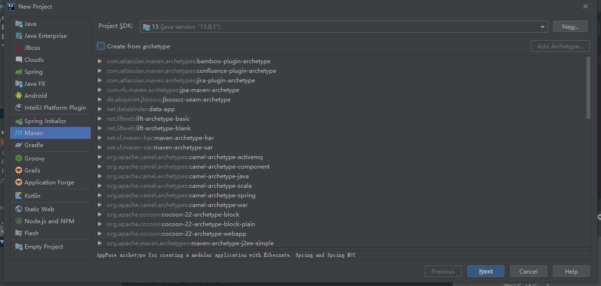
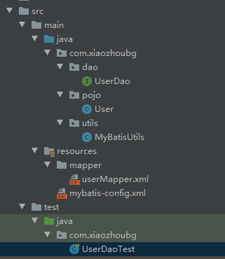
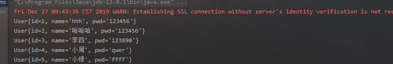

# 第02节：IDEA创建mybatis项目

### 一、创建项目模板

两种方法创建mybatis。

1. 去下载jar包然后手动导入到咱们的项目中

2. 创建maven类型的项目，然后配置pom.xml文件，利用pom.xml来配置jar包。

这里没有必要去手动下载jar包，很麻烦，咱们直接创建maven项目就好了。



不需要创建任何模板，一路next。

#### 添加数据库值

mybatis是操作数据库的，所以说在写之前先加入模拟的数据。

``` sql
CREATE DATABASE mybatis

USE mybatis

CREATE TABLE `user` (
  `id` int(20) NOT NULL,
  `name` varchar(32) DEFAULT NULL,
  `pwd` varchar(32) DEFAULT NULL,
  PRIMARY KEY  (`id`)
) ENGINE=InnoDB DEFAULT CHARSET=utf8;


insert  into `user`(`id`,`username`,`birthday`,`sex`,`address`) values (41,'老王','2018-02-27 17:47:08','男','北京'),(42,'小二王','2018-03-02 15:09:37','女','北京金燕龙'),(43,'小二王','2018-03-04 11:34:34','女','北京金燕龙'),(45,'传智播客','2018-03-04 12:04:06','男','北京金燕龙'),(46,'老王','2018-03-07 17:37:26','男','北京'),(48,'小马宝莉','2018-03-08 11:44:00','女','北京修正');
```

### 二、配置框架

接下来给项目进行配置

这是我的目录结构，一会配置文件的时候如果不知道在哪写就回来看一下目录。



#### 1.pom.xml

如果我们想使用mybatis，不仅要下载mybatis依赖，还要下载mysql依赖等。

``` xml
<!-- pom.xml -->

 <!--导入依赖-->
    <dependencies>
        <!--mysql驱动-->
        <dependency>
            <groupId>mysql</groupId>
            <artifactId>mysql-connector-java</artifactId>
            <version>5.1.17</version>
        </dependency>
        <!--mybatis-->
        <dependency>
            <groupId>org.mybatis</groupId>
            <artifactId>mybatis</artifactId>
            <version>3.5.2</version>
        </dependency>
        <!--junit-->
        <dependency>
            <groupId>junit</groupId>
            <artifactId>junit</artifactId>
            <version>4.12</version>
        </dependency>
    </dependencies>
```

#### 2.编写mybatis工具类

``` java
// MybatisUtils
package com.xiaozhoubg.utils;

import org.apache.ibatis.io.Resources;
import org.apache.ibatis.session.SqlSession;
import org.apache.ibatis.session.SqlSessionFactory;
import org.apache.ibatis.session.SqlSessionFactoryBuilder;

import java.io.IOException;
import java.io.InputStream;

public class MybatisUtils {
    private static SqlSessionFactory sqlSessionFactory;
    static {

        try {
            //    读取配置文件
            String resource = "mybatis-config.xml";
            InputStream inputStream = Resources.getResourceAsStream(resource);
            sqlSessionFactory = new SqlSessionFactoryBuilder().build(inputStream);
        } catch (IOException e) {
            e.printStackTrace();
        }

    }

    // 引用了 SqlSessionFactory，我们就可以从中获得 SqlSession 的实例了。
    // SqlSession 完全包含了面向数据库执行 SQL 命令所需的所有方法。
    // 你可以通过 SqlSession 实例来直接执行已映射的 SQL 语句。
    public  static SqlSession getSqlSession(){
        return sqlSessionFactory.openSession();
    }
}
```

#### 3.创建mybatis的主配置文件

再咱们的resources配置文件下面创建mybatis-config.xml文件。

``` xml
<?xml version="1.0" encoding="UTF-8" ?>
<!DOCTYPE configuration
        PUBLIC "-//mybatis.org//DTD Config 3.0//EN"
        "http://mybatis.org/dtd/mybatis-3-config.dtd">
<configuration>
    <environments default="development">
        <environment id="development">
            <transactionManager type="JDBC"/>
            <dataSource type="POOLED">
                <property name="driver" value="com.mysql.jdbc.Driver"/>
                <property name="url" value="jdbc:mysql://localhost:3306/mybatis"/>
                <property name="username" value="root"/>
                <property name="password" value="123456"/>
            </dataSource>
        </environment>
    </environments>
    <!--映射配置文件路径-->
    <mappers>
        <mapper resource="mapper/userMapper.xml"/>
    </mappers>
</configuration>
```

#### 4.编写实体类

``` java
// User
// 注意这个实体类里的私有类名必须和之前数据库创建的字段名名称一样
// 生成toString和getter and setter 和constructor方法
package com.xiaozhoubg.pojo;

public class User {
    private int id;
    private String name;
    private String pwd;

    public User() {
    }

    public User(int id, String name, String pwd) {
        this.id = id;
        this.name = name;
        this.pwd = pwd;
    }

    public int getId() {
        return id;
    }

    public void setId(int id) {
        this.id = id;
    }

    public String getName() {
        return name;
    }

    public void setName(String name) {
        this.name = name;
    }

    public String getPwd() {
        return pwd;
    }

    public void setPwd(String pwd) {
        this.pwd = pwd;
    }

    @Override
    public String toString() {
        return "User{" +
                "id=" + id +
                ", name='" + name + '\'' +
                ", pwd='" + pwd + '\'' +
                '}';
    }
}

```

#### 5.编写dao接口

``` java
// UserDao
package com.xiaozhoubg.dao;

import com.xiaozhoubg.pojo.User;
import java.util.List;

public interface UserDao {

    // 声明一个List类型，getUserList方法表示查询表单所有数据
    List<User> getUserList();
}
```

##### 6.创建映射文件

在resources文件夹下创建mapper文件夹，里面创建userMapper.xml文件

``` xml
<?xml version="1.0" encoding="UTF-8" ?>
<!DOCTYPE mapper
        PUBLIC "-//mybatis.org//DTD Mapper 3.0//EN"
        "http://mybatis.org/dtd/mybatis-3-mapper.dtd">
<!--namespace=绑定一个对应的mapper接口-->
<mapper namespace="com.xiaozhoubg.dao.UserDao">
    <!--select查询语句-->
    <!-- id对应接口中的方法，resultType对应实体类 -->
    <select id="getUserList" resultType="com.xiaozhoubg.pojo.User">
       <!-- 定义sql语句 -->
       select * from mybatis.user
   </select>
</mapper>
```

到这里咱们的基本配置就ok了。

### 三、配置框架流程分析

咱们已经创建好了基本环境，下面咱们把创建的流程分析一下，让大家有个具体的印象

1. 创建maven工程，导入依赖
2. 创建工具类，获取sqlSessionFactory，并且读取配置文件
3. 创建mybatis的主配置文件mybatis-config.xml来配置数据库
4. 编写实体类，变量要和数据库对应。 编写dao接口，里面写方法。
5. 创建映射文件，里面写sql语句，映射dao接口中的方法。

### 四、测试运行

在java测试类编写代码

``` java

package com.xiaozhoubg;

import com.xiaozhoubg.dao.UserDao;
import com.xiaozhoubg.pojo.User;
import com.xiaozhoubg.utils.MyBatisUtils;
import org.apache.ibatis.session.SqlSession;
import org.junit.Test;

import java.util.List;

public class UserDaoTest {
    @Test
    public void test(){
        //第一步：获得SqlSession对象
        SqlSession sqlSession = MyBatisUtils.getSqlSession();
        //执行SQL
        UserDao mapper = sqlSession.getMapper(UserDao.class);
        List<User> userList = mapper.getUserList();
        // 遍历了所有数据
        for (User user : userList) {
            System.out.println(user);
        }
        //关闭SqlSession
        sqlSession.close();
    }
}
```

run执行这个方法



### 四、总结

环境搭建好以后咱们以后写mybatis只需要修改接口和映射文件就ok了本节咱们配置了mybatis环境，本节的案例地址放在下一节的总结中了。下一节咱们实现数据库增删改查(CRDU)。
