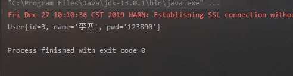

# 第03节：数据库操作(CRDU)

### 一、前言

本节咱们学习增删改查，以后实现增删改查只需要改他的接口和映射文件，就ok了。

慢慢的会发现mybatis真的用起来方便很多。

### 二、根据ID查询

#### 编写UserDao 接口

``` java
package com.xiaozhoubg.dao;

import com.xiaozhoubg.pojo.User;
import java.util.List;

public interface UserDao {

    List<User> getUserList();

//    根据ID查询用户
    User getUserById(int id);

}
```

#### 编写接口的映射文件

``` xml
<?xml version="1.0" encoding="UTF-8" ?>
<!DOCTYPE mapper
        PUBLIC "-//mybatis.org//DTD Mapper 3.0//EN"
        "http://mybatis.org/dtd/mybatis-3-mapper.dtd">
<!--namespace=绑定一个对应的mapper接口-->
<mapper namespace="com.xiaozhoubg.dao.UserDao">
    <!--查询所有-->
    <select id="getUserList" resultType="com.xiaozhoubg.pojo.User">
       /*定义sql*/
       select * from mybatis.user
   </select>

<!--    根据id查询-->
    <select id="getUserById" resultType="com.xiaozhoubg.pojo.User">
        select * from mybatis.user where id = #{id}
    </select>
</mapper>
```

#### 编写测试类

``` java
package com.xiaozhoubg;

import com.xiaozhoubg.dao.UserDao;
import com.xiaozhoubg.pojo.User;
import com.xiaozhoubg.utils.MyBatisUtils;
import org.apache.ibatis.session.SqlSession;
import org.junit.Test;

import java.util.List;

public class UserDaoTest {
    //查询全部
    @Test
    public void test(){
        //第一步：获得SqlSession对象
        SqlSession sqlSession = MyBatisUtils.getSqlSession();
        //执行SQL
        UserDao mapper = sqlSession.getMapper(UserDao.class);
        List<User> userList = mapper.getUserList();
        for (User user : userList) {
            System.out.println(user);
        }
        //关闭SqlSession
        sqlSession.close();
    }

    //根据ID查询
    @Test
    public void getUserById(){
        //获得SqlSession对象和mapper
        SqlSession sqlSession = MyBatisUtils.getSqlSession();
        UserDao mapper = sqlSession.getMapper(UserDao.class);

        //要查询的ID
        User user = mapper.getUserById(3);
        System.out.println(user);

        //关闭SqlSession
        sqlSession.close();
    }

}

```

运行会在控制台打印出对应ID的那条数据



### 三、增加数据

#### 编写UserDao接口

``` java
//    增加用户
    int addUser(User user);
```

#### 编写接口的映射文件

``` xml
    <insert id="addUser" parameterType="com.xiaozhoubg.pojo.User">
        insert into mybatis.user(id, name, pwd) value (#{id},#{name},#{pwd});
    </insert>
```

#### 编写测试类

``` java
    @Test
    public void addUser(){
        SqlSession sqlSession = MyBatisUtils.getSqlSession();
        UserDao mapper = sqlSession.getMapper(UserDao.class);

        mapper.addUser(new User(7, "沈剑心", "fff"));


        //提交请求方法
        sqlSession.commit();
        sqlSession.close();
    }
```

运行后去看一眼数据库里，会发现新添加了一条数据。

### 四、修改数据

#### 编写UserDao接口

``` java
//    修改用户
    int updateUser(User user);
```

#### 编写接口的映射文件

``` xml
<!--    根据ID修改用户-->
    <update id="updateUser" parameterType="com.xiaozhoubg.pojo.User">
        update mybatis.user set name=#{name},pwd=#{pwd} where id=#{id}
    </update>
```

#### 编写测试类

``` java
        @Test
        public void updataUser(){
        SqlSession sqlSession = MyBatisUtils.getSqlSession();
        UserDao mapper = sqlSession.getMapper(UserDao.class);

        mapper.updateUser(new User(8,"哈哈","666"));

        sqlSession.commit();
        sqlSession.close();
        }


```

### 五、删除数据

#### 编写UserDao接口

``` java
//    删除用户
    int delUser(int id);
```

#### 编写接口的映射文件

``` xml
<!--    根据ID删除用户-->
    <delete id="delUser" parameterType="com.xiaozhoubg.pojo.User">
        delete from mybatis.user where id=#{id}
    </delete>

```

#### 编写测试类

``` java
        @Test
        public void delUser(){
        SqlSession sqlSession = MyBatisUtils.getSqlSession();
        UserDao mapper = sqlSession.getMapper(UserDao.class);

        mapper.delUser(8);

        sqlSession.commit();
        sqlSession.close();
        }

```

### 六、总结

[案例地址](https://github.com/xiaozhoulee/java-examples/tree/master/15-mybatis/第03节%EF%BC%9A数据库操作(CRDU)/untitled1)

以上就是增删改查数据库内容的代码了，下一节学习