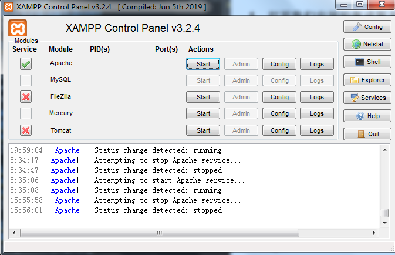
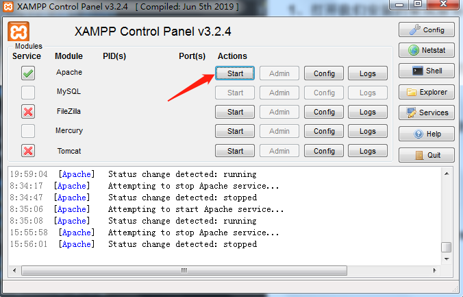
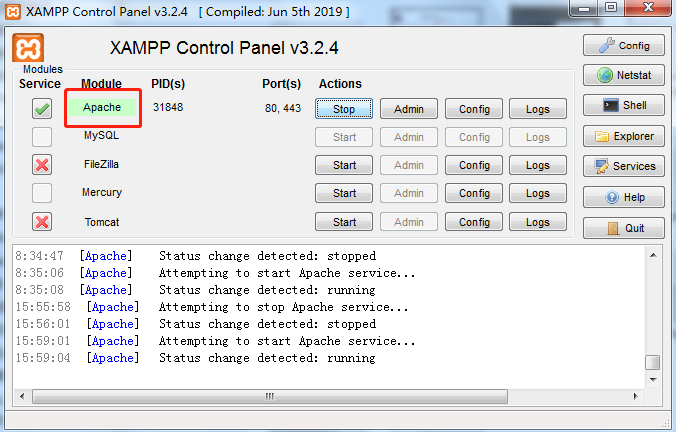
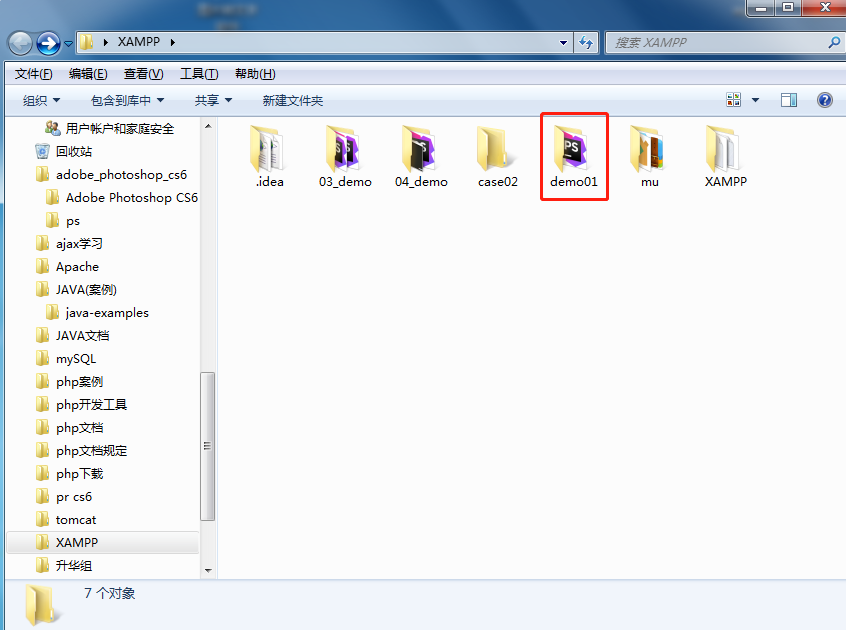
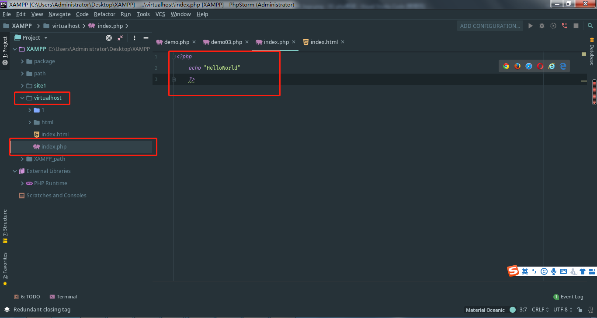
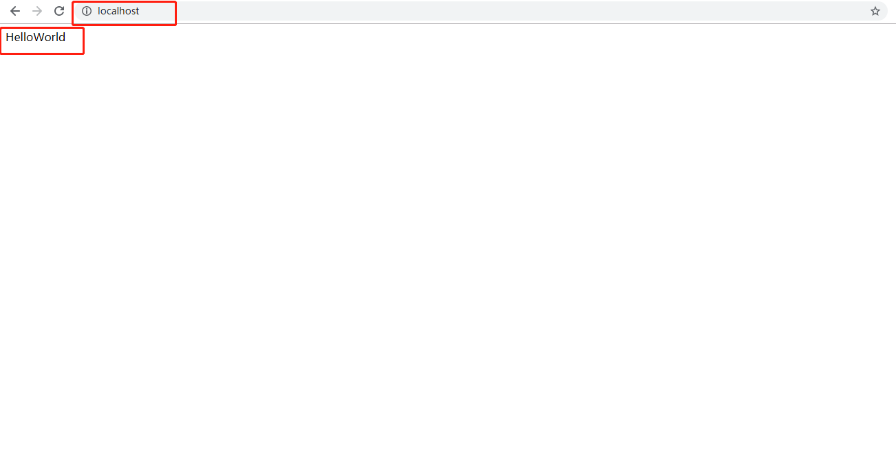

# 第04节:第一个php程序
上一节我们学习了怎么下载XAMPP以及如何通过此软件搭建集成服务器，本节我们之前学过的通过XAMPP来搭建集成服务器,写第一个php程序并输出HelloWorld

### 一、学习目标
把前几节学习的知识点统一，通过编辑器和集成服务器来写出我的第一个php程序并输出HelloWorld

### 二、我的第一个php程序
#### 1.打开我们安装的集成服务器XAMPP


#### 2.打开了xampp后，看到这个Apache，点击Start


只运行Apache这款软件就可以了，其他内容我们以后再去做系统的了解

#### 3.等到这个按钮变成了绿色了后，就证明我们已经开启了php的环境


#### 4.根据配置的虚拟主机路径


此时我创建了一个虚拟主机路径为:D:\XAMPP\demo01
提示:一定要在XAMPP==>apache==>conf==>extra==>httpd-vhosts.conf文件夹修改配置过后并把C盘==>Windows==>system32==>drivers==>etc==>hosts文件夹里面应用虚拟主机配置的域名才可以

#### 5.打开后，新建php文件，记住后缀名为 .php,我这儿新建了一个文件夹为index


#### 6.用编程工具打开刚才创建的index.php文件，打开php文件后输入以下代码保存就好了


echo是php中常用的输出语句类似于JavaScript里面的console.log，输出HelloWorld

#### 7.开游览器输入：localhost/index.php这就是我们刚才做的项目了



### 三、第一个HelloWorld步骤
* 1.通过XAMPP里面的Apache搭建一个集成服务器
* 2.通过phpStrom编辑软件来编写一个后缀名为.php的一个php文件
* 3.通过Apache搭建的这个服务器来为php进行解析，到浏览器执行php开始标签里面的语句(提示:如果不通过服务器来解析的话，浏览器收到的数据会是php解析出来的源码，源码是不会执行php语句的，会原封不动的显示出来)

实例如下所示：

``` php
<?php echo 'HelloWorld' ?>

输出:<?php echo 'HelloWorld' ?>
```

这样就相当于php没有执行，返回的是一段html的代码

通过本节的学习我们学习了如何运用以前学过的一些相关知识来进行第一个php程序的编写以及通过XAMPP搭建的服务器将php代码进行解析并展示在浏览器的页面上，php开始标签和输出语句将会在下一章中为大家讲解

### 四、作业
* 1.了解php当中的的执行原理和流程
* 2.熟练运用编写php程序的具体步骤
* 3.通过新配置的一个虚拟主机来运行php代码并输出 "你好 世界！"
