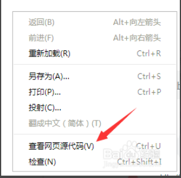

# 第02节:输出语句
上一节我们学到了php基本语法的注意事项，本节我们会讲解php当中的几种常用的输出语句

### 一、学习目标
php几种输出种语句的定义及每种输出语句都能输出什么类型的数据，如何通过输出语句来把数据打印在页面上

### 二、php当中的输出语句
本次向大家简单介绍php的几种输出方式：

* 1、echo 常用的输出语句，例如：echo 'helloworld！
* 2、print() 输出语句，有返回值。例如：print('helloworld!'); 输出成功返回1，失败返回0。
* 3、print_r(); 输出数组、对象等复合数据类型。例如:print_r($array);
* 4、var_dump(); 可以判断一个变量的类型与长度,并输出变量的数值。例如：var_dump('helloworld！');

为方便我们的记忆，先对这几种不同的输出方式做个对比。

* echo   - 可以输出一个或多个字符串
* print   - 只能输出简单类型变量的值,如int,string
* print_r - 可以输出复杂类型变量的值,如数组,对象
* var_dump -打印变量的相关信息,包括表达式的类型与值,通过缩进显示其结构。

提示：echo输出的速度比print快,echo是PHP语句,没有返回值,print和print_r是PHP函数,函数有返回值。

print_r返回值为true(bool类型)。

#### 1.echo
echo 是一个语言结构，使用的时候可以不用加括号，也可以加上括号： echo 或 echo()。

##### 显示字符串

下面的实例演示了如何使用 echo 命令输出字符串（字符串可以包含 HTML 标签）：

``` php
<?php
    echo "<h2>PHP is fun!</h2>";
    echo "Hello world!<br>";
    echo "I'm about to learn PHP!<br>";
    echo "This", " string", " was", " made", " with    multiple parameters.";
?>

```

输出结果：

``` php
PHP is fun!
 
Hello world!
I'm about to learn PHP!
This string was made with multiple parameters.
```

##### 显示变量

下面的实例演示了如何使用 echo 命令输出变量和字符串：

``` php
<?php
$txt1="Learn PHP";
$txt2="xiaozhou.com";
$cars=array("Volvo","BMW","Toyota");

echo $txt1;
echo "<br>";
echo "Study PHP at $txt2"; //这里外面用的是双引号，在php里，双引号是可以解析变量的
echo "<br>";
echo "My car is a {$cars[0]}";
```

结果：

``` php
Learn PHP

Study PHP at xiaozhou.com

My car is a Volvo
```

#### 2.print 语句
print 同样是一个语言结构，可以使用括号，也可以不使用括号： print 或 print()。

##### 显示字符串

下面的实例演示了如何使用 print 命令输出字符串（字符串可以包含 HTML 标签）：

``` php
<?php
    print "<h2>PHP is fun!</h2>";
    print "Hello world!<br>";
    print "I'm about to learn PHP!";
?>
```

输出结果：

``` php
PHP is fun!
 
Hello world!
I'm about to learn PHP!
```

##### 显示变量
下面的实例演示了如何使用 print 命令输出变量和字符串：
``` php
<?php
    $txt1="Learn PHP";
    $txt2="xiaozhou.com";
    $cars=array("Volvo","BMW","Toyota");
    
    print $txt1;
    print "<br>";
    print "Study PHP at $txt2";
    print "<br>";
    print "My car is a {$cars[0]}";
?>
```

输出结果：

``` php
Learn PHP
Study PHP at xiaozhou.com
My car is a Volvo
```

#### 3.print_r 语句
print_r 显示关于一个变量的易于理解的信息,如果给出的是 string、integer 或 float，将打印变量值本身。

如果给出的是 array，将会按照一定格式显示键和元素。object与数组类似。

使用时必须加上括号:print_r()。

小提示:print_r()会将把数组的指针移到最后边。使用 reset() 可让指针回到开始处。

##### 显示字符串
下面的实例演示了如何使用 print_r 命令输出字符串（字符串可以包含 HTML 标签）：

``` php
<?php
$txt1="Hello World!";
$cars=array("Volvo","BMW","Toyota");

print_r($txt1);
print_r($cars);
?>
```

输出结果：

``` php
Hello World!Array ( [0] => Volvo [1] => BMW [2] => Toyota ) <!-- 后面array是打印的$cars数组 -->
```

#### 4.var_dump
打印变量的相关信息，此函数显示关于一个或多个表达式的结构信息，包括表达式的类型与值。数组将递归展开值，通过缩进显示其结构。

``` php
<?php
$a = array(1, 2, array("a", "b", "c"));
var_dump($a);
?>
```

输出结果:

``` php
array(3) { [0]=> int(1) [1]=> int(2) [2]=> array(3) { [0]=> string(1) "a" [1]=> string(1) "b" [2]=> string(1) "c" } }
```

提示:在网页源代码里看比较清晰,通过浏览器渲染页面观看比较杂乱



通过源代码比较效果如下:

``` php
array(3) {
  [0]=>
  int(1) 前面是类型
  [1]=>
  int(2)
  [2]=>
  array(3) {
    [0]=>
    string(1) "a"
    [1]=>
    string(1) "b"
    [2]=>
    string(1) "c"
  }
}
```

再来一个例子

``` php
<?php
 
$b = 3.1;
$c = true;
var_dump($b, $c);
 
?>
``` 

输出结果:

``` php
float(3.1)
bool(true)
```


通过本节的讲解我们学习到了php的四种输出语句，每一种输出语句输出出来的数据都不太一样，可以在php输出语句中输出html的代码，var_drop可以打印变量的相关数据