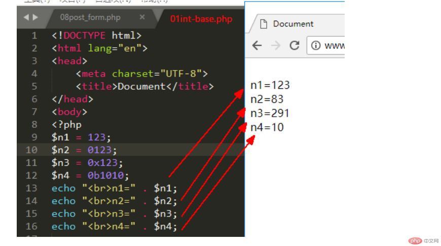
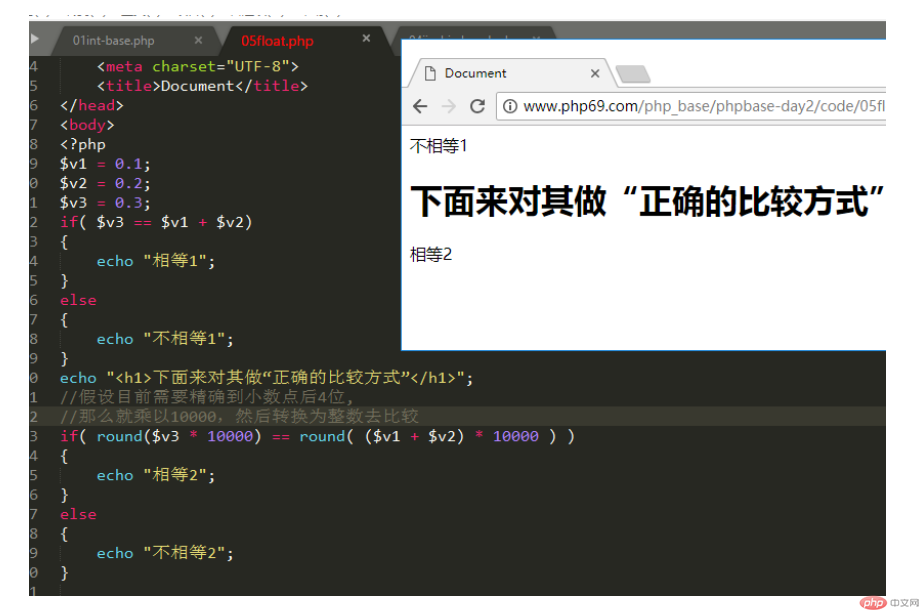

# 第03节:变量与数据类型
上一节我们学习了php当中的四种输出语句，本节我们会讲解php的变量的使用与数据类型的分类、判断及转换

### 一、学习目标
如何定义一个变量，怎么对一个定义好的变量进行赋值，定义变量的规则，数据类型的分类，怎么判断定义好的变量是什么数据类型，数据类型之间的相互转换

### 二、PHP的变量
变量是用于存储信息的"容器"：

``` php
实例
<?php
$x=5;
$y=6;
$z=$x+$y;
echo $z;
?>

```


#### 1.与代数类似

x=5
y=6
z=x+y

在代数中，我们使用字母（如 x），并给它赋值（如 5）。

从上面的表达式 z=x+y ，我们可以计算出 z 的值为 11。

在 PHP 中，这些字母被称为变量。

``` html
变量是用于存储数据的容器。
定义变量名时要做到见名知意
比如：定义年龄时用(age)
```

#### 2.PHP 变量规则：

* 变量以 $ 符号开始，后面跟着变量的名称
* 变量名必须以字母或者下划线字符开始
* 变量名只能包含字母数字字符以及下划线（A-z、0-9 和 _ ）
* 变量名不能包含空格
* 变量名是区分大小写的（$y 和 $Y 是两个不同的变量）

``` html
PHP 语句和 PHP 变量都是区分大小写的。
```

#### 3.创建（声明）PHP 变量
PHP 没有声明变量的命令。

变量在您第一次赋值给它的时候被创建：

实例:
``` php
<?php
$txt="Hello world!";
$x=5;
$y=10.5;
?>
```

在上面的语句执行中，变量 txt 将保存值为 Hello world!，且变量 x 将保存值为 5。

注释：当您赋一个文本值给变量时，请在文本值两侧加上引号。

### 三、php的数据类型
#### 1.数据类型的分类
##### 1、变量类型

也可以理解为简单类型、基本类型。包含以下4种类型：

* 字符串 string
* 整数类型 int
* 浮点类型   float  double 
* 布尔类型   bool    boolean

##### 2、复合类型 
* 1.数组

* 2.对象
##### 3、特殊类型
* 1.空类型null： 有且只有一个数据可以使用，那就是null。
* 2.资源类型resource：表示一种外部的可供php使用(操作)的资源（比如图片，数据库，文件等）。

#### 2.整型数据类型
##### 1、四种书写形式
* 1.十进制形式： 

``` html
$a = 123;
``` 

* 2.八进制形式：

```html
$b = 0123;      // 以0开头，只能出现0-7这8个数字
```

* 3.十六进制形式：

``` html
$c = 0x12A34   //  以0x开头，可以出现0-9，A-F这16个数字
```

* 4.二进制形式：

``` html
$d = 0b1011011010;     // 以0b开头，只能出现0和1这2个数字
```



##### 2、进制之间的相互转换
通过函数来进行转换。

1、10进制转2、8、16进制

* 1.decbin()：将10进制转为2进
* 2.decoct()：将10进制转为8进
* 3.dechex()：将10进制转为16进制

2、8、16进制转换成10进制

* 1.bindec()：将2进制数字字符串转为10进
* 2.octdec()：将8进制数字字符串转为10进
* 3.hexdec()：将16进制数字字符串转为10进制

#### 3.浮点数据类型
浮点数就是相当于数学上的“小数”

两种书写形式：

常规形式（带小数点）：
``` html
$f1 = 0.1;   //或者1.23;   123.0;
```

科学计数法形式（带e）：

``` html
$f2 = 1.23e3;  //表示1.23 乘以10的3次方

$f3 = 123e2;  //这个也是浮点数，虽然其结果值是一个“整数”（12300）

```

特别注意：浮点数不要随便做相等比较（==）：因为浮点数进行相等比较，是“不可靠”的：

``` html
$v1 = 0.1 + 0.2;
$v2 = 0.3;
问：$v1和$v2相等吗？
```

那怎么办？

需要在考虑精度的基础上，将浮点数转换为整数，然后进行“比较大小”，此时，在精度范围内，如果相等，我们就认为是相等的。将上述程序改造为：



#### 4.布尔类型boolean
 只有两个数据值： true，  false（不区分大小写）

在需要当做“布尔值”进行判断或比较的时候，以下数据会被当作布尔值的  false：
``` html
false,  0,  0.0, "",   null,  ‘0’,  空数组
```
其余都被当做布尔值的 true。

#### 5.字符串string
可以使用单引号或双引号来表示（引起来）。
表示一串“连续的字符”，最短的字符串是“空字符串”，比如： $str1  =  " "。
注意：这个不是空字符串：  " "，  因为其中包括了1个空格字符。

``` php
      $name  = "张三";

      $edu = "北京大学";

      $title = "关于微信应用的几个改进建议"； //文章标题

      $v1 = "";  //这也是字符串（空字符串）, 跟null不同！！！

      $v2 = '123';  //这还是字符串

      $v3 = "false";  //这仍然是字符串
```


``` html
     特别注意：

             双引号字符串中，如果出现“$”符号，则该符号后的连续字符（单词）会被识别为一个变量名。

             如果识别成功（即确实存在该变量），则会将该变量转换为实际内容。

             如果识别失败（即实际没有该变量），则会报错。
```

#### 6.数组类型array
 数组，就是将多个“数据”放在一起，排成一个有序序列，这个序列作为一个整体（里面包括了多个数据），就称                     为“数组”。比如：

 ``` php
 $info1  =  array(‘张三丰’,  18,  “男” );  

           //新版本中，还可以这样写： [‘张三丰’,  18,  “男” ]

           或： $info2  =  array(‘name’ => ‘张三丰’,  ‘age’=>18,  ‘gender’ => “男” );
 ```

#### 7.空类型NULL 
只有一个值： null（不区分大小写）。

``` php
$v1 = null; //此时，具有变量$v1,但其中的数据是“空的”（没有数据）
```
空值变量，isset()判断的结果是false（即不存在）

#### 8.类型判断
##### 1.gettype()
获取一个变量的类型，结果为一个变量类型的名称（字符串）

``` php
  $v1 = 10;

echo($r1 = gettype( $v1 )); //结果为：“integer”

echo '<br>';

$v2 = 'abc';

echo($r2 = gettype( $v2 )); //结果为：“string”

echo '<br>';

$v3 = 1.23;

echo($r3 = gettype( $v3 )); //结果为：“double”(返回的是double，但其实就是我们所说的float类型）
```

两个特殊判断：
##### 2.isset()
判断一个变量是否存在，或变量中是否有数据，有则返回true，否则返回false。

如果变量中有数据，返回true

如果变量中没有有数据，返回false

##### 3.empty()
判断是否为“空的”。如果确实是“空的”，返回true，否则返回false。
如果变量中的数据为空的，返回true
如果变量中的数据不是空的，返回false
空的”的意思，比较接近日常生活中的“没有”。以下值都是空的（empty）:
0， 0.0， ""， "0"， false， array(), //这几项，empty判断的结果都是true
而空（null）是一个计算机中的特殊概念，表示"完全不存在"，可以理解为"真空"。

#### 9.类型转换
##### 1.自动转换   
我们无需做任何处理，而是，程序会根据运算时运算符所需要的数据类型进行转换。

如果参与运算的数据不是需要的类型，则会自动转换为需要的数据类型。

``` php
echo($v1 = 1  +  '3'); //结果是4；

echo($v2 = 1  .  '3'); //“.”是字符串连接符，这里，1会被转换为字符串，结果是：“13”
```

规律：一个字符串当做数字，就会将该字符串的最前面的数字转换为数字值，如果没有，就为0

转换为整数（直接保留整数部分）：

``` php
10.8  %  3.6       // 先两边取整，再取余  结果是1
```

##### 2.强制转换
人为使用强转换语法进行转换，比如：

``` php

echo($v1 = (int) '1'); //结果，$v1是整数类型的1

echo('<br>');

echo($v2 = (float)  '1.23'); //结果，$v2是浮点类型的1.23

echo('<br>');

echo($v3 = (string) $v1); //结果，$v3是字符串“1”

```

通过本节的讲解什么是变量，变量的定义与赋值，变量的规定规则以及数据的六种数据类型，判断变量是什么数据类型，他们之间类型是怎么转换的

### 四、作业
* 1.建立变量Hello并赋值为Hello World
* 2.理解整数数据类型当中进制的转换形式
* 3.将浮点数据类型转换为整数数据类型并输出