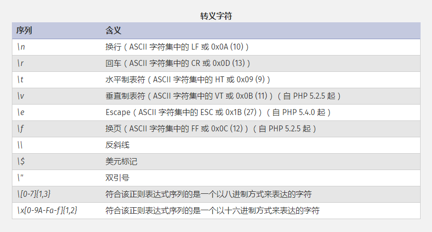
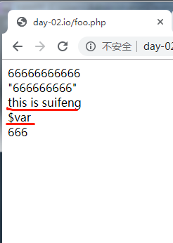
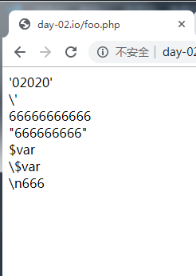

# 第04节:常量和字符串
上一节我们讲解了变量与数据类型的使用方式，本节介绍php当中常量的定义和用法以及字符串的方式表达

### 一、学习目标
常量当中的特点、命名规范及声明常量的三个方法，php当中字符串的语法定义，单引号和双引号的区别，新添两个语法糖的用法解析

### 二、php的常量
特点： 不能修改，不能销毁，不能删除，声明常量后，该常量可以在页面的任意处使用

声明常量的方法：const 、define、static

命名规范：和变量一样，但是全部大写

#### 1.define函数
define是函数，不能在对象中定义，但可在类中定义使用
实例代码如下：

``` php
define('CL',10);

echo CL;

//判断常量是否存在
if(defined('CL')){
echo 'ture';        
}else{
echo 'false';
}

//输出：10和true
```

#### 2.static静态常量
静态常量：是一个变量，可以通过常量的语法访问，就是 ::  ，可以没有实例化也能访问

注：static只初始化一次，递归调用时将不会被重复初始化

实例代码如下：

``` php
//定义静态常量
class Person{
    public static $a = "呵呵";
    public static function say(){
        echo "我丢：".self::$a."<br>";
    }
}
//输出静态属性
echo Person::$a."<br>";
//调用静态方法
Person::say();
//修改静态属性
Person::$a = "我靠";
echo Person::$a."<br>";
```

#### 3.const
const是一个语言结构，编译时要比define快，是为全局常量，可在对象里定义，类中使用，可理解为类常量

实例代码如下：

``` php
class CL
    {    
        //定义常量
        const CLS = '常量值';

        function a() {
                //调用常量方法
            echo self::CLS;
    
        }
    }

    (new CL)->a();//使用调用常量方法的这个函数
```

### 三、php的String 字符串
#### 1.简介
在PHP中这门语言中，因为是弱类型语言，因此使用变量时不需提前定义即可使用。

我们在使用php进行开发的时候，大多数使用双引号、单引号进行定义字符串。既然有这两种方式，那么他们之间肯定是有区别的。

并且，除了单双引号定义字符串这两种方式外，php还增加了heredoc和nowdoc这两种语法糖进行补充。

#### 2.语法
一个字符串可以用 4 种方式表达：
* 单引号
* 双引号
* heredoc
* nowdoc

##### 1、单引号
定义一个字符串的最简单的方法是用单引号把它包围起来（'字符 '）。

要表达一个单引号自身，需在它的前面加个反斜线（\）来转义。要表达一个反斜线自身，则用两个反斜线（\\\）。其它任何方式的反斜线都会被当成反斜线本身：也就是说如果想使用其它转义序列例如 \r 或者 \n，并不代表任何特殊含义，就单纯是这两个字符本身。

提示: 不像双引号和 heredoc 语法结构，在单引号字符串中的变量和特殊字符的转义序列将不会被替换。

``` php
<?php
echo 'this is a simple string';

// 可以录入多行
echo 'You can also have embedded newlines in 
strings this way as it is
okay to do';

// 输出： Arnold once said: "I'll be back"
echo 'Arnold once said: "I\'ll be back"';

// 输出： You deleted C:\*.*?
echo 'You deleted C:\\*.*?';

// 输出： You deleted C:\*.*?
echo 'You deleted C:\*.*?';

// 输出： This will not expand: \n a newline
echo 'This will not expand: \n a newline';

// 输出： Variables do not $expand $either
echo 'Variables do not $expand $either';
?>
```

##### 2、双引号
如果字符串是包围在双引号（"）中， PHP 将对一些特殊的字符进行解析：


和单引号字符串一样，转义任何其它字符都会导致反斜线被显示出来。PHP 5.1.1 以前，\{$var} 中的反斜线还不会被显示出来。

用双引号定义的字符串最重要的特征是变量会被解析，

##### 3、单双引号之间的区别
以上两者主要区别：
　　1、双引号会替换变量的值，而单引号会把它当做字符串输出。
　　2、对于转义的支持
　　3、性能速度问题，由于双引号中的字符串需要检测是否含有$符号修饰的变量，因此从理论上讲，单引号是比较快的。

##### 4、heredoc
heredoc可以理解为不使用双引号来定义字符串，但效果与使用双引号一致。【此时双引号相当于普通字符】

语法要求：
* 1、开始标记和结束标记使用相同的字符串，通常以大写字母来写。

* 2、开始标记后不能出现空格或多余的字符。

* 3、结束标记必须顶头写，不能有缩进和空格，且在结束标记末尾要有分号 。

* 4、位于开始标记和结束标记之间的变量可以被正常解析，但是函数则不可以。

实例代码如下：

``` php
$var = 'this is suifeng';

echo <<< "EOT"

<!DOCTYPE html>
<html>
<head>
    <meta http-equiv="Content-Type" content="text/html; charset=utf8" />
    <title></title>
</head>
<body>
66666666666<br/>
"666666666"<br/>
$var<br/>
\$var<br/>
\n666<br>
</body>
</html>

EOT;
```



从打印的结果我们可以看出：此时双引号仅仅只是一个普通字符；其他的效果和双引号的字符串效果一致。

##### 5、nowdoc
同理，nowdoc是不使用单引号来定义，但效果相当于使用单引号来定义的字符串。【此时单引号相当于普通字符】

语法同heredoc

实例代码如下：

``` php
<?php

$var = 'this is suifeng';

echo <<<'EOT'

<!DOCTYPE html>
<html>
<head>
    <meta http-equiv="Content-Type" content="text/html; charset=utf8" />
    <title></title>
</head>
<body>
'02020'<br/>
\'<br/>
66666666666<br/>
"666666666"<br/>
$var<br/>
\$var<br/>
\n666<br>
</body>
</html>

EOT;
```



注意：
定界符之后必须不能有任何字符【特别是空格字符有时会没注意到】，否则将会出错。

如上例中的EOT后面有空格就会报这个错误：【Parse error: syntax error, unexpected '<<' (T_SL)】

通过本节我们讲解了常量的特性和命名规范及三个定义常量的方法，php字符串的两种常用的表达方式：双引号("")、单引号('')，新增的语法糖：heredoc(类似双引号)、nowdoc(类似单引号)以及他们之间的区别

### 四、作业
* 1.可以自己写出常量三种方法的案例
* 2.熟记常量的特点、方法及使用地点，如：可以在类中使用
* 3.了解单引号和双引号的区别和新增的两个语法糖