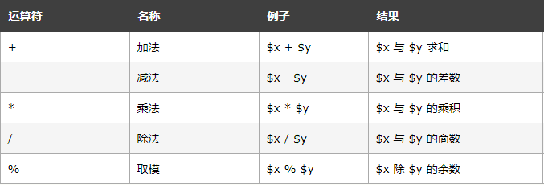
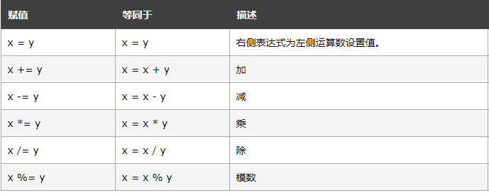
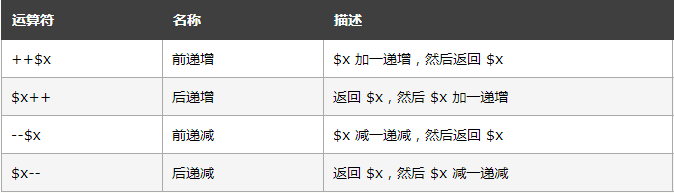
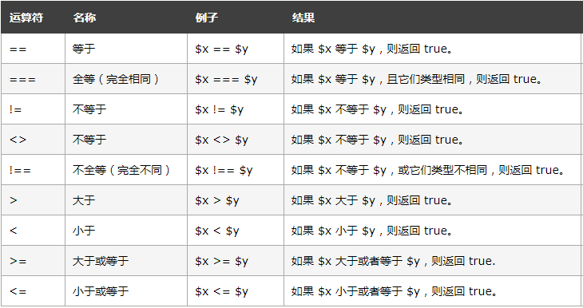
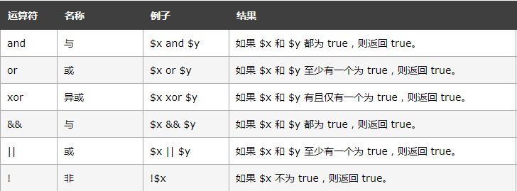
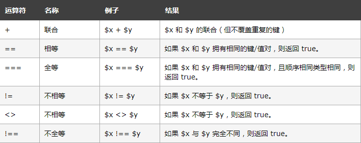

# 第05节:运算符
上一节我们介绍了常量和字符串的表达方式，本节我们将讲解php中不同运算符的定义与案例

### 一、学习目标
学习php当中的七种运算符及从不同实例中得到的不同结果

### 二、什么是运算符
什么是运算符？运算符是告诉PHP做相关运算的标识符号。例如，你需要计算123乘以456等于多少，这时候就需要一个符号，告诉服务器，你需要做乘法运算。

### 三、常用运算符分类
* 算数运算符
* 赋值运算符
* 字符串运算符
* 递增/递减运算符
* 比较运算符
* 逻辑运算符
* 数组运算符

#### 1、算数运算符
算术运算符主要是用于进行算术运算的，例如：加法运算、减法运算、乘法运算、除法运算。在PHP中的常用的算术运算符对应下表：


下例展示了使用不同算数运算符输出的不同结果：

实例代码如下：

``` php
<?php 
$x=17;
$y=8;
echo ($x + $y); // 输出 25
echo '<br>';
echo ($x - $y); // 输出 9
echo '<br>';
echo ($x * $y); // 输出 136
echo '<br>';
echo ($x / $y); // 输出 2.125
echo '<br>';
echo ($x % $y); // 输出 1
?>
```

#### 2、赋值运算符
赋值运算符主要是用于进行赋值运算的，在PHP中常用的赋值运算符如下表：



下例展示了使用不同赋值运算符的不同结果：

实例代码如下：

``` php
<?php 
$x=17;
echo $x; // 输出 17
echo '<br>';

$y=17;
$y += 8;
echo $y; // 输出 25
echo '<br>';

$z=17;
$z -= 8;
echo $z; // 输出 9
echo '<br>';

$i=17;
$i *= 8;
echo $i; // 输出 136
echo '<br>';

$j=17;
$j /= 8;
echo $j; // 输出 2.125
echo '<br>';

$k=17;
$k %= 8;
echo $k; // 输出 1
?>
```

#### 3、字符串运算符
字符串运算符是由“.”、“.=”两个字符组成，他们的作用是用来进行字符串拼接和拼接的同时进行赋值的效果，如下表：


下例展示了使用字符串运算符的结果：

实例代码如下：

``` php
<?php
$a = "Hello";
$b = $a . " world!";
echo $b; // 输出 Hello world!
echo ('<br>');

$x="Hello";
$x .= " world!";
echo $x; // 输出 Hello world!
?>
```

#### 4、递增/递减运算符
递增/递减运算符主要是用于进行递增运算的，例如：前递增、后递增、前递减、后递减。在PHP中常用的递增/递减运算符如下表：


下例展示了使用不同递增/递减运算符的不同结果：

实例代码如下：

``` php
<?php
$x=17; 
echo ++$x; // 输出 18

$y=17; 
echo $y++; // 输出 17

$z=17;
echo --$z; // 输出 16

$i=17;
echo $i--; // 输出 17
?>
```

注意：如果运算符在后面那就是先用 变量 进行运算在把 变量+1，如果运算符在前面那就是先把 变量+1 在进行运算

#### 5、比较运算符
比较运算符主要是用于进行比较运算的，例如：等于、全等、不等、大于、小于。在PHP中常用的比较运算符如下表：


下例展示了使用某些比较运算符的不同结果：

实例代码如下：

``` php
<?php
$x=17;
$y="17";

var_dump($x == $y); //true
echo "<br>";
var_dump($x === $y); //false
echo "<br>";
var_dump($x != $y); //falese
echo "<br>";
var_dump($x !== $y); //true
echo "<br>";

$a=17;
$b=8;

var_dump($a > $b); //true
echo "<br>";
var_dump($a < $b); //false
?>
```

#### 6、逻辑运算符
逻辑运算符主用是进行逻辑运算的，例如：逻辑与、逻辑或、逻辑异或、逻辑非等，在PHP中常用的逻辑运算符如下表：


逻辑运算符是PHP程序中一组非常重要的运算符，用来组合逻辑运算的结果

实例代码如下：

``` php
<?php

header("Content-type:text/html;charset=utf-8");  //什么使用UTF-8编码
$a = true;             //声明一个布尔型变量$a，赋值为真
$b = true;             //声明一个布尔型变量$b，赋值为真
$c = false;            //声明一个初值为假的布尔型变量$c
if($a or $b and $c){      //用or做判断

    echo "真";
}else{
    echo "假";
}
echo "<br/>";
if($a || $b and $c){      //用||做判断
    echo "真";
}else{
    echo "假";
}
?>

//输出：真,假
```

#### 7、数组运算符
数组(array)几乎存在于所有的编程语言中。不过，与Java、JavaScript等编程语言不同的是，在PHP中，数组还支持使用数组运算符来进行运算，就像做加法运算一样简单，并且显得非常优雅直观。

目前，PHP中的数组运算符如下表：


下例展示了使用不同数组运算符的不同结果：

实例代码如下：

``` php
<?php
$x = array("a" => "apple", "b" => "banana");
$y = array("c" => "orange", "d" => "peach");
$z = $x + $y; // $x 与 $y 的联合
var_dump($z);
var_dump($x == $y); //false
var_dump($x === $y); //false
var_dump($x != $y); //true
var_dump($x <> $y); //true
var_dump($x !== $y); //true
?>
```

### 四、总结

本节我们学习了七种运算符是怎么定义的以及他们的写法作用，图片是运算符的定义，通过运算符的定义实现基本效果

### 五、作业

* 熟练运用每个运算符当中不同的写法
* 了解运算符的优先级
* 理解递增/递减运算符中前++与后++的区别