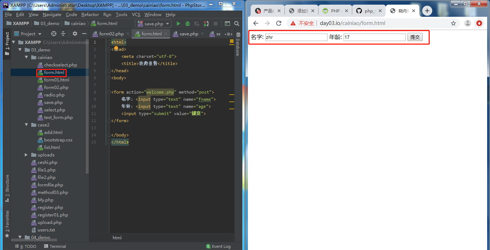
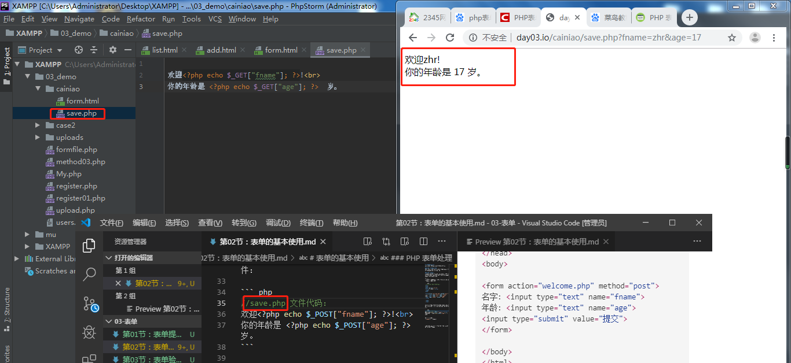

# 第02节:表单的基本使用
上一节我们介绍了表单交互的业务流程，本节我们来了解一下php表单传递数据的多种方式

### 一、学习目标
理解一个form表单把用户输入的数据通过多种方式来提交到另一个php文件中使用接受方法接受数据并处理

### 二、PHP 表单和用户输入
PHP 中的 \$_GET 和 \$_POST 变量用于检索表单中的信息，比如用户输入。

### 三、PHP 表单处理
有一点很重要的事情值得注意，当处理 HTML 表单时，PHP 能把来自 HTML 页面中的表单元素自动变成可供 PHP 脚本使用。

下面的实例包含了一个 HTML 表单，带有两个输入框和一个提交按
钮。

实例代码如下：

``` php
//form.html 文件中的代码：
<html>
<head>
<meta charset="utf-8">
<title>晓舟报告</title>
</head>
<body>
 
<form action="welcome.php" method="post">
名字: <input type="text" name="fname">
年龄: <input type="text" name="age">
<input type="submit" value="提交">
</form>
 
</body>
</html>
```

当用户填写完上面的表单并点击提交按钮时，表单的数据会被送往名为 "save.php" 的 PHP 文件：

``` php
//save.php 文件代码：
欢迎<?php echo $_POST["fname"]; ?>!<br>
你的年龄是 <?php echo $_POST["age"]; ?>  岁。
```

结果如下显示：

这是客户端提交数据页面

这是服务端接受数据并把数据打印的页面


### 三、PHP 获取下拉菜单的数据
#### 1.PHP 下拉菜单单选
以下实例我们设置了下拉菜单三个选项，表单使用 GET 方式获取数据，action 属性值为空表示提交到当前脚本，我们可以通过 select 的 name 属性获取下拉菜单的值

实例代码如下：

``` php
//select.php中的代码
<?php
$q = isset($_GET['q'])? htmlspecialchars($_GET['q']) : '';
if($q) {
    if($q =='xiaozhou') {
        echo '晓舟报告<br>http://www.xiaozhou.com';
    } else if($q =='GOOGLE') {
        echo 'Google 搜索<br>http://www.google.com';
    } else if($q =='TAOBAO') {
        echo '淘宝<br>http://www.taobao.com';
    }
} else {
    ?>
    <form action="" method="get">
        <select name="q">
            <option value="">选择一个站点:</option>
            <option value="xiaozhou">xiaozhou</option>
            <option value="GOOGLE">Google</option>
            <option value="TAOBAO">Taobao</option>
        </select>
        <input type="submit" value="提交">
    </form>
    <?php
}
?>
```
通过isset关键字验证用户是否选择了下拉列表当中的站点，未选择则重新填写，如有选择则根据select下拉列表中的name属性进行判断，如用户选择的是xiaozhou，则输出'晓舟报告<br>http://www.xiaozhou.com'，以此类推

#### 2.PHP 下拉菜单多选
如果下拉菜单是多选的（ multiple="multiple"），我们可以通过将设置 select name="q[]" 以数组的方式获取，以下使用 POST 方式提交


实例代码如下：

``` php
//checkselect.php中的代码
<?php
$q = isset($_POST['q'])? $_POST['q'] : '';
if(is_array($q)) {
    $sites = array(
        'xiaozhou' => '晓舟报告: http://www.xiaozhou.com',
        'GOOGLE' => 'Google 搜索: http://www.google.com',
        'TAOBAO' => '淘宝: http://www.taobao.com',
    );
    foreach($q as $val) {
        // PHP_EOL 为常量，用于换行
        echo $sites[$val] . PHP_EOL;
    }

} else {
    ?>
    <form action="" method="post">
        <select multiple="multiple" name="q[]">
            <option value="">选择一个站点:</option>
            <option value="xiaozhou">xiaozhou</option>
            <option value="GOOGLE">Google</option>
            <option value="TAOBAO">Taobao</option>
        </select>
        <input type="submit" value="提交">
    </form>
    <?php
}
?>
```
下拉菜单多选和下拉菜单类似，唯一不同的是点击提交时换成以数组的方式进行提交，接收到数组时则根据数组中选择的下拉列表进行输出

### 四、PHP 获取按钮表单数据
#### 1.PHP 单选按钮
PHP 单选按钮表单中 name 属性的值是一致的，value 值是不同的

实例代码如下：

``` php
//radio.php中的代码
<?php
$q = isset($_GET['q'])? htmlspecialchars($_GET['q']) : '';
if($q) {
    if($q =='xiaozhou') {
        echo '晓舟报告<br>http://www.xiaozhou.com';
    } else if($q =='GOOGLE') {
        echo 'Google 搜索<br>http://www.google.com';
    } else if($q =='TAOBAO') {
        echo '淘宝<br>http://www.taobao.com';
    }
} else {
    ?><form action="" method="get">
        <input type="radio" name="q" value="xiaozhou" />晓舟报告
        <input type="radio" name="q" value="GOOGLE" />Google
        <input type="radio" name="q" value="TAOBAO" />Taobao
        <input type="submit" value="提交">
    </form>
    <?php
}
?>
```
单选按钮和下拉框列表不同点，单选框没有select元素，所以他的name里面的值必须一样，这样才能通过name值来选取value里面的数据：xiaozhou，服务端接收到数据进行打印

#### 2.checkbox 多选按钮
PHP checkbox 复选框可以选择多个值：

``` php
//checkbox.php中的代码
<?php
$q = isset($_POST['q'])? $_POST['q'] : '';
if(is_array($q)) {
    $sites = array(
        'xiaozhou' => '晓舟报告: http://www.xiaohzou.com',
        'GOOGLE' => 'Google 搜索: http://www.google.com',
        'TAOBAO' => '淘宝: http://www.taobao.com',
    );
    foreach($q as $val) {
        // PHP_EOL 为常量，用于换行
        echo $sites[$val] . PHP_EOL;
    }

} else {
    ?><form action="" method="post">
        <input type="checkbox" name="q[]" value="xiaozhou"> 晓舟报告<br>
        <input type="checkbox" name="q[]" value="GOOGLE"> Google<br>
        <input type="checkbox" name="q[]" value="TAOBAO"> Taobao<br>
        <input type="submit" value="提交">
    </form>
    <?php
}
?>
```
复选框和下拉列表多选基本相同，不同的是复选框没有select元素只能通过name值一样来进行传值以及他的input属性为checkbox

通过本节的学习我们学习到了通过用户输入来进行表单的多种传值方法及服务端的处理逻辑

### 五、作业
* 1.熟练应用表单的多种传输方式
* 2.自己编写代码案例，加深印象
* 3.练习多选按钮，进行对猪、狗、猫、羊的多种选取及服务处理逻辑输出相关语句：猪肉真好吃！...