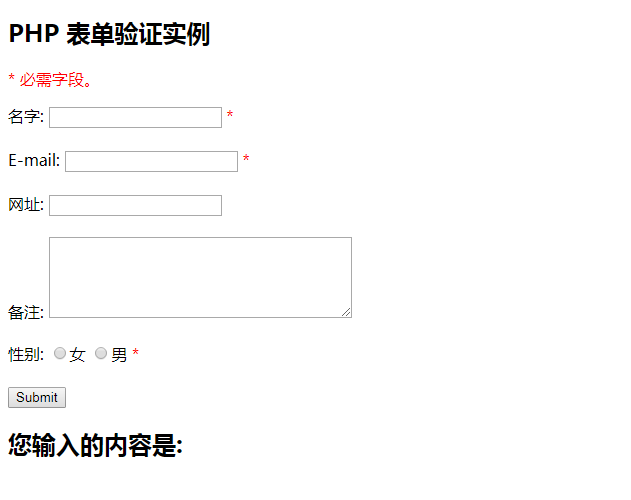

# 第03节:表单验证
上一节我们讲解了表单上传数据的多种方式，本节我们将介绍如何使用PHP验证客户端提交的表单数据,提高表单验证的安全性

### 一、学习目标
为了让表单更具有安全性防止黑客或垃圾信息的入侵以及表单验证的验证规则和所用表单字段的解释

### 二、PHP 表单验证
在处理PHP表单时我们需要考虑安全性。

在本节介绍的HTML表单中包含以下输入字段： 必须与可选文本字段，单选按钮，及提交按钮：



上述表单验证规则如下：

| 字段        | 验证规则            |
| ---   | ---       |
| 名字        | 必须。 只能包含字母和空格       |
| E-mail        | 必须。 必须是一个有效的电子邮件地址（包含'@'和'.'）        |
| 网址        | 可选。如果存在，它必须包含一个有效的URL       |
| 备注        | 	可选。多行输入字段（文本域）      |
| 性别        | 必须。 必须选择一个       |

首先让我们先介绍一下纯HTML的表单代码：

#### 1.文本字段
"名字", "E-mail", 及"网址"字段为文本输入元素，"备注"字段是用textarea标签(多行文本)来写的

实例代码如下：

``` php
“名字”: <input type="text" name="name">
E-mail: <input type="text" name="email">
网址: <input type="text" name="website">
备注: <textarea name="comment" rows="5" cols="40"></textarea>
```

#### 2.单选按钮
"性别"字段是单选按钮

实例代码如下：

``` php
性别:
<input type="radio" name="gender" value="female">女
<input type="radio" name="gender" value="male">男
```

#### 3.表单元素

实例代码如下：

``` php
<form method="post" action="<?php echo htmlspecialchars($_SERVER["PHP_SELF"]);?>">
```

该表单使用 method="post" 方法来提交数据，action当中的'htmlspecialchars'是为了防止黑客或垃圾数据进行入侵，\$_SERVER["PHP_SELF"]通过超级全局变量$_SERVER里面的参数PHP_SELF来指向当前执行文本的文件名

##### 什么是 $_SERVER["PHP_SELF"] 变量?
$_SERVER["PHP_SELF"]是超级全局变量，返回当前正在执行脚本的文件名

所以， $_SERVER["PHP_SELF"] 会发送表单数据到当前页面，而不是跳转到不同的页面。

##### 什么是 htmlspecialchars()方法?
htmlspecialchars() 函数把一些预定义的字符转换为 HTML 实体。
预定义的字符是：

* & （和号） 成为 &amp;
* " （双引号） 成为 &quot;
* ' （单引号） 成为 &#039;
* < （小于） 成为 &lt;
* \> （大于） 成为 &gt;


### 三、PHP表单中需引起注重的地方？
$_SERVER["PHP_SELF"] 变量有可能会被黑客使用！

当黑客使用跨网站脚本的HTTP链接来攻击时，\$_SERVER["PHP_SELF"]服务器变量也会被植入脚本。原因就是跨网站脚本是附在执行文件的路径后面的，因此$_SERVER["PHP_SELF"]的字符串就会包含HTTP链接后面的JavaScript程序代码。

提示:XSS又叫 CSS (Cross-Site Script) ,跨站脚本攻击。恶意攻击者往Web页面里插入恶意html代码，当用户浏览该页之时，嵌入其中Web里面的html代码会被执行，从而达到恶意用户的特殊目的。

### 四、如何避免 $_SERVER["PHP_SELF"] 被利用?
$_SERVER["PHP_SELF"] 可以通过 htmlspecialchars() 函数来避免被利用。
form 代码如下所示：
``` php
<form method="post" action="<?php echo htmlspecialchars($_SERVER["PHP_SELF"]);?>">
```

htmlspecialchars() 把一些预定义的字符转换为 HTML 实体。现在如果用户想利用 PHP_SELF 变量, 结果将输出如下所示：

``` php
<form method="post" action="test_form.php/&quot;&gt;&lt;script&gt;alert('hacked')&lt;/script&gt;">
```
尝试该漏洞失败！

### 五、使用 PHP 验证表单数据
首先我们对用户所有提交的数据都通过 PHP 的 htmlspecialchars() 函数处理。

当我们使用 htmlspecialchars() 函数时，在用户尝试提交以下文本域:
``` php
<script>location.href('http://www.xiaozhou.com')</script>
```

该代码将不会被执行，因为它会被保存为HTML转义代码，如下所示：

``` php
&lt;script&gt;location.href('http://www.xiaozhou.com')&lt;/script&gt;
```

以上代码是安全的，可以正常在页面显示或者插入邮件中。

当用户提交表单时，我们将做以下两件事情：

* 1、使用 PHP trim() 函数去除用户输入数据中不必要的字符 (如：空格，tab，换行)。
* 2、使用PHP stripslashes()函数去除用户输入数据中的反斜杠 (\\)

接下来让我们将这些过滤的函数写在一个我们自己定义的函数中，这样可以大大提高代码的复用性。

将函数命名为 test_input()。

现在，我们可以通过test_input()函数来检测 $_POST 中的所有变量

实例代码如下：

``` php
<?php
// 定义变量并默认设置为空值
$name = $email = $gender = $comment = $website = "";
 
if ($_SERVER["REQUEST_METHOD"] == "POST")
{
  $name = test_input($_POST["name"]);
  $email = test_input($_POST["email"]);
  $website = test_input($_POST["website"]);
  $comment = test_input($_POST["comment"]);
  $gender = test_input($_POST["gender"]);
}
 
function test_input($data)
{
  $data = trim($data);
  $data = stripslashes($data);
  $data = htmlspecialchars($data);
  return $data;
}
?>
```

注意我们在执行以上脚本时，会通过$_SERVER["REQUEST_METHOD"]来检测表单是否被提交 。如果 REQUEST_METHOD 是 POST, 表单将被提交 - 数据将被验证。如果表单未提交将跳过验证并显示空白。

在以上实例中使用输入项都是可选的，即使用户不输入任何数据也可以正常显示。

通过本节的学习我们学习到了如何让表单防止黑客恶意插入代码和怎么利用$_SERVER["PHP_SELF"]这个变量进行表单提交时指向点前运行的脚本文件，在接下来的章节中我们将介绍如何对用户输入的数据进行验证。

### 六、作业
* 1.可以独自编写案例的实例代码
* 2.深入学习$_SERVER["PHP_SELF"]变量和htmlspecialchars()方法
* 3.熟练运用安全表单数据的提交方式，防止黑客入侵