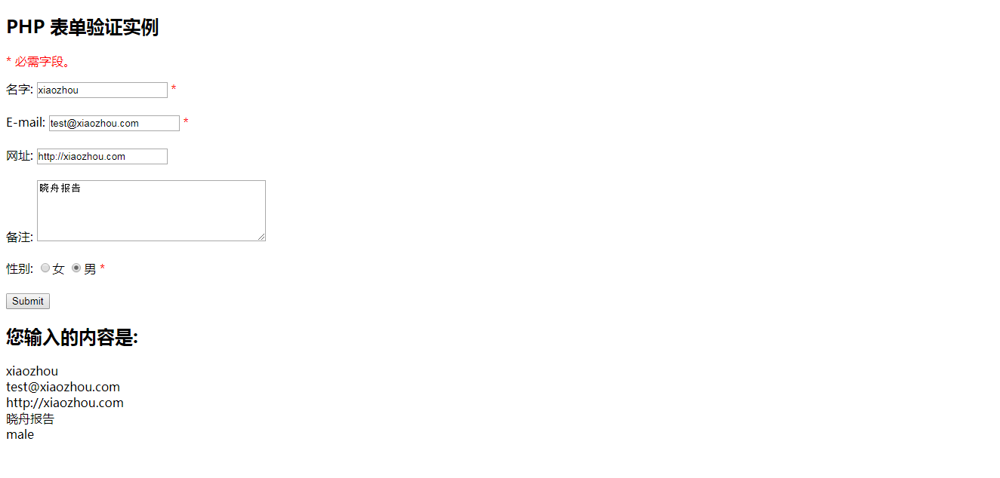

# 第06节:完整表单案例
上一节我们了解了如何表单中的邮箱、URL是否符合规范，本节将介绍如何让用户在点击"提交"按钮，提交数据前保证所有字段正确输入。

### 一、学习目标
通过HTML页面来检查字段值是否输入正确及完整实例展示

### 一、PHP-在表单中确保输入值
在用户点击提交按钮后，为确保字段值是否输入正确，我们在HTML的input元素中插添加PHP脚本， 各字段名为: name, email, 和 website。 在备注中的 textarea 字段中，我们将脚本放于 \<textarea> 和 \</textarea> 标签之间。

PHP脚本输出值为： \$name, \$email, \$website, 和 \$comment 变量。 

然后，我们同样需要检查被选中的单选按钮， 对于这一点，我们 必须设置好checked属性(不是radio按钮的 value 属性) :

``` php
<form method="post" action="<?php echo htmlspecialchars($_SERVER["PHP_SELF"]);?>"> 
   名字: <input type="text" name="name" value="<?php echo $name;?>">
   <span class="error">* <?php echo $nameErr;?></span>
   <br><br>
   E-mail: <input type="text" name="email" value="<?php echo $email;?>">
   <span class="error">* <?php echo $emailErr;?></span>
   <br><br>
   网址: <input type="text" name="website" value="<?php echo $website;?>">
   <span class="error"><?php echo $websiteErr;?></span>
   <br><br>
   备注: <textarea name="comment" rows="5" cols="40"><?php echo $comment;?></textarea>
   <br><br>
   性别:
   <input type="radio" name="gender" <?php if (isset($gender) && $gender=="female") echo "checked";?>  value="female">女
   <input type="radio" name="gender" <?php if (isset($gender) && $gender=="male") echo "checked";?>  value="male">男
   <span class="error">* <?php echo $genderErr;?></span>
   <br><br>
   <input type="submit" name="submit" value="Submit"> 
</form>
```


### 二、PHP-完整表单实例
以下是完整的PHP表单验证实例：案例地址:[demo01](https://github.com/xiaozhoulee/php_example/blob/master/03-%E8%A1%A8%E5%8D%95/%E7%AC%AC03%E8%8A%82%EF%BC%9A%E8%A1%A8%E5%8D%95%E9%AA%8C%E8%AF%81/demo01/form02.php)


实例中执行结果类似如下图所示：



通过本节的学习我们检查了表单字段值是否输入正确以及综合展示了之前做过得所有案例

### 三、作业
1.理解HTML页面里面字段值的含义
2.熟练运用demo01案例当中的所有知识点
3.应用以前学习的知识点写出一个简单的注册列表，内容为：用户名、密码、确认密码、同意用户协议