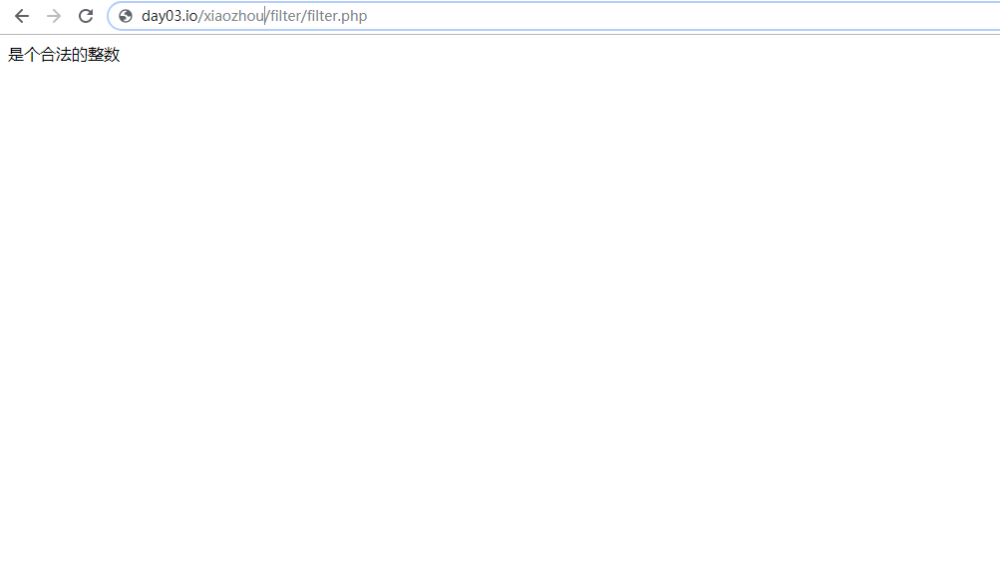
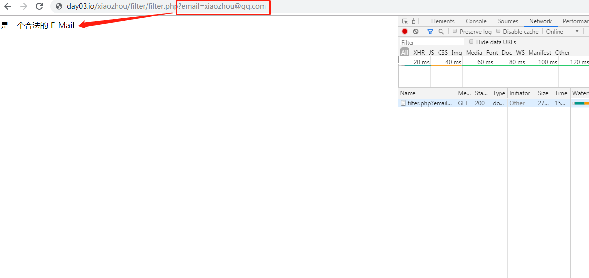
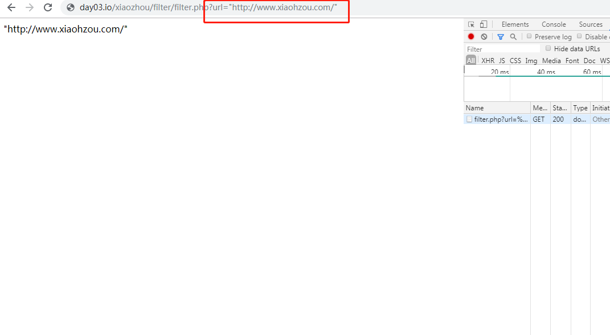

# 第12节:过滤器
上一节我们介绍了异常的多种不同处理方法，本节我们来学习过滤器的定义以及语法和讲解具体实例

### 一、学习目标
过滤器的定义，以及过滤器的多种过滤方法，与两种过滤器的应用领域，如何净化from表单传过来的URL

### 二、PHP 过滤器
#### 1.什么是 PHP 过滤器？
PHP 过滤器用于验证和过滤来自非安全来源的数据。

测试、验证和过滤用户输入或自定义数据是任何 Web 应用程序的重要组成部分。

PHP 的过滤器扩展的设计目的是使数据过滤更轻松快捷。

#### 2.为什么使用过滤器？
几乎所有的 Web 应用程序都依赖外部的输入。这些数据通常来自用户或其他应用程序（比如 web 服务）。通过使用过滤器，您能够确保应用程序获得正确的输入类型。

您应该始终对外部数据进行过滤！

输入过滤是最重要的应用程序安全课题之一。

什么是外部数据？
* 1、来自表单的输入数据
* 2、Cookies
* 3、Web services data
* 4、服务器变量
* 5、数据库查询结果

#### 3.函数和过滤器
如需过滤变量，请使用下面的过滤器函数之一：

* filter_var() - 通过一个指定的过滤器来过滤单一的变量
* filter_var_array() - 通过相同的或不同的过滤器来过滤多个变量
* filter_input - 获取一个输入变量，并对它进行过滤
* filter_input_array - 获取多个输入变量，并通过相同的或不同的过滤器对它们进行过滤

在下面的实例中，我们用 filter_var() 函数验证了一个整数：

实例代码如下：

``` php
<?php
$int = 123;
 
if(!filter_var($int, FILTER_VALIDATE_INT))
{
    echo("不是一个合法的整数");
}
else
{
    echo("是个合法的整数");
}
?>
```

上面的代码使用了 "FILTER_VALIDATE_INT" 过滤器来过滤变量。由于这个整数是合法的，因此上面的代码将输出：



如果我们尝试使用一个非整数的变量（比如 "123abc"），则将输出："Integer is not valid"的错误信息。

#### 4.Validating 和 Sanitizing

有两种过滤器：
Validating 过滤器：

* 1、用于验证用户输入
* 2、严格的格式规则（比如 URL 或 E-Mail 验证）
* 3、如果成功则返回预期的类型，如果失败则返回 FALSE

Sanitizing 过滤器：

* 1、用于允许或禁止字符串中指定的字符
* 2、无数据格式规则
* 3、始终返回字符串

#### 5.选项和标志
选项和标志用于向指定的过滤器添加额外的过滤选项。

不同的过滤器有不同的选项和标志。

在下面的实例中，我们用 filter_var() 和 "min_range" 以及 "max_range" 选项验证了一个整数：

实例代码如下：

``` php
<?php
$var=300;
 
$int_options = array(
    "options"=>array
    (
        "min_range"=>0,
        "max_range"=>256
    )
);
 
if(!filter_var($var, FILTER_VALIDATE_INT, $int_options))
{
    echo("不是一个合法的整数");
}
else
{
    echo("是个合法的整数");
}
?>

//输出：不是一个合法的整数
```

就像上面的代码一样，选项必须放入一个名为 "options" 的相关数组中。如果使用标志，则不需在数组内。

#### 6.验证输入
让我们试着验证来自表单的输入。

我们需要做的第一件事情是确认是否存在我们正在查找的输入数据。

然后我们用 filter_input() 函数过滤输入的数据。

在下面的实例中，输入变量 "email" 被传到 PHP 页面：

实例代码如下：

``` php
<?php
if(!filter_has_var(INPUT_GET, "email"))
{
    echo("没有 email 参数");
}
else
{
    if (!filter_input(INPUT_GET, "email", FILTER_VALIDATE_EMAIL))
    {
        echo "不是一个合法的 E-Mail";
    }
    else
    {
        echo "是一个合法的 E-Mail";
    }
}
?>
```

以上实例测试结果如下：



#### 7.实例解释
上面的实例有一个通过 "GET" 方法传送的输入变量 (email)：

* 1、检测是否存在 "GET" 类型的 "email" 输入变量
* 2、如果存在输入变量，检测它是否是有效的 e-mail 地址

#### 8.净化输入
让我们试着清理一下从表单传来的 URL。

首先，我们要确认是否存在我们正在查找的输入数据。

然后，我们用 filter_input() 函数来净化输入数据。

在下面的实例中，输入变量 "url" 被传到 PHP 页面：

实例代码如下：

``` php
<?php
if(!filter_has_var(INPUT_GET, "url"))
{
    echo("没有 url 参数");
}
else
{
    $url = filter_input(INPUT_GET, 
    "url", FILTER_SANITIZE_URL);
    echo $url;
}
?>
```

#### 9.实例解释
上面的实例有一个通过 "GET" 方法传送的输入变量 (url)：

* 1、检测是否存在 "GET" 类型的 "url" 输入变量
* 2、如果存在此输入变量，对其进行净化（删除非法字符），并将其存储在 $url 变量中

假如输入变量是一个类似这样的字符串："http://xiaozhou.com"，则净化后的 $url 变量如下所示：


#### 10.使用 Filter Callback
通过使用 FILTER_CALLBACK 过滤器，可以调用自定义的函数，把它作为一个过滤器来使用。这样，我们就拥有了数据过滤的完全控制权。

您可以创建自己的自定义函数，也可以使用已存在的 PHP 函数。

将您准备用到的过滤器的函数，按指定选项的规定方法进行规定。在关联数组中，带有名称 "options"。

在下面的实例中，我们使用了一个自定义的函数把所有 "_" 转换为 "."：

实例代码如下：

``` php
<?php
function convertSpace($string)
{
    return str_replace("_", ".", $string);
}

$string = "www_xiaozhou_com!";

echo filter_var($string, FILTER_CALLBACK,
    array("options"=>"convertSpace"));
?>

//输出：www.xiaozhou.com!
```

#### 11.实例解释
上面的实例把所有 "_" 转换成 "." ：
* 1、创建一个把 "_" 替换为 "." 的函数
* 2、调用 filter_var() 函数，它的参数是 FILTER_CALLBACK 过滤器以及包含我们的函数的数组

通过本节的学习我们学到了可以通过filter_var()、filter_input来过滤变量或用户输入的变量以及Validating 和 Sanitizing这两种的应用领域，通过表单传来的 URL，我们用 filter_input() 函数来净化输入数据（删除非法字符）

### 三、作业
* 1.理解过滤器的定义以及过滤器的多种过滤方法与不同过滤器相关的作用
* 2.手动编写本节相关案例并理解案例解析，加深印象
* 3.熟练运用本节相关知识点以及可以独自书写相关案例