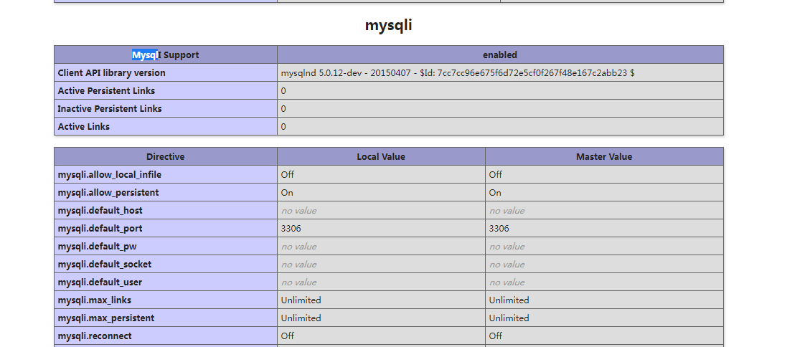
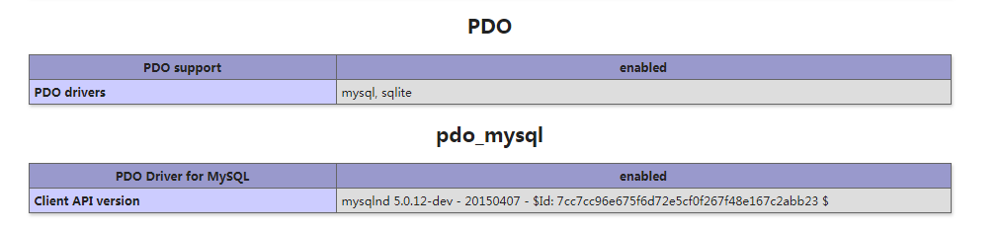

# 第02节:PHP 连接 MySQL
上一节我们了解了mysql的一个大致的轮廓，本节我们将介绍php连接mysql的三种方式

### 一、学习目标

通过三种不同的方法来实现php连接数据库，以及mysql数据库的注意事项

### 二、PHP 连接 MySQL

PHP 5 及以上版本建议使用以下方式连接 MySQL :

* MySQLi extension ("i" 意为 improved)
* PDO (PHP Data Objects)

在 PHP 早期版本中我们使用 MySQL 扩展。但该扩展在 2012 年开始不建议使用。

#### 1.我是该用 MySQLi ，还是 PDO?

如果你需要一个简短的回答，即 "你习惯哪个就用哪个"。

MySQLi 和 PDO 有它们自己的优势：

PDO 应用在 12 种不同数据库中， MySQLi 只针对 MySQL 数据库。

所以，如果你的项目需要在多种数据库中切换，建议使用 PDO ，这样你只需要修改连接字符串和部分查询语句即可。 使用 MySQLi, 如果不同数据库，你需要重新编写所有代码，包括查询。

两者都是面向对象, 但 MySQLi 还提供了 API 接口。

两者都支持预处理语句。 预处理语句可以防止 SQL 注入，对于 web 项目的安全性是非常重要的。

#### 2.MySQLi 和 PDO 连接 MySQL 的实例

在本章节及接下来的章节中，我们会使用以下三种方式来演示 PHP 操作 MySQL:

* MySQLi (面向对象)
* MySQLi (面向过程)
* PDO

#### 3.MySQLi 安装

Linux 和 Windows: 在 php5 mysql 包安装时 MySQLi 扩展多数情况下是自动安装的。

可以通过 phpinfo() 查看是否安装成功：



找到phpinfo() 函数打印的上面mysqli这条信息，若果有就说明安装php时自动安装了MySQLi

#### 4.PDO 安装

可以通过 phpinfo() 查看是否安装成功：



如果phpinfo() 函数有打印出pdo这条信息，说明pdo也自动安装成功了

#### 5.连接 MySQL

在我们访问 MySQL 数据库前，我们需要先连接到数据库服务器

案例如下所示：

``` php
//实例 (MySQLi - 面向对象)

<?php
$servername = "localhost";
$username = "username";
$password = "password";
 
// 创建连接
$conn = new mysqli($servername, $username, $password);
 
// 检测连接
if ($conn->connect_error) {
    die("连接失败: " . $conn->connect_error);
} 
echo "连接成功";
?>
```

``` php
//实例 (MySQLi - 面向过程)

<?php
$servername = "localhost";
$username = "username";
$password = "password";
 
// 创建连接
$conn = mysqli_connect($servername, $username, $password);
 
// 检测连接
if (!$conn) {
    die("Connection failed: " . mysqli_connect_error());
}
echo "连接成功";
?>
```

``` php
//实例 (PDO)

<?php
$servername = "localhost";
$username = "username";
$password = "password";
 
try {
    // 连接数据库
    $conn = new PDO("mysql:host=$servername;", $username, $password);
    echo "连接成功"; 
}
catch(PDOException $e)
{
    echo $e->getMessage();
}
?>
```

总结：连接数据库必须要有的三个参数：mysql服务器地址(servername)、mysql用户名(username)、mysql密码(password)，以上三个实例中用户名密码一定要输入正确，如没有修改的话：默认的servername是"localhost"，默认用户名是"root"，密码是"123456"

如果您的密码您不知道的话，请查看我们[前端学习手册](http://www.xiaozhoubg.com/content/1) /MySQL这一章节中的内容，里面有对应修改密码的sql语句

#### 6.关闭连接

连接在脚本执行完后会自动关闭。你也可以使用以下代码来关闭连接：

案例如下所示：

``` php
//实例 (MySQLi - 面向对象)

$conn->close();
```

``` php
//实例 (MySQLi - 面向过程)

mysqli_close($conn);
```

``` php
//实例 (PDO)

$coon = null;
```

### 三、总结

本节我们学习了php连接mysql的三种不同方法： MySQLi - 面向对象 、 MySQLi - 面向过程 、 PDO 这三种方法，下一节我们将学习通过php 来创建 mysql数据库

### 四、作业

* 创建一个php文件，通过我们上面学习的三种连接mysql的方法，进行连接并成功输出连接成功
* 根据对应的连接方法关闭连接，实现在php中退出mysql的效果
* 科普一下 mysqli 和 pdo 的区别在哪里