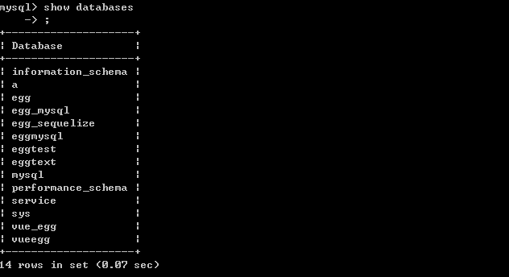
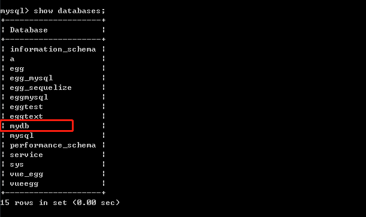
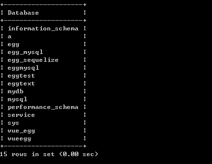
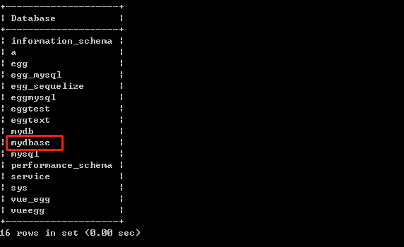
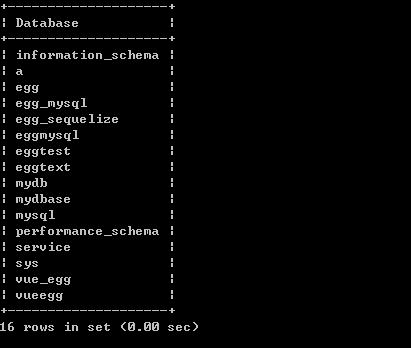
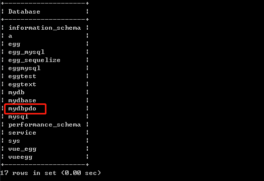
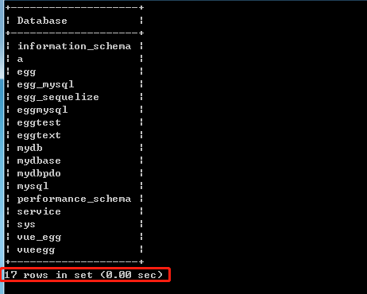

# 第03节:PHP MySQL 创建数据库
上一节我们介绍了 php 连接 mysql 的三种方法，本节我们来讲解使用php 对 mysql 数据库进行建库的操作

### 一、学习目标

学习如何使用 mysqli 和 pdo 这两种方法在 mysql 中进行创建数据库，以及建库的注意事项

### 二、PHP MySQL 创建数据库

数据库存有一个或多个表。

你需要 CREATE 权限来创建或删除 MySQL 数据库。

#### 使用 MySQLi 和 PDO 创建 MySQL 数据库

CREATE DATABASE 语句用于在 MySQL 中创建数据库。

以下三个示例中，分别创建了三个不同的数据库，分别是："myDB"，"myDBASE"，"myDBPDO"

第一个示例(面向对象)：

``` php
//实例 (MySQLi - 面向对象)

<?php
$servername = "localhost";
$username = "username";
$password = "password";
 
// 创建连接
$conn = new mysqli($servername, $username, $password);
// 检测连接
if ($conn->connect_error) {
    die("连接失败: " . $conn->connect_error);
} 
 
// 创建数据库
$sql = "CREATE DATABASE myDB";
if ($conn->query($sql) === TRUE) {
    echo "数据库创建成功";
} else {
    echo "Error creating database: " . $conn->error;
}
 
$conn->close();
?>
```

通过CREATE DATABASE 关键字 创建一个名为myDB的数据库，判断如果mysql里面有没有myDB的这个数据库，如果有则输出"数据库创建成功"，没有则返回报错信息，最后通过 close() 函数关闭掉所创建的这个数据库

请看数据库中创建与未创建对比图如下：


这是未创建数据库时的图


这是创建数据库以后的图，我们会发现多出了上面我们所创的mydb这个数据库，数据库默认都是小写所以myDB才会变成mydb


注意：当你创建一个新的数据库时，你必须为 mysqli 对象指定三个参数 (servername, username 和 password)。

第二个示例(面向过程)：

``` php
//实例 (MySQLi - 面向过程)

<?php
$servername = "localhost";
$username = "username";
$password = "password";
 
// 创建连接
$conn = mysqli_connect($servername, $username, $password);
// 检测连接
if (!$conn) {
    die("连接失败: " . mysqli_connect_error());
}
 
// 创建数据库
$sql = "CREATE DATABASE myDBASE";
if (mysqli_query($conn, $sql)) {
    echo "数据库创建成功";
} else {
    echo "Error creating database: " . mysqli_error($conn);
}
 
mysqli_close($conn);
?>
```

这种案例方法和 面向对象 的方法上面基本相同，唯一不同的是代码的书写上有一些区别，但最后的结果都是创建一个数据库

注意：我们此时的数据库是myDBASE，如果是之前的数据库名的话，将会报出错误 Error creating database: Can't create database 'mydbase'; database exists 数据库名重复

请看数据库中创建与未创建对比图如下：


这是未创建数据库时的图


这是创建数据库以后的图

第三个示例(PDO)：

``` php
//实例(PDO)

<?php
$servername = "localhost";
$username = "username";
$password = "password";

try {
    //连接数据库
    $conn = new PDO("mysql:host=$servername", $username, $password);

    // 设置 PDO 错误模式为异常
    $conn->setAttribute(PDO::ATTR_ERRMODE, PDO::ERRMODE_EXCEPTION);
    $sql = "CREATE DATABASE myDBPDO";

    // 使用 exec() ，因为没有结果返回
    $conn->exec($sql);

    echo "数据库创建成功<br>";
}
catch(PDOException $e)
{
    echo $sql . "<br>" . $e->getMessage();
}

$conn = null;
?>
```

使用 PDO 创建数据库的最大好处是在数据库查询过程出现问题时可以使用异常类来 处理问题。如果 try{ } 代码块出现异常，脚本会停止执行并会跳到第一个 catch(){ } 代码块执行代码。 在以上捕获的代码块中我们输出了 SQL 语句并生成错误信息

请看数据库中创建与未创建对比图如下：


这是未创建数据库时的图


这是创建数据库以后的图

注意：查询出来的数据库下面紧跟着的那一行代码的作用是 统计mysql里面一共有条数据，查询表也是一样，关于查询的sql语句内容请看本站 [前端学习手册](http://www.xiaozhoubg.com/content/1) /MySQL这一章节中的内容



### 三、总结

本节我们学习了使用 MySQLi 和 PDO 里面的三种方法在 mysql 当中创建数据库，注意：在创建数据库的时候，库名一定要不一致否则会报出数据库名重复的错误，下一节我们将会学习通过 php 对 mysql数据库 表结构 的创建