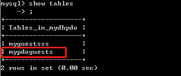

# 第04节:PHP MySQL 创建数据表
上一节我们讲解了如何运用php对数据库进行建库的操作，本节我们来介绍使用php 对 mysql数据库进行 建表的操作

### 一、学习目标

学习如何使用 mysqli 和 pdo 这两种方法在 mysql数据库中进行创建表结构，以及建表的注意事项

### 二、PHP 创建 MySQL 表

一个数据表只有一个唯一名称，并由行和列组成。

#### 使用 MySQLi 和 PDO 创建 MySQL 数据表

CREATE TABLE 语句用于创建 MySQL 表

创建表前，我们需要使用 use myDB 来选择要操作的数据库：

``` php
use myDB;
```

我们将创建一个名为 "MyGuests" 的表，有 5 个列： "id", "firstname", "lastname", "email" 和 "reg_date":

``` php
CREATE TABLE MyGuests (
    id INT(6) UNSIGNED AUTO_INCREMENT PRIMARY KEY,
    firstname VARCHAR(30) NOT NULL,
    lastname VARCHAR(30) NOT NULL,
    email VARCHAR(50),
    reg_date TIMESTAMP
)
```

上表中的注意事项:
数据类型指定列可以存储什么类型的数据。完整的数据类型请参考我们的 [前端学习手册](http://www.xiaozhoubg.com/content/1) /MySQL这一章节下的内容。

在设置了数据类型后，你可以为每个列指定其他选项的属性：

* NOT NULL - 每一行都必须含有值（不能为空），null 值是不允许的。
* DEFAULT value - 设置默认值
* UNSIGNED - 使用无符号数值类型，0 及正数
* AUTO INCREMENT - 设置 MySQL 字段的值在新增记录时每次自动增长 1
* PRIMARY KEY - 设置数据表中每条记录的唯一标识。 通常列的 PRIMARY KEY 设置为 ID 数值，与 AUTO_INCREMENT 一起使用。

每个表都应该有一个主键(本列为 "id" 列)，主键必须包含唯一的值。

##### 以下三个示例展示了如何在 PHP 中创建表

第一个示例(面向对象)：

``` php
//实例 (MySQLi - 面向对象)

<?php
$servername = "localhost";
$username = "username";
$password = "password";
$dbname = "myDB";
 
// 创建连接
$conn = new mysqli($servername, $username, $password, $dbname);
// 检测连接
if ($conn->connect_error) {
    die("连接失败: " . $conn->connect_error);
} 
 
// 使用 sql 创建数据表
$sql = "CREATE TABLE MyGuests (
id INT(6) UNSIGNED AUTO_INCREMENT PRIMARY KEY, 
firstname VARCHAR(30) NOT NULL,
lastname VARCHAR(30) NOT NULL,
email VARCHAR(50),
reg_date TIMESTAMP
)";
 
if ($conn->query($sql) === TRUE) {
    echo "已成功创建MyGuests表";
} else {
    echo "创建数据表错误: " . $conn->error;
}
 
$conn->close();
?>
```

通过创建连接的第四个参数($dbname)，进入我们之前所创建的myDB这个数据库中用 sql语句 创建MyGuests表，firstname、lastname、email、reg_date是MyGuests这个表中的字段，后面跟着的是字段的属性

请看数据库中创建与未创建对比图：


这是建表之前的图，图中显示这个数据库中没有表


创建表之后的图，发现会多出了我们所创建的myguests这个表，这样就说明我们建表成功了

第二个示例(面向过程)：

``` php
//实例 (MySQLi - 面向过程)

<?php
$servername = "localhost";
$username = "username";
$password = "password";
$dbname = "myDB";
 
// 创建连接
$conn = mysqli_connect($servername, $username, $password, $dbname);
// 检测连接
if (!$conn) {
    die("连接失败: " . mysqli_connect_error());
}
 
// 使用 sql 创建数据表
$sql = "CREATE TABLE MyGuestss (
id INT(6) UNSIGNED AUTO_INCREMENT PRIMARY KEY, 
firstname VARCHAR(30) NOT NULL,
lastname VARCHAR(30) NOT NULL,
email VARCHAR(50),
reg_date TIMESTAMP
)";
 
if (mysqli_query($conn, $sql)) {
    echo "数据表 MyGuestss 创建成功";
} else {
    echo "创建数据表错误: " . mysqli_error($conn);
}
 
mysqli_close($conn);
?>
```

和第一个示例类似，我们就不在此过多介绍了

请看数据库中创建与未创建对比图：


这是建表之前的图，图中显示这个数据库中只有之前我们所创的一个表


创建表之后的图，发现会多出了我们所创建的myguestss这个表

第三个示例(pdo)：

``` php
//实例 (PDO)

<?php
$servername = "localhost";
$username = "username";
$password = "password";
$dbname = "myDBPDO";
 
try {
    $conn = new PDO("mysql:host=$servername;dbname=$dbname", $username, $password);
    // 设置 PDO 错误模式，用于抛出异常
    $conn->setAttribute(PDO::ATTR_ERRMODE, PDO::ERRMODE_EXCEPTION);
 
    // 使用 sql 创建数据表
    $sql = "CREATE TABLE MyGuests (
    id INT(6) UNSIGNED AUTO_INCREMENT PRIMARY KEY, 
    firstname VARCHAR(30) NOT NULL,
    lastname VARCHAR(30) NOT NULL,
    email VARCHAR(50),
    reg_date TIMESTAMP
    )";
 
    // 使用 exec() ，没有结果返回 
    $conn->exec($sql);
    echo "数据表 MypdoGuests 创建成功";
}
catch(PDOException $e)
{
    echo $sql . "<br>" . $e->getMessage();
}
 
$conn = null;
?>
```

注意：我们创建表的位置在 myDBPDO 的这个数据库下，所以要查看mysql数据库的话 要切换到mydbpdo这个数据库下,查询mysql内容的 sql 语句请看本站[前端学习手册](http://www.xiaozhoubg.com/content/1) /MySQL这一章节中的内容

请看数据库中表的创建与未创建对比图：


这是建表之前的图，图中显示这个mydbpdo数据库中没有任何一个表


创建表之后的图，发现会多出了我们所创建的这个表

### 三、总结

本节我们学习了通过 面向对象、面向过程、pdo 这三种方法进行对表结构的创建，下一节我们将学习如何对创建的 这个表结构 插入数据
