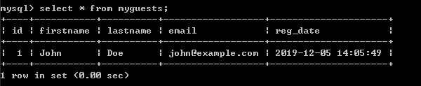
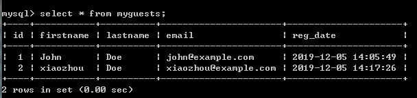

# 第05节:PHP MySQL 插入数据
上一节我们介绍了通过 php 来对 myqsl数据库进行创建表结构的操作，本节我们来学习创建表结构之后在一些所需字段中进行插入数据

### 一、学习目标
学习在表中插入数据的规定规范，以及如何通过 php 对表中的字段进行插入数据

### 二、PHP MySQL 插入数据

#### 使用 MySQLi 和 PDO 向 MySQL 插入数据

在创建完数据库和表后，我们可以向表中添加数据。

以下为一些语法规则：

* PHP 中 SQL 查询语句必须使用引号
* 在 SQL 查询语句中的字符串值必须加引号
* 数值的值不需要引号
* NULL 值不需要引号

INSERT INTO 语句通常用于向 MySQL 表添加新的记录

语法：

``` php
INSERT INTO table_name (column1, column2, column3,...)
VALUES (value1, value2, value3,...)
```

想要学习更多关于 SQL语句 的知识，请查看我们的 [前端学习手册](http://www.xiaozhoubg.com/content/1) /MySQL这一章节中的内容

在前面的几个章节中我们已经创建了表 "MyGuests"，表字段有: "id", "firstname", "lastname", "email" 和 "reg_date"。 现在，让我们开始向表填充数据。

注意： 如果列设置 AUTO_INCREMENT (如 "id" 列) 或TIMESTAMP (如 "reg_date" 列),，我们就不需要在SQL 查询语句中指定值； MySQL 会自动为该列添加值。

以下展示了三种不同示例方法 向 "MyGuests" 表添加了新的记录

第一个示例(面向对象)：

``` php
//实例 (MySQLi - 面向对象)

<?php
$servername = "localhost";
$username = "username";
$password = "password";
$dbname = "myDB";
 
// 创建连接
$conn = new mysqli($servername, $username, $password, $dbname);
// 检测连接
if ($conn->connect_error) {
    die("连接失败: " . $conn->connect_error);
} 
 
$sql = "INSERT INTO MyGuests (firstname, lastname, email)
VALUES ('John', 'Doe', 'john@example.com')";
 
if ($conn->query($sql) === TRUE) {
    echo "新记录插入成功";
} else {
    echo "Error: " . $sql . "<br>" . $conn->error;
}
 
$conn->close();
?>
```

通过INSERT INTO 这个关键字，在MyGuests这个表中的(firstname, lastname, email)字段，插入('John', 'Doe', 'john@example.com')"这三条数据，实现在表中插入数据的效果

请看表中的数据创建与未创建对比图：


这是建表之前的图，图中显示这个数据库中没有任何一条数据


创建表之后的图，发现会多出了我们在这个表中所创建的这条数据

第二个示例(面向过程)：

``` php
//实例 (MySQLi - 面向过程)

<?php
$servername = "localhost";
$username = "username";
$password = "password";
$dbname = "myDB";
 
// 创建连接
$conn = mysqli_connect($servername, $username, $password, $dbname);
// 检测连接
if (!$conn) {
    die("Connection failed: " . mysqli_connect_error());
}
 
$sql = "INSERT INTO MyGuests (firstname, lastname, email)
VALUES ('xiaozhou', 'Doe', 'xiaozhou@example.com')";
 
if (mysqli_query($conn, $sql)) {
    echo "新记录插入成功";
} else {
    echo "Error: " . $sql . "<br>" . mysqli_error($conn);
}
 
mysqli_close($conn);
?>
```

面向过程与面向对象示例类似，就不在此过多介绍了

请看表中的数据创建与未创建对比图：


这是建表之前的图，图中显示这个数据库中只有一条我们之前插入的数据


创建表之后的图，发现会多出了我们在这个表中所创建的这条数据

第三个示例(pdo)：

``` php
//实例 (PDO)

<?php
$servername = "localhost";
$username = "username";
$password = "password";
$dbname = "myDBPDO";
 
try {
    $conn = new PDO("mysql:host=$servername;dbname=$dbname", $username, $password);
    // 设置 PDO 错误模式，用于抛出异常
    $conn->setAttribute(PDO::ATTR_ERRMODE, PDO::ERRMODE_EXCEPTION);
    $sql = "INSERT INTO MyGuests (firstname, lastname, email)
    VALUES ('xiaozhou', 'Doe', 'xiaozhou@example.com')";
    // 使用 exec() ，没有结果返回 
    $conn->exec($sql);
    echo "新记录插入成功";
}
catch(PDOException $e)
{
    echo $sql . "<br>" . $e->getMessage();
}
 
$conn = null;
?>
```

pod应用异常处理的方法，在数据库的MyGuests这个表中对应的字段插入数据

请看表中的数据创建与未创建对比图：


这是建表之前的图，图中显示这个数据库中没有任何一条数据


创建表之后的图，发现会多出了我们在这个表中所创建的这条数据

注意：我们的pdo这个方法，插入的数据库是"myDBPDO"

### 三、总结

本节我们学习了表中插入数据的规范以及通过 INSERT INTO 这个关键字对数据库下面某个表中的字段进行插入数据，注意：在数据库中查询表中的数据通过 select * from 表名(案例表名是：MyGuests)，下一节我们来学习通过编写php代码对表中的字段进行多条数据插入