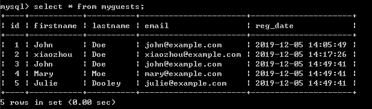
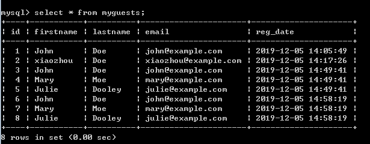
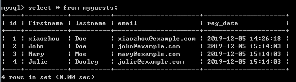

# 第06节:PHP MySQL 插入多条数据
上一节我们介绍了如何通过php 在mysql表中插入数据，本节我们来学习向mysql数据库下面 表 中的字段中插入多条数据

### 一、学习目标

学习如何通过 面向对象 、 面向过程 、pdo 以及 预处理的方法对表进行多条数据的插入以及预处理的一些注意事项

### 二、PHP MySQL 插入多条数据

#### 1.使用 MySQLi 和 PDO 向 MySQL 插入多条数据

mysqli_multi_query() 函数可用来执行多条SQL语句。

以下展示了三种实例方法 向 "MyGuests" 表添加了三条新的记录:

第一个示例(面向对象)：

``` php
//实例 (MySQLi - 面向对象)

<?php
$servername = "localhost";
$username = "username";
$password = "password";
$dbname = "myDB";
 
// 创建链接
$conn = new mysqli($servername, $username, $password, $dbname);
// 检查链接
if ($conn->connect_error) {
    die("连接失败: " . $conn->connect_error);
} 
 
$sql = "INSERT INTO MyGuests (firstname, lastname, email)
VALUES ('John', 'Doe', 'john@example.com');";
$sql = "INSERT INTO MyGuests (firstname, lastname, email)
VALUES ('Mary', 'Moe', 'mary@example.com');";
$sql = "INSERT INTO MyGuests (firstname, lastname, email)
VALUES ('Julie', 'Dooley', 'julie@example.com')";
 
if ($conn->multi_query($sql) === TRUE) {
    echo "新记录插入成功";
} else {
    echo "Error: " . $sql . "<br>" . $conn->error;
}
 
$conn->close();
?>
```

上面的这个案例把我们想要插入的多条数据通过 multi_query 这个关键字一起插入进我们myDB这个数据库下的MyGuests表中

请看表中的数据创建与未创建对比图：


这是建表之前的图，图中显示这个数据库中有两条我们之前所创的数据


创建表之后的图，发现会多出我们在这个表中所创建的这三条数据

第二个示例(面向过程)：

``` php
//实例 (MySQLi - 面向过程)

<?php
$servername = "localhost";
$username = "username";
$password = "password";
$dbname = "myDB";
 
// 创建链接
$conn = mysqli_connect($servername, $username, $password, $dbname);
// 检查链接
if (!$conn) {
    die("连接失败: " . mysqli_connect_error());
}
 
$sql = "INSERT INTO MyGuests (firstname, lastname, email)
VALUES ('John', 'Doe', 'john@example.com');";
$sql .= "INSERT INTO MyGuests (firstname, lastname, email)
VALUES ('Mary', 'Moe', 'mary@example.com');";
$sql .= "INSERT INTO MyGuests (firstname, lastname, email)
VALUES ('Julie', 'Dooley', 'julie@example.com')";
 
if (mysqli_multi_query($conn, $sql)) {
    echo "新记录插入成功";
} else {
    echo "Error: " . $sql . "<br>" . mysqli_error($conn);
}
 
mysqli_close($conn);
?>
```

请看表中的数据创建与未创建对比图：


这是建表之前的图，图中显示这个数据库中有五条数据是我们之前所创的


创建表之后的图，发现会多出三条我们刚刚插入进去的数据

第三个示例(pdo)：

``` php
//实例 (PDO)

<?php
$servername = "localhost";
$username = "username";
$password = "password";
$dbname = "myDBPDO";
 
try {
    $conn = new PDO("mysql:host=$servername;dbname=$dbname", $username, $password);
    // set the PDO error mode to exception
    $conn->setAttribute(PDO::ATTR_ERRMODE, PDO::ERRMODE_EXCEPTION);
 
    // 开始事务
    $conn->beginTransaction();
    // SQL 语句
    $conn->exec("INSERT INTO MyGuests (firstname, lastname, email) 
    VALUES ('John', 'Doe', 'john@example.com')");
    $conn->exec("INSERT INTO MyGuests (firstname, lastname, email) 
    VALUES ('Mary', 'Moe', 'mary@example.com')");
    $conn->exec("INSERT INTO MyGuests (firstname, lastname, email) 
    VALUES ('Julie', 'Dooley', 'julie@example.com')");
 
    // 提交事务
    $conn->commit();
    echo "新记录插入成功";
}
catch(PDOException $e)
{
    // 如果执行失败 则返回报错信息
    $conn->rollback();
    echo $sql . "<br>" . $e->getMessage();
}
 
$conn = null;
?>
```

通过pdo插入多条数据，应用异常处理的方法，在数据库里面的MyGuests这个表中对应的字段插入相应的多条数据

请看表中的数据创建与未创建对比图：


这是建表之前的图，图中显示这个数据库中有我们之前所插入的一条数据


创建表之后的图，发现我们在这个表中新插入了三条数据

#### 2.使用预处理语句

mysqli 扩展提供了第二种方式用于插入语句。

我们可以预处理语句及绑定参数。

mysql 扩展可以不带数据发送语句或查询到mysql数据库。 你可以向列关联 或 "绑定" 变量。

``` php
//实例 (MySQLi 使用预处理语句)

<?php
$servername = "localhost";
$username = "username";
$password = "password";
$dbname = "myDB";
 
// 创建连接
$conn = new mysqli($servername, $username, $password, $dbname);
// 检测连接
if ($conn->connect_error) {
    die("连接失败: " . $conn->connect_error);
} else {
    $sql = "INSERT INTO MyGuests(firstname, lastname, email)  VALUES(?, ?, ?)";
 
    // 为 mysqli_stmt_prepare() 初始化 statement 对象
    $stmt = mysqli_stmt_init($conn);
 
    //预处理语句
    if (mysqli_stmt_prepare($stmt, $sql)) {
        // 绑定参数
        mysqli_stmt_bind_param($stmt, 'sss', $firstname, $lastname, $email);
 
        // 设置参数并执行
        $firstname = 'John';
        $lastname = 'Doe';
        $email = 'john@example.com';
        mysqli_stmt_execute($stmt);
 
        $firstname = 'Mary';
        $lastname = 'Moe';
        $email = 'mary@example.com';
        mysqli_stmt_execute($stmt);
 
        $firstname = 'Julie';
        $lastname = 'Dooley';
        $email = 'julie@example.com';
        mysqli_stmt_execute($stmt);
    }
}
?>
```

我们可以看到以上实例中使用模块化来处理问题，我们可以通过创建代码块实现更简单的读取和管理，关于预处理更深一层的知识点我们将在下一章节带给大家

注意：参数的绑定。让我们看下 mysqli_stmt_bind_param() 中的代码：

``` php
mysqli_stmt_bind_param($stmt, 'sss', $firstname, $lastname, $email);
```

该函数绑定参数查询并将参数传递给数据库。第二个参数是 "sss" ,以下列表展示了参数的类型。 s 字符告诉 mysql 参数是字符串。

可以是以下四种参数:

* i - 整数
* d - 双精度浮点数
* s - 字符串
* b - 布尔值

每个参数必须指定类型，来保证数据的安全性。通过类型的判断可以减少 SQL 注入漏洞带来的风险。

### 三、总结

通过本节的学习介绍了，可以通过四种方法进行对表的多条数据插入，以及预处理使用的注意事项，下一节我们将学习对预处理语句的传参进行解析，以及更加深刻去通过预处理语句进行多条数据的插入