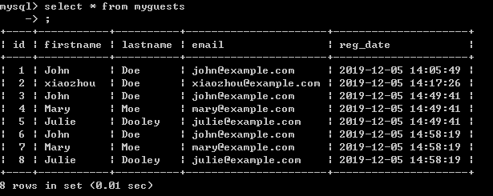
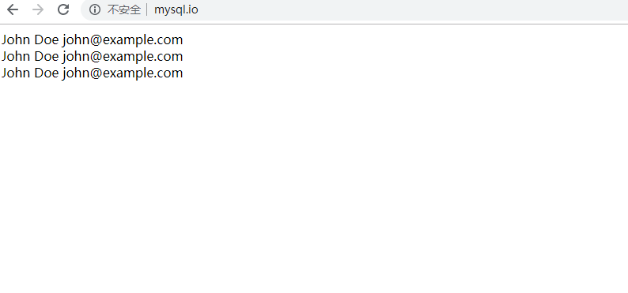
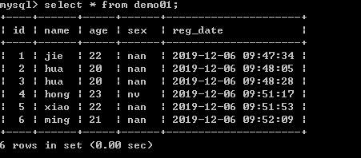

# 第09节:PHP MySQL Where
上一节我们介绍了通过 SELECT 语句来进行数据库 表 内容的读取，本节我们来学习在查询 数据库 表 中的数据时可以把不需要的数据进行过滤

### 一、学习目标

学mysql数据库中 Where 语句的语法，以及通过一个实例带大家了解一下怎样在查询时过滤不需要的数据

### 二、PHP MySQL Where 子句

WHERE 子句用于过滤记录。

#### 1.where 子句

WHERE 子句用于提取满足指定标准的的记录。

##### 语法

``` PHP
SELECT column_name(s)
FROM table_name
WHERE column_name operator value
```

为了让 PHP 执行上面的语句，我们必须使用 mysqli_query() 函数。该函数用于向 MySQL 连接发送查询或命令。

##### 实例

下面的实例将从 "myguests" 表中选取所有 FirstName='john' 的行：

``` php
<?php
$servername = "localhost";
$username = "username";
$password = "password";
$dbname = "mydb";

// 创建连接
$con=mysqli_connect($servername,$username,$password,$dbname);
if (mysqli_connect_errno($con))
{
    echo "连接 MySQL 失败: " . mysqli_connect_error();
}

// 执行查询
$result = mysqli_query($con,"SELECT * FROM myguests WHERE firstname='John'");


while($row = mysqli_fetch_array($result))
{
    echo $row['firstname'];
    echo " " . $row['lastname'];
    echo " " . $row['email'];
    echo "<br>";
}
?>
```

##### 表格数据


##### 网页结果



### 三、总结

通过本节的学习，我们学习了如何通过 Where 条件语句对 数据库 表 中的内容进行过滤查询，下一节我们要学习的内容为 怎样通过某个特定的数据 对表中所有数据进行 升序或降序的排列

### 四、作业

* 我们上一节课留的作业是，通过SELECT查询 databases数据库 表中的内容，我们在此进行改进，改进的效果为只可以查询这个表中 username 字段里面存放的内容并且显示在网页上

* 我们创建一个数据库名为php_mysql的一个数据库，里面建一个表名为demo的一个表，里面有五个字段：id、name、age、sex、reg_date，为这五个字段插入多条数据 如下图：



必须做，为接下来讲解Order升序、降序做铺垫