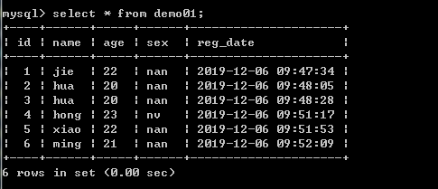

# 第10节:PHP MySQL Order By
上一节我们介绍了在 SELECT 语句 查询的过程中通过 Where 语句去过滤掉 表中所不需要的数据，本节我们来学习运用Order By 语句对查询出来的数据进行升序或降序的排列

### 一、学习目标

学习ORDER BY语句的语法，以及如何对 数据库中 表里面的数据进行 升序或降序 的排列

### 二、PHP MySQL Order By 关键词

在MySQL中，ORDER BY子句可与SELECT语句一起使用，以便按顺序对特定字段的数据进行排序；它可以按升序或降序对结果集进行排序

#### ORDER BY 关键词

##### 基本语法

ORDER BY子句的基本语法：

``` php
SELECT  字段名 FROM 表名 ORDER BY 字段名 ASC/DESC（升序或降序）
```

注意：在ORDER BY子句中ASC是默认的，可省略，表示升序

##### 使用示例

下面是一个数据表"demo01"，其中包含五个字段，分别为：id、name、age、sex、reg_date，我们通过简单的示例来介绍ORDER BY子句的使用。




1、简单的按照age字段升序排序

``` php
<?php

header("content-type:text/html;charset=utf-8");
$link = mysqli_connect("localhost", "username", "password", "database"); //连接数据库
mysqli_set_charset($link,"utf8");
if($link === false){ 
    die("ERROR: Could not connect. " 
        . mysqli_connect_error()); 
} 
$sql = "SELECT * FROM demo01 ORDER BY age"; 
if($res = mysqli_query($link, $sql)){ 
    if(mysqli_num_rows($res) > 0){ 
        echo "<table>"; 
            echo "<tr>"; 
            echo "<th>name</th>"; 
            echo "<th>age</th>"; 
            echo "<th>sex</th>"; 
            echo "</tr>"; 
        while($row = mysqli_fetch_array($res)){ 
            echo "<tr>"; 
                echo "<td>" . $row['name'] . "</td>"; 
                echo "<td>" . $row['age'] . "</td>"; 
                echo "<td>" . $row['sex'] . "</td>"; 
            echo "</tr>"; 
        } 
        echo "</table>"; 
        mysqli_free_result($res); 
    } else{ 
        echo "找不到匹配的记录。"; 
    } 
} else{ 
    echo "错误：无法执行 $sql. " . mysqli_error($link); 
} 
mysqli_close($link); 
?>
```

输出：


代码说明：

“res”变量存储函数mysql_query()返回的数据。

每次调用mysqli_fetch_array()时，它都会从res()集返回下一行。

while循环用于遍历表“demo01”的所有行。

2、使用面向对象方法通过ORDER BY子句降序排序

``` php
<?php
header("content-type:text/html;charset=utf-8");
$link = new mysqli("localhost", "username", "password", "database");
mysqli_set_charset($link,"utf8");
if($link === false){
    die("ERROR: Could not connect. "
        . mysqli_connect_error());
}
$sql = "SELECT * FROM demo01 ORDER BY age DESC";
if($res = mysqli_query($link, $sql)){
    if(mysqli_num_rows($res) > 0){
        echo "<table>";
        echo "<tr>";
        echo "<th>name</th>";
        echo "<th>age</th>";
        echo "<th>sex</th>";
        echo "</tr>";
        while($row = mysqli_fetch_array($res)){
            echo "<tr>";
            echo "<td>" . $row['name'] . "</td>";
            echo "<td>" . $row['age'] . "</td>";
            echo "<td>" . $row['sex'] . "</td>";
            echo "</tr>";
        }
        echo "</table>";
        mysqli_free_result($res);
    } else{
        echo "找不到匹配的记录。";
    }
} else{
    echo "错误：无法执行 $sql. "  . mysqli_error($link);
}
mysqli_close($link);
?>
```

输出：


注意：Order By 默认为ASC(升序)

### 三、总结

以两个实例为例为大家讲解了运用Order By语句对查询出来的数据进行升序或降序的学习，下一节我们将为大家带来如何运用 Update语句 来修改数据库下面 表里面的数据
