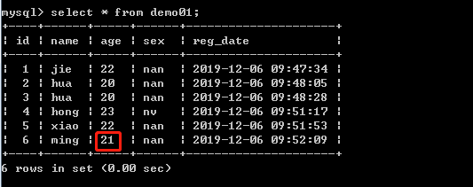
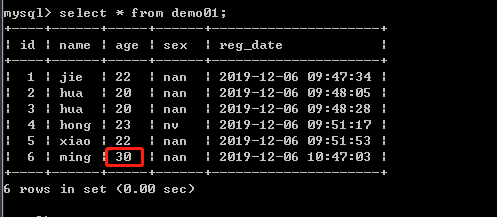

# 第11节:PHP MySQL Update
上一节我们介绍了运用 Order By 语句对查询出来的数据进行升序或降序，本节我们来学习运用 Update 语句 对表中的数据进行修改

### 一、学习目标

了解Update 语法，以及学会如何运用 Updata 语句 对表中的数据进行修改

### 二、PHP MySQL Update

UPDATE 语句用于修改数据库表中的数据。

#### 1.更新数据库中的数据

##### 语法

``` php
UPDATE table_name
SET column1=value, column2=value2,...
WHERE some_column=some_value
```

注意：请注意 UPDATE 语法中的 WHERE 子句，WHERE 子句规定了哪些记录需要更新，如果您想省去 WHERE 子句，所有的记录都会被更新！

为了让 PHP 执行上面的语句，我们必须使用 mysqli_query() 函数，该函数用于向 MySQL 连接发送查询命令。

##### 实例

在本教程的前面章节中，我们创建了一个名为 "demo01" 的表，如下所示：



在下面的例子我们会更新 "demo01" 表的一些数据：

``` php
<?php
$con=mysqli_connect("localhost","username","password","database");
// 检测连接
if (mysqli_connect_errno())
{
    echo "连接失败: " . mysqli_connect_error();
}

mysqli_query($con,"UPDATE demo01 SET Age=30
WHERE name='ming' AND sex='nan'");

mysqli_close($con);
?>
```

在这次更新后，"demo01" 表如下所示：



demo01表中 name值为 "ming" 并且 sex值 为 "nan" 的这条字段中，他的age 从21被修改到了30

### 三、总结

本节我们学习了，运用 Update 语句 对 demo01 的这个表进行数据的修改，注意：尽量不要省略掉WHERE 子句，下一节我们将带着大家学习如何通过 Delete语句 来删除数据库中 表里面的数据