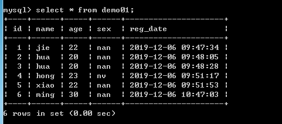
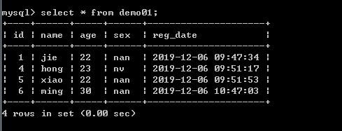

# 第12节:PHP MySQL Delete
上一节我们介绍了如何通过 Update 语句 对数据库中表里面数据进行修改，本节我们来学习运用 Delete 语句 对数据库中表里面得数据进行删除

### 一、学习目标

了解 DELETE语句语法，以及学习如何通过 DELETE 语句对数据库中 表 里面的数据进行删除行的操作

### 二、PHP MySQL Delete

DELETE 语句用于从数据库表中删除行。

#### 1.删除数据库中的数据

##### 语法

``` php
DELETE FROM table_name
WHERE some_column = some_value
```

注意：DELETE 语法中的 WHERE 子句，WHERE 子句规定了哪些记录需要删除，如果您想省去 WHERE 子句，所有的记录都会被删除！

为了让 PHP 执行上面的语句，我们必须使用 mysqli_query() 函数，该函数用于向 MySQL 连接发送查询命令。

##### 实例

请看下面的 "demo01" 表：



下面的实例删除 "demo01" 表中所有 name='hua' 的记录：

``` php
<?php
$con=mysqli_connect("localhost","username","password","database");
// 检测连接
if (mysqli_connect_errno())
{
    echo "连接失败: " . mysqli_connect_error();
}

mysqli_query($con,"DELETE FROM demo01 WHERE name='hua'");

mysqli_close($con);
?>
```

在这次删除后，"demo01" 表如下所示：



注意：我们看上面的图，他的id不会随着删除的数据而自动补进，这点我们需要注意一下

### 三、总结

本节我们学习了mysql数据库中 DELETE 语句语法，以及通过 php 来对 数据库中 表里面的数据进行删除，注意：在删除的同时 如果不进行WHERE条件判断的话 会删除整个表中的内容