# 第05节:视图和模板
上一节我们介绍了thinkphp获取多种请求对象的方法，以及根据不同的情况返回相应的数据格式，本节我们来学习视图的多种编写方式以及模板的输出、替换与赋值

### 一、学习目标

### 二、视图
1.主要展示界面 可以接受用户输入等操作 通常是一个html页面

2.助手函数 view()

在application/controller/Index.php文件下输入以下代码
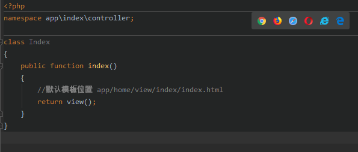

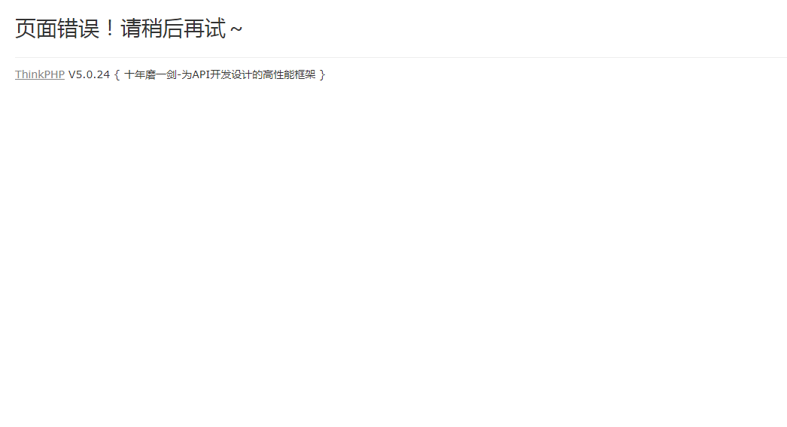
会报出这个错误，原因是没有设置对应模板

注意：如果没有对模版进行配置(没有在配置文件中修改 )默认调用 当前模块/view/当前控制器/当前方法名.html

1、view() 传递一个参数之后 return view(‘a’) ；

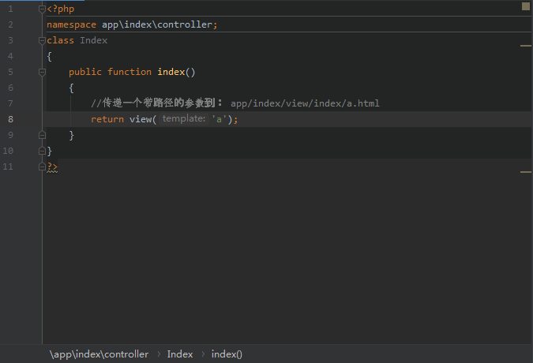

通过助手函数view()传参,传递到app/home/view/index/a.html这个目录下

2、传递一个带路径的参数 return view(‘config/a’) ；
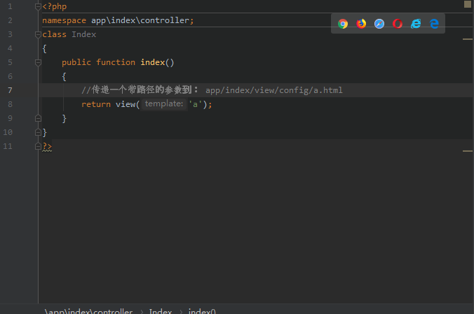

通过助手函数view()传递参数，把参数传递到指定的config/a.html这个目录下

3、传递路径 ./，return view(‘./a.html’) ; public/index.php入口文件 ./同级 此种写法
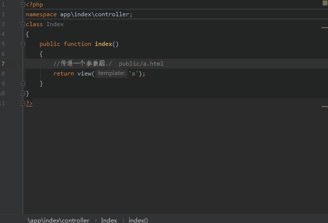

在默认模板文件地址下(app/home/view)寻找的同级文件，找到a.html这个文件

注意：此种写法 必须加上后缀 .html

4、View()助手函数 传递两个参数
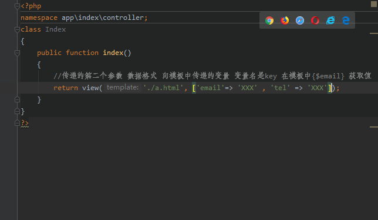

第一个值是传递的路径，第二个值是传递的参数

5、view()助手函数的第三个参数 替换
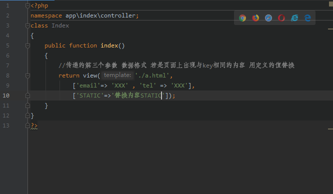

如果页面上出现于key值相同的页面的话可以用第三个参数里面的值来替换掉相同的内容

6、总结:使用助手函数很方便 但是有隐患 如：同名函数覆盖，一些配置失效等等。

3.return $this->fetch() 传递三个参数 使用方法同上 (use think\Controller) extends Controller

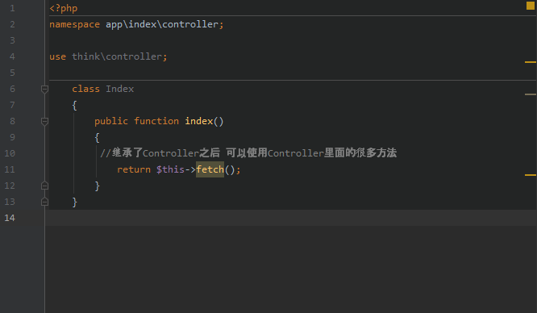

通过use引入所需的Controller这个文件继承(extends)Controller下的方法，从而实现简单化的效果

4.使用$this->assign(‘’,’’) 传递变量

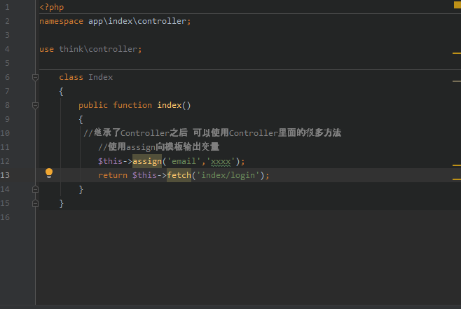

通过assign()这个函数向index/login模板传递数据

5.\$this->display(‘串’) 与模版没有关系

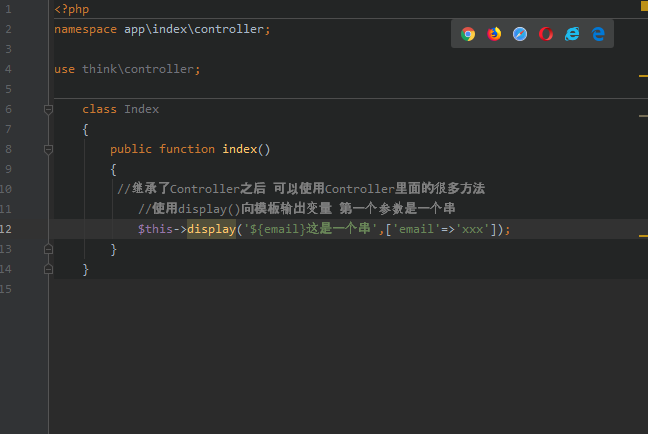

通过display()这个函数进行传参，第一个值是串，意思是必须要通过{$email}这个关键字来获取第二个值里面的数据

### 三、模板
1.经过php编译器解析 模版文件最终 编译成.php文件 具体位置在 runtime/temp
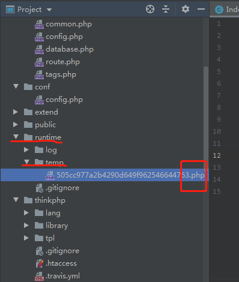

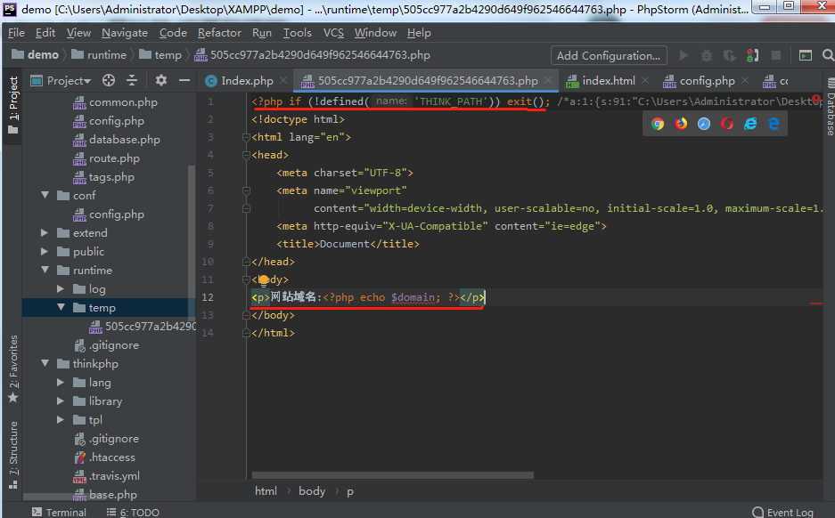

标注第一行是ThinkPhp的安全机制，不允许直接访问临时文件，标注第二行是视图里想打印的内容

2.模版语法 {} 以花括号开始结束标记 如需配置请找到 (thinkphp/convention.php) 里面找到模板设置板块


1、拷贝到应用配置文件中 测试 (conf/config.php)

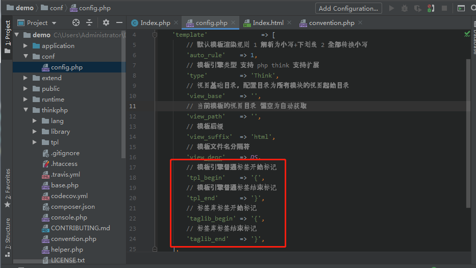

注意：定义了在模板中开始、结束标记默认是{}

2、如果配置这两个选项的场景: 程序中使用了 Vue.js、AngularJS、Angular2...这样的前端框架 很有可能和模版冲突 就需要修改此处的 开始 结束标记

3.变量输出---模版中{\$a} 变量和开始、结束标记之间 不能有空格{ $a }

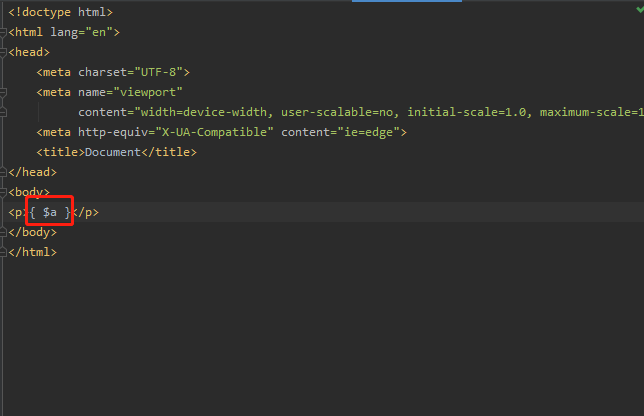

注意：如果中间有空格的话将不会被php解析，原封不动输出{$a}

4.变量赋值---向模版文件中输出变量

1、fetch(‘’,[])的第二个参数 数组类型

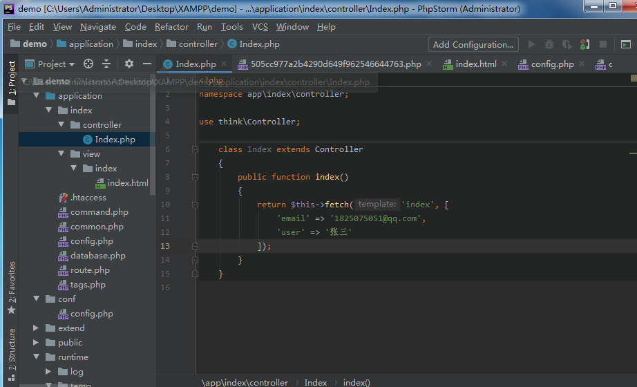

通过继承think\Controller文件下的方法来进行传递数据

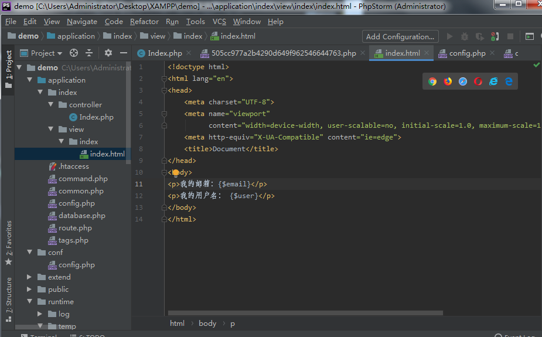

通过{$email},{user}接受传递过来的数据


接收到数据后并把结果显示在网页上

2、assign(‘’,’’) key=>value类型


通过$this->assign()这个函数进行传递参数，和上面的方法类似

3、view方法 继承Controller之后 key2=>value2


注意：这个方法在模板中通过{$key2}来打印

5.替换

1、fetch(‘’,[],[‘ABC’=>’页面上的ABC替换成此内容’])第三个参数

2、修改配置文件 具体位置在：thinkphp/convention.php

``` php
// 视图输出字符串内容替换
'view_replace_str'       => [],
```

a) 在应用配置文件中修改配置
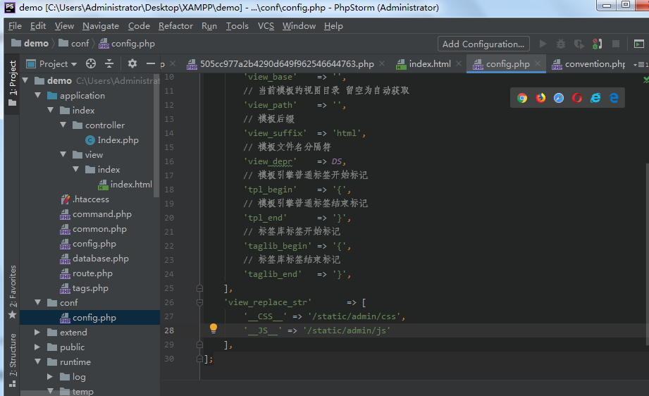

添加两个配置__CSS__、\__JS__