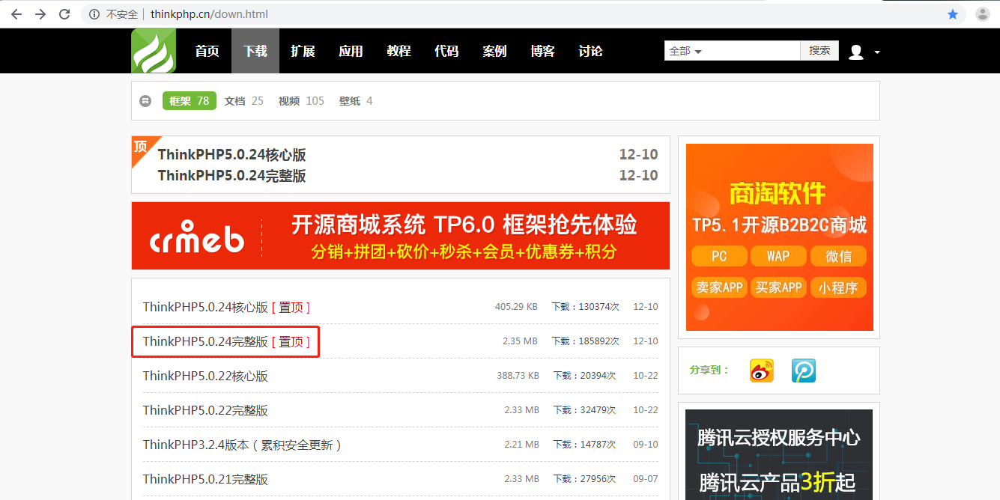
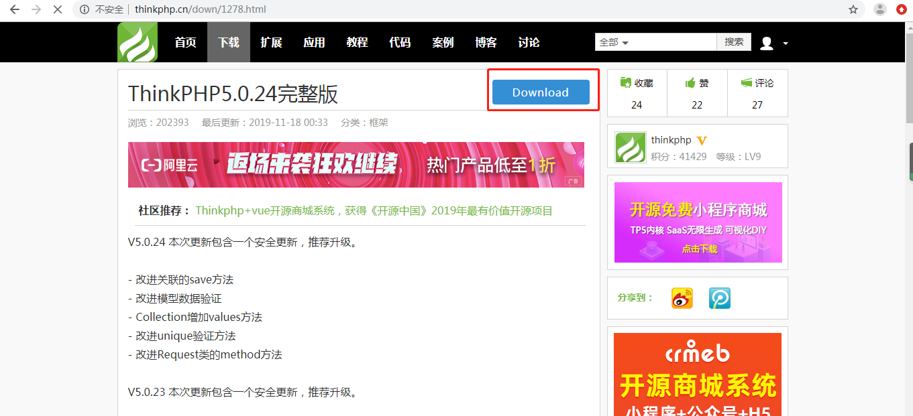
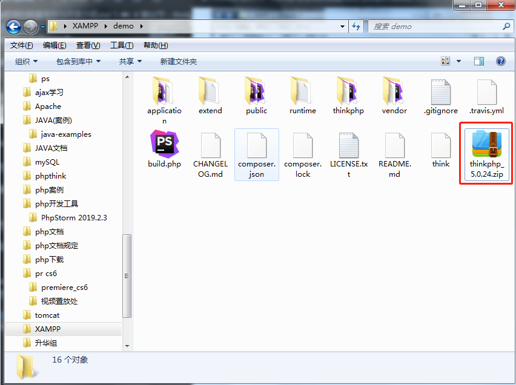
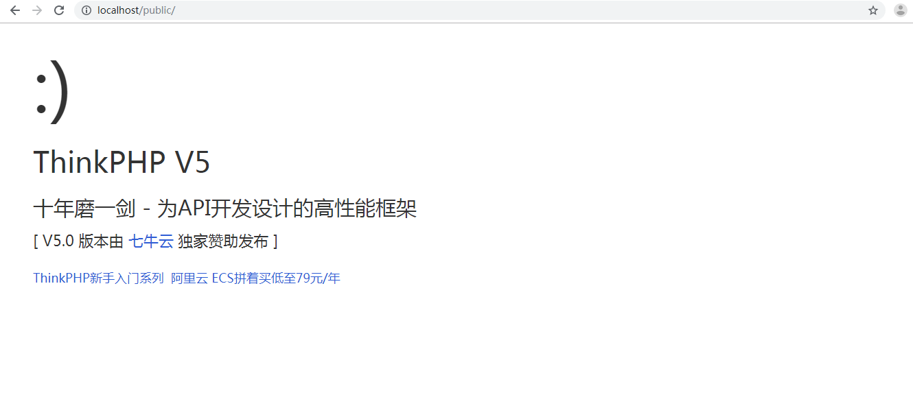
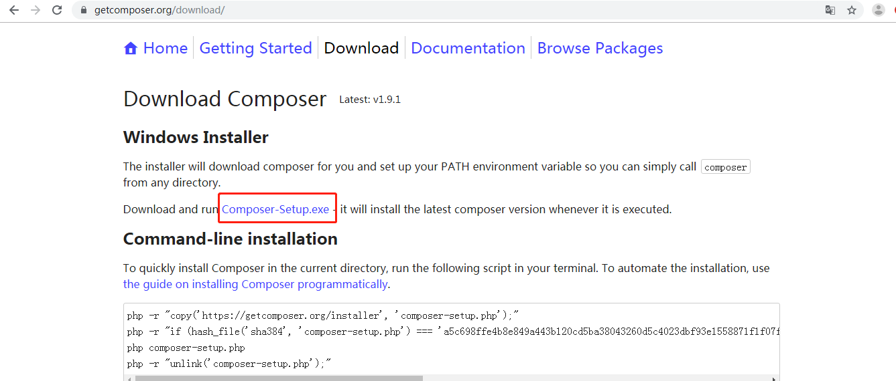
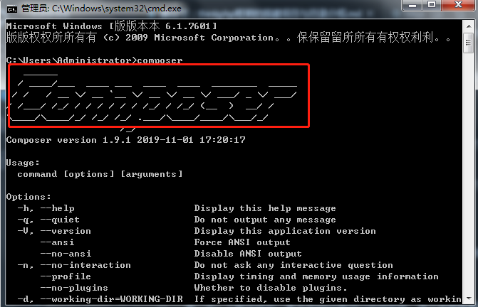

# 第02节:thinkphp框架的搭建项目与目录结构介绍
上一节我们讲解了thinkphp的特性、好处及优势所在，本节我们来学习thinkphp的搭建项目与目录结构的简单介绍

### 一、学习目标

本节我们来学习thinkphp的三种项目搭建方法与项目搭建后里面目录结构的具体介绍以及thinkphp的相关规范

### 二、thinkphp - 搭建项目

搭建项目有三种方式，在下面我们会分别罗列出来：

#### 1.第一种方法：使用源代码包安装

第一步：进入thinkphp的源代码包的官网：http://www.thinkphp.cn/down.html

第二步：进入官网后，进入下载页面，选择一个相关版本的安装包，我的版本是：ThinkPHP5.0.24完整版



第三步：进入后，请点击Download，点击后会跳转页面，等待5秒后会自动下载


第四步：把下载好的zip压缩包解压到你的XAMPP软件跟目录，完成搭建
我的目录如图所示：


注意：把压缩包解压到你服务器的根目录或虚拟主机配置的根目录下才可以正常运行

第五步：在浏览器输入localhost或者您的虚拟主机地址，点击public文件夹，看到以下页面说明搭建项目成功



#### 2.第二种方法：使用Composer方式进行安装

第一步：首先进入到composer的官方网站进行composer.exe的下载（https://getcomposer.org/download/） 如图所示：


第二步：下载完成后一直点击next就可以完成安装。接下来就需要按win+R键进入命令行输入composer判断是否安装成功。若出现超大的composer字体就说明安装成功，如下图所示：


第三步：镜像切换：安装成功之后需要进行镜像切换，切换至中国镜像，否则处理起来速度很慢，切换的方方法为：输入以下的代码：
composer config -g repo.packagist composer https://packagist.phpcomposer.com

就可以完成镜像切换。

第四步：将目录切换至相应的www目录下，输入以下加粗的代码

#### 3.第三种方法：使用github安装

### 三、thinkphp - 目录结构

我们搭建的ThinkPHP目录如下所示：

``` php
project  应用部署目录
├─application           应用目录（可设置）
│  ├─common             公共模块目录（可更改）
│  ├─index              模块目录(可更改)
│  │  ├─config.php      模块配置文件
│  │  ├─common.php      模块函数文件
│  │  ├─controller      控制器目录
│  │  ├─model           模型目录
│  │  ├─view            视图目录
│  │  └─ ...            更多类库目录
│  ├─command.php        命令行工具配置文件
│  ├─common.php         应用公共（函数）文件
│  ├─config.php         应用（公共）配置文件
│  ├─database.php       数据库配置文件
│  ├─tags.php           应用行为扩展定义文件
│  └─route.php          路由配置文件
├─extend                扩展类库目录（可定义）
├─public                WEB 部署目录（对外访问目录）
│  ├─static             静态资源存放目录(css,js,image)
│  ├─index.php          应用入口文件
│  ├─router.php         快速测试文件
│  └─.htaccess          用于 apache 的重写
├─runtime               应用的运行时目录（可写，可设置）
├─vendor                第三方类库目录（Composer）
├─thinkphp              框架系统目录
│  ├─lang               语言包目录
│  ├─library            框架核心类库目录
│  │  ├─think           Think 类库包目录
│  │  └─traits          系统 Traits 目录
│  ├─tpl                系统模板目录
│  ├─.htaccess          用于 apache 的重写
│  ├─.travis.yml        CI 定义文件
│  ├─base.php           基础定义文件
│  ├─composer.json      composer 定义文件
│  ├─console.php        控制台入口文件
│  ├─convention.php     惯例配置文件
│  ├─helper.php         助手函数文件（可选）
│  ├─LICENSE.txt        授权说明文件
│  ├─phpunit.xml        单元测试配置文件
│  ├─README.md          README 文件
│  └─start.php          框架引导文件
├─build.php             自动生成定义文件（参考）
├─composer.json         composer 定义文件
├─LICENSE.txt           授权说明文件
├─README.md             README 文件
├─think                 命令行入口文件
```
application 目录： 是用于应用目录，我们写的代码都在这个目录下(常用)

conf：我们自己设置的配置都放在这个目录下(常用)

backup 放置系统的备份文件

extend 用于放置扩展类库

安装好之后 可以将install目录删除,避免遭受到攻击，如果没有忽略就好

plugins 是插件目录 用于放置各种插件 比如 第三方登录、第三方支付、物流信息等等。

public：用于放置网站的静态文件 缩略图 静态文件等等 缩略图在开始创建的时候 会默认创建 不同大小的图片 比如 上传的图片有一张意外删除掉了 他就会去找 是否有这个图片 如果有就直接使用 如果没有 就重新生成

上面的目录介绍了搭建的项目中的所有文件及他们的作用，通过这些文件我们就可以开起学习thinkphp的道路了

### 四、thinkphp - 规范

#### 1.目录和文件

* 目录使用小写+下划线；
* 类库、函数文件统一以.php为后缀；
* 类的文件名均以命名空间定义，并且命名空间的路径和类库文件所在路径一致；
* 类文件采用驼峰法命名（首字母大写），其它文件采用小写+下划线命名；
* 类名和类文件名保持一致，统一采用驼峰法命名（首字母大写）；

#### 2.函数和类、属性命名

* 类的命名采用驼峰法（首字母大写），例如 User、UserType，默认不需要添加后缀，例如UserController应该直接命名为User；
* 函数的命名使用小写字母和下划线（小写字母开头）的方式，例如 get_client_ip；
* 方法的命名使用驼峰法（首字母小写），例如 getUserName；
* 属性的命名使用驼峰法（首字母小写），例如 tableName、instance；
* 以双下划线“__”打头的函数或方法作为魔术方法，例如__call和__autoload；

#### 3.常量和配置

* 常量以大写字母和下划线命名，例如 APP_PATH和 THINK_PATH；
* 配置参数以小写字母和下划线命名，例如 url_route_on 和url_convert；

#### 4.数据表和字段

数据表和字段采用小写加下划线方式命名，并注意字段名不要以下划线开头，例如 think_user 表和 user_name字段，不建议使用驼峰和中文作为数据表字段命名。

#### 5.应用类库命名空间规范

应用类库的根命名空间统一为app（不建议更改，可以在配置文件下设置app_namespace配置参数更改）

例如：app\index\controller\Index和app\index\model\User。

为以后出现不让以后出现不必要的麻烦，所以请您牢记上面的常用规范，避免在以后做项目时出现命名规范上的错误。

### 五、总结

通过本节的学习，我们收获了通过以上三种方式来进行项目的搭建以及搭建项目后对所创项目进行目录结构的解析，带您领略其当中常用文件的作用及用法，注意：thinkphp当中的规范一定要牢记

### 六、作业

* 把上面讲解的三种搭建项目的方式，逐一创建
* 熟悉thinkphp的目录结构，认识每个文件的作用
* 牢记thinkphp相关规范，为以后写项目、多人合作打下基础