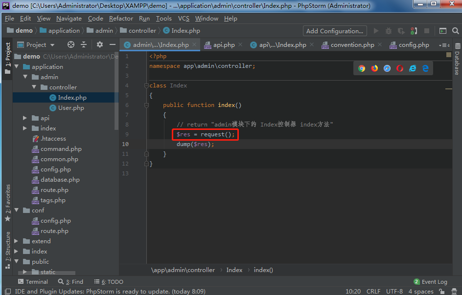
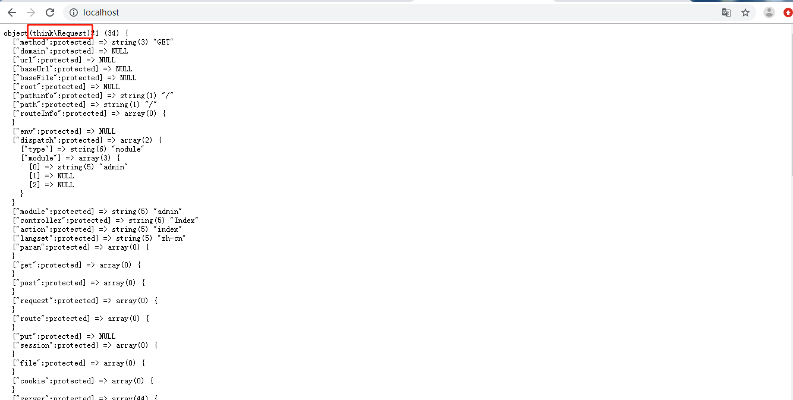
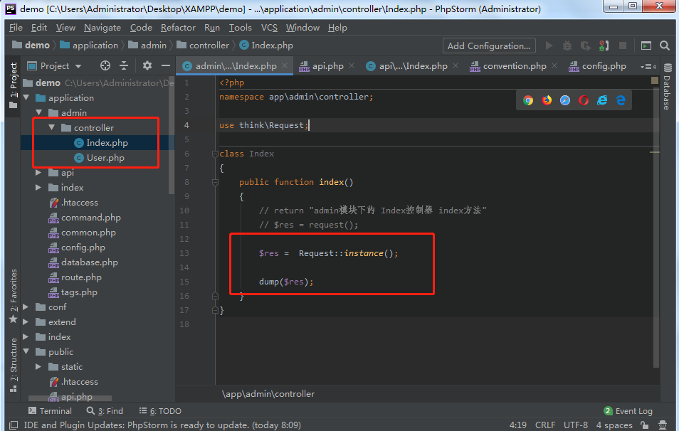
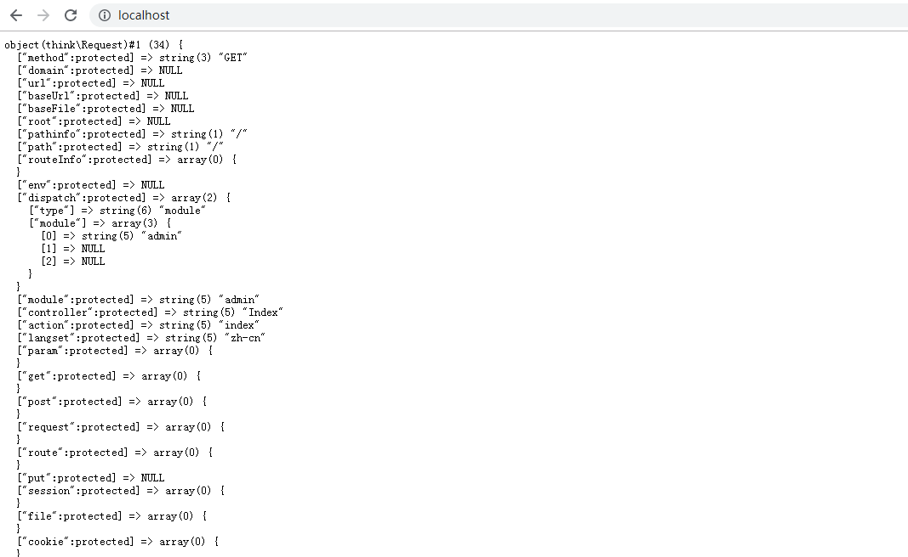
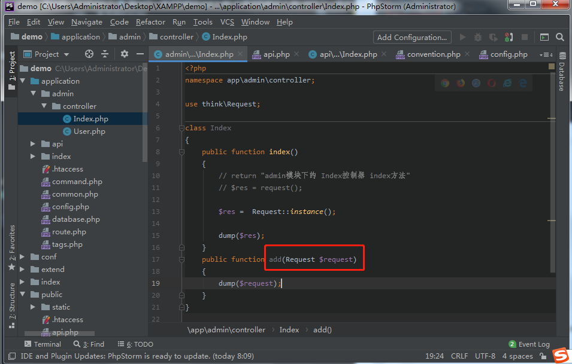
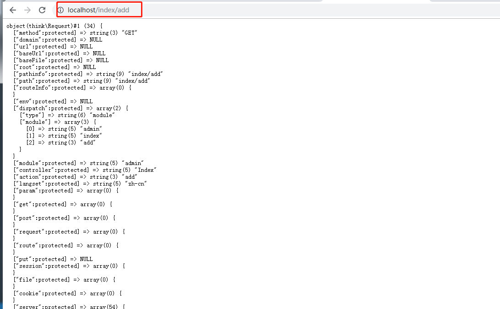
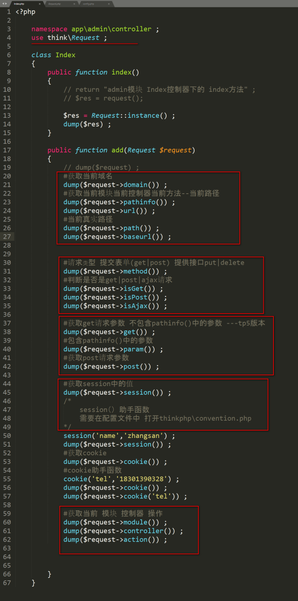
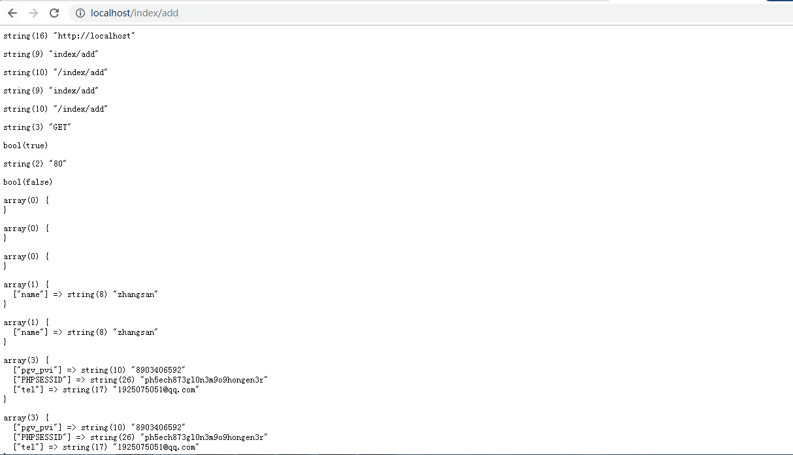
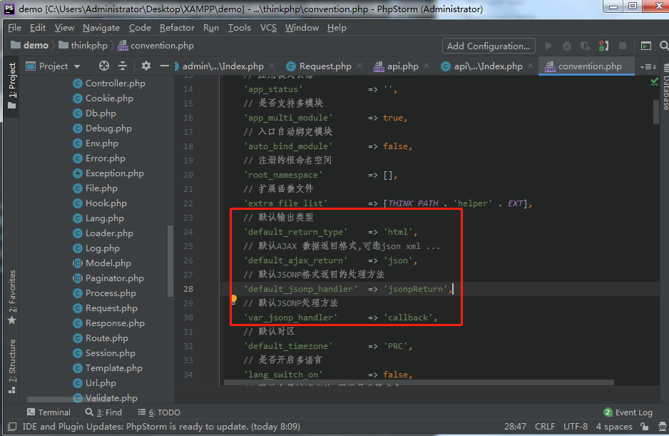
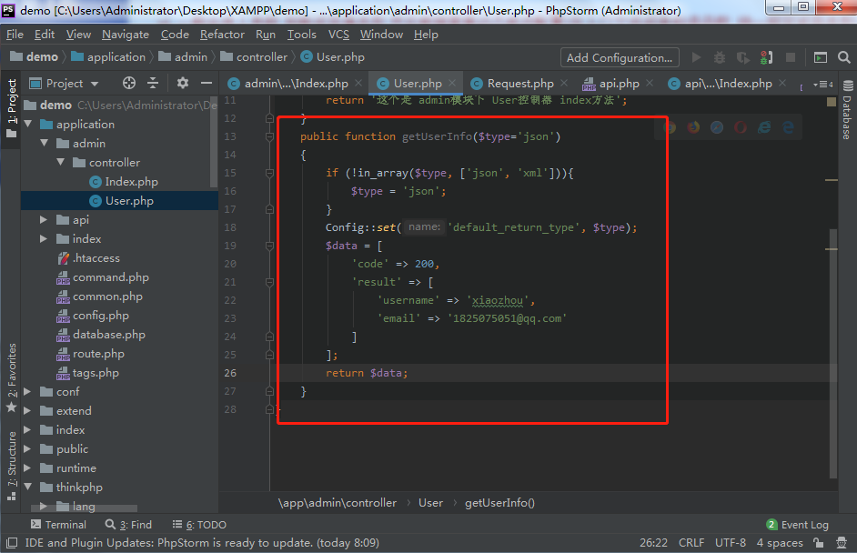

# 第04节:请求和响应
上一节我们讲解了URL的使用方式以及如何通过路由来美化URL，本节我们介绍thinkphp的多种获取请求对象的方法,以及根据不同情况返回相应的数据格式

### 一、学习目标

通过哪三种方式来获取request对象，他们的注意事项和特殊配置，以及请求对象的参数是如何获取的，和接收到特定的请求后如何返回相应的数据格式

### 二、请求对象Request

1、单入口public/index.php  此文件接收http请求 请求中的所有参数都可以通过Request对象接收、处理

2、三种获取request对象的方法
1.助手函数request()

2.use think\Request ; Request是单例模式 通过Request::instance() ;获取对象

3.方法传参 request对象 ---public function index(Request $request){}【推荐使用】

3、请求对象参数获取

1.请求对象的定义 App::run()

请求对象获取参数的流程

2.Request类定义的多种方法，如下所示：

具体方法详情请参见 thinkphp\library\think\Request.php这个文件

### 三、响应对象Response
1.为app开发接口 响应对象可能是json|XML

2.ajax请求  响应对象可能是json|jsonp|xml|html

3.企业官网 可能返回html就可以了

4.tp5不建议在控制器中  echo...  die()操作  控制器最终会返回一个值 这个值需要在response对象中处理  推荐return dump($res) 或者 return ‘123’ ...

5.Thinkphp\convention.php 配置默认输出对象
'default_return_type'    => 'html', |json|xml...

注意：这里配置返回格式时，按所需配置

6.一般会传入参数 判断返回值类型 然后根据需要动态修改配置(在入口文件或者构造函数 统一规定返回类型)

模拟一个json返回格式的数组

in_array($type, ['json', 'xml'])：判断参数是否为一个数组并且这个数组的返回格式是json或者xml，如果不为这两个其中的一个，让其转换为json格式

Config::set('default_return_type', \$type)：让其默认返回类型为json

$data[]：存放数据，如果成功后则输出里面的内容

### 四、总结

本节我们学习了三种不同获取request对象的方法，以及获取请求对象参数，根据不同情况返回相应的数据格式，注意：在以后通过thinkphp框架做项目时，尽量使用public function index(Request $request){}这种方式来请求request对象，这种方法理解起来较为简单且方法体里面的代码会显得更加简洁

### 五、作业

* 了解本节内容里面相关配置文件中的内容
* 对获取对象的Request类定义的多种方法进行多次编写，加深印象
* 通过方法传参的方式进行获取Request对象，并输出"我要学好php"