# 第05节:视图和模板
上一节我们介绍了thinkphp获取多种请求对象的方法，以及根据不同的情况返回相应的数据格式，本节我们来学习视图的多种传递方式以及模板的输出、替换与赋值，循环、比较与条件判断

### 一、学习目标

如何应用多种方式进行传递参数并把数据打印在页面上,以及在模板上进行循环、比较、条件判断等多种书写方式的学习，对模版的布局、包含和继承进行了解与实践

### 二、视图

1.主要展示界面 可以接受用户输入等操作 通常是一个html页面

2.助手函数 view()

在application/index/controller/Index.php文件下输入以下代码


会报出这个错误，原因是没有设置对应模板

注意：如果没有对模版进行配置(没有在配置文件中修改 )默认调用 当前模块/view/当前控制器/当前方法名.html

1、view() 传递一个参数之后 return view(‘a’) ；


通过助手函数view()传参,传递到app/index/view/index/a.html这个目录下

2、传递一个带路径的参数 return view(‘config/a’) ；


通过助手函数view()传递参数，把参数传递到指定的config/a.html这个目录下

3、传递路径 ./，return view(‘./a.html’) ; public/index.php入口文件 ./同级 此种写法


在默认模板文件地址下(app/index/view)寻找的同级文件，找到a.html这个文件

注意：此种写法 必须加上后缀 .html

4、View()助手函数 传递两个参数


第一个值是传递的路径，第二个值是传递的参数

5、view()助手函数的第三个参数 替换


如果页面上出现于key值相同的页面的话可以用第三个参数里面的值来替换掉相同的内容

6、总结:使用助手函数很方便 但是有隐患 如：同名函数覆盖，一些配置失效等等。

3.return $this->fetch() 传递三个参数 使用方法同上 (use think\Controller) extends Controller


通过use引入所需的Controller这个文件继承(extends)Controller下的方法，从而实现简单化的效果

4.使用$this->assign(‘’,’’) 传递变量


通过assign()这个函数向index/login模板传递数据

5.\$this->display(‘串’) 与模版没有关系


通过display()这个函数进行传参，第一个值是串，意思是必须要通过{$email}这个关键字来获取第二个值里面的数据

### 三、模板
1.经过php编译器解析 模版文件最终 编译成.php文件 具体位置在 runtime/temp


标注第一行是ThinkPhp的安全机制，不允许直接访问临时文件，标注第二行是视图里想打印的内容

2.模版语法 {} 以花括号开始结束标记 如需配置请找到 (thinkphp/convention.php) 里面找到模板设置板块


1、拷贝到应用配置文件中 测试 (conf/config.php)


注意：默认定义了在模板中开始、结束标记默认是{}

2、如果配置这两个选项的场景: 程序中使用了 Vue.js、AngularJS、Angular2...这样的前端框架 很有可能和模版冲突 就需要修改此处的 开始 结束标记

3.变量输出---模版中{\$a} 变量，开始、结束标记之间 不能有空格{ $a }


注意：如果中间有空格的话将不会被php解析，原封不动输出{$a}

4.变量赋值---向模版文件中输出变量

1、fetch(‘’,[])的第二个参数 数组类型


通过继承think\Controller文件下的方法来进行传递数据


通过{$email},{user}接受传递过来的数据


接收到数据后并把结果显示在网页上

2、assign(‘’,’’) key=>value类型


通过$this->assign()这个函数进行传递参数，和上面的方法类似

5.替换

1、fetch(‘’,[],[‘ABC’=>’页面上的ABC替换成此内容’])第三个参数用于对模板数据进行替换

2、修改配置文件 具体位置在：thinkphp/convention.php

``` php
// 视图输出字符串内容替换配置
'view_replace_str'       => [],
```

a) 在应用配置文件中修改配置


添加两个配置，分别是__CSS__、\__JS__

b)多个模块的时候 可以使用我们上面配置的方法
1、传统
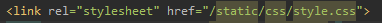

2、潮流
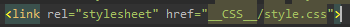

这种方法模块多了维护起来更方便，显得逼格高一些

thinkphp\library\think\View.php 默认配置
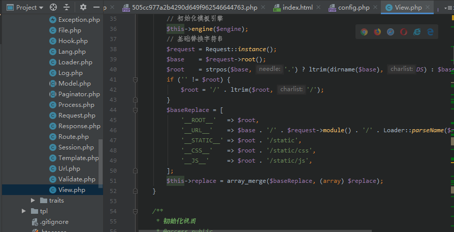

3、优先级，相同配置的优先级：方法>控制器>扩展>应用>默认 

### 四、变量输出调节器
1.在模版中使用函数 md5() 加密，substr() 截串，date() 格式化时间

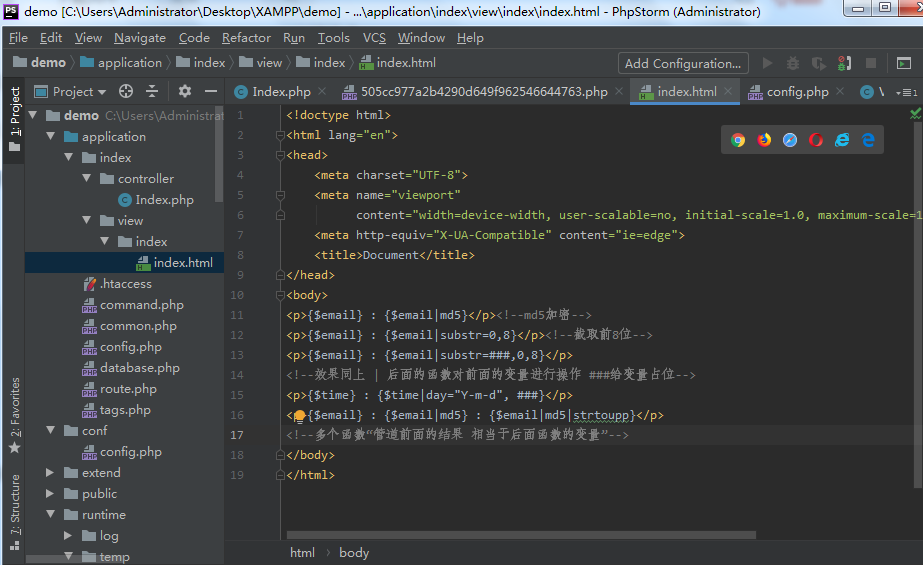

2.数值运算 自增 自减
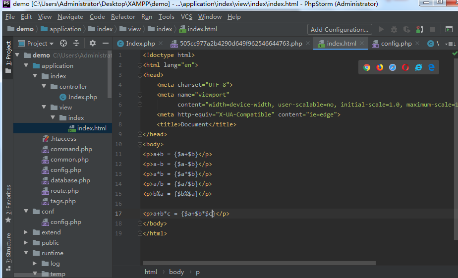

3.{literal}中间的内容不会被编译 原样输出{/literal}
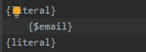

4.注释
页面上不显示 查看源代码能看到

{/* 模版注释 */} 页面不显示 查看源代码看不到

### 五、模板循环标签
下面我们要讲解模板循环的三种循环方式

1.volist标签通常用于查询数据集（select方法）的结果输出，通常模型的select方法返回的结果是一个二维数组，可以直接使用volist标签进行输出。

1、默认，迭代器遍历数组中所有数据

a) 在控制器中首先对模版赋值：

``` php
$list = User::all();
$this->assign('list', $list)
```
把$list这个变量传递到模板当中

b) 在模版定义如下，循环输出用户的编号和姓名：

``` html
{volist name="list" id="vo"}
{$vo.id}:{$vo.name}<br/>
{/volist}
```

c) name属性：当前模板赋值的变量名称，
id：表示当前的循环变量，可以随意指定 v|k|data...

2、查询结果中的部分数据

a) 输出5~15条记录

``` html
{volist name="list" id="vo" offset="5" length="10"}
{$vo.name}
{/volist}
```

b) 输出偶数记录

``` html
{volist name="list" id="vo" mod="2"}
{eq name="mod" value="1"}{$vo.name}{/eq}
{volist}
```

{eq}是模板判断语句，判断list这个数组中为2的倍数的所有name值并输出

3、可传入的参数:
a) offset: offset=’5’ 从第五条记录开始遍历

b) length: 遍历的长度(当前循环的次数)

c) mod: 对当前循环次数取余

d) empty: empty=”暂时没有数据” 支持变量输出

e) key: 数组索引，直接使用\$i|\$key即可，或者指定key属性 key=’s’ 用$s 获取索引

2.foreach 类似于volist 没有太多额外属性

1、最简单的一个例子

``` html
{foreach $list as $vo}
    {$vo.id}:{$vo.name}
{/foreach}
```

2、也可以用name:数据源 item:循环变量的索引

``` html
{foreach name="list" item="vo"}
    {$vo.id}:{$vo.name}
{/foreach}
```

3、直接 \$key 输出索引 或者 key=’k’ $k获取当前索引

3.for循环
1、开始值、结束值、步进值和循环变量都可以支持变量，开始值和结束值是必须，其他是可选。comparison 的默认值是lt，name的默认值是i，步进值的默认值是1

语法如下：

``` html
{for start="开始值" end="结束值" comparison="" step="步进值" name="循环的数组名"}

{/for}
```

简单来写就是：

``` html
{for start="1" end="10"}
{$i}
{/for}
```

我们经常用的属性只有开始值和结束值

2、解析之后

``` php
for($i=1;$i<10;i++){
    echo i;
}
```

### 六、比较标签
下面我们简单介绍模板比较标签的大于小于、及相等与不等

1.判断数值相等或不等的多种方式

``` html
<!--eq equal-->
{eq name="a" value="10"}
    <p>相等</p>
{else/}
    <p>不等</p>
{/eq}

{equal name="a" value="10"}
    <p>相等</p>
{else/}
    <p>不等</p>
{/equal}

<!--neq notequal-->
{neq name="a" value="10"}
    <p>相等</p>
{/else}
    <p>不等</p>
{/neq}
```

eq|equal|nequal|notequal判断变量是否与我们比较的值相等，相等则输出else之前的代码，不等则输出之后代码

2.gt|lt 大于|小于

``` html
<!--gt 大于-->
{gt name="a" value="8"}
    <p>正确</p>
{/else}
    <p>错误</p>
{/gt}

<!--lt 小于-->
{lt name="a" value="8"}
    <p>正确</p>
{/else}
    <p>错误</p>
{/lt}
```

gt判断变量里面的值是否大于比较的值，如果大于则输出else之前的代码，小于则输出之后的代码

3.egt|elt 大于等于|小于等于 同理上面讲解的大于小于

4.以上比较是变量(name=’X’) 和一个数值的比较 变量和变量的比较 value=”$b” 其他和上面一样

``` html
<!--eq equal-->
{eq name="a" value="$b"}
    <p>相等</p>
{/else}
    <p>不等</p>
{/eq}

<!--gt|lt 大于和小于-->
{gt name="a" value="$b"}
    <p>正确</p>
{/else}
    <p>错误</p>
{/gt}

{lt name="a" value="$b"}
    <p>正确</p>
{/else}
    <p>错误</p>
{/lt}
```

同理上面方法进行变量与变量的判断

### 七、条件判断标签
1.Switch标签

1、语法
``` html
{switch name="变量"}
    {case value="值1" break="0或1"}输出内容1{/case}
    {case value="值2"}输出内容2{/case}
    {default /}默认情况
{/switch}
```

2、案例如下

``` html
{switch name="User.level"}
    {case value="1"}value1{/case}
    {case value="2"}value2{/case}
    {default/} default
{/switch}
```

3、name:可以使用函数以及系统变量 name=”Think，get，sid | abs”

case的value属性支持多个条件判断与分割

{case value=”gif|png|jpg”}图片格式{/case}

也可以使用变量 用变量的话不支持多个条件判断

4、简单用法:

``` html
{switch $User.userId}
    {case $adminId}admin{/case}
    {case $memberId}member{/case}
{/switch}
```

2.if标签

1、语法

``` html
{if condition="($name == 1) OR ($name > 100)"}value1
{elseif condition="$name eq 2" /}value2
```

2、condition属性：

a) 使用php代码
condition="strtoupper($user['name']) neq 'THINKPHP'"

判断变量name中的值是否与THINKPHP相等

b) 支持点|对象语法
condition="$user:name neq 'ThinkPHP'"

c)简单用法

``` html
{if count($res) > 0}

{/else}

{/if}
```

d) 以上三种写法 结果是一样的 简单来说可以把以上三种方法看成这样

``` html
{if condition="表达式"}
{if (表达式)}
{if 表达式}
```

3.| in | between | 判断变量是否在某个范围

1、Value可用变量 $range可以是数组 也可以是以逗号分割的字符串，value也可以是系统变量

``` html
{in name="id" value="$range"}
id在范围内
{/in}
```

``` html
{in name="id" value="1,2,3"}
id在范围内
{/in}
```

2、Between同理，value代表区间，传入两个值，分别是(系统)变量和数组

``` html
{between name="id" value="1,10"}
输出内容1
{/else}
{/between}
```

4.range

1、语法：

``` html
{range name="id" value="1,2,3" type="in"}
输出内容1
{/range}

```

2、其中type属性的值可以用in/notin/between/notbetween，其它属性的用法和in或者between一致。

5.defined判断常量是否定义

语法：

``` html
{default name="NAME"}
NAME常量已定义
{else /}
NAME常量未定义
{/default}
```

注意：name:属性值 严格大小写

### 八、模版的布局、包含和继承

1.包含：模版引入 include
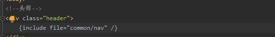

引入另一个模板通过include这个代码，使用file属性，值为引入模板的路径

注意：如写入多个模板，相似开头的情况下，可以在一个文件中写下相应开头的代码，通过inclide引入的方式引入到所需模板下，实现多个模板一次代码的效果

2.继承
1、定义base.html 作为父模版文件

2、其他模版文件继承
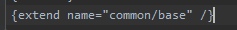

继承创建的父类模板base.html

3、在父模板文件中写入数据，我们把它比喻成刨坑
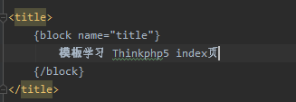

4、在其他继承父模板的文件中写入以下数据，我们比喻成填土
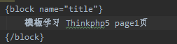

5、坑可以有多个 但是给坑起的名字不能一样 否则就填错土了

6、填坑的时候 可以在子模板的基础上填(继承父模板坑里面的内容)，如下所示：

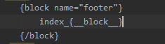

3.布局 layout

1、应用配置 conf/config.php 模版配置'template' => [] ;里面新增配置，新增配置如下：

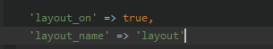

新增配置的效果是：开启layout布局模块，设置布局入口文件名为layout_name，默认是layout

2、开启layout之后 fetch()默认查找的是 view/layout.html


3、定义base.html(基板文件)，它的作用是替换内容的地方
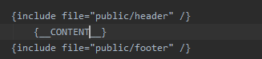

4、其他模版文件则不需要继承直接输出，替换的就是{CONTENT}里面的内容
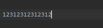

直接通过本文件输入的内容替换{\__CONTENT__}，实现输出的效果

注意：在什么情况下使用继承或布局，视所需情况来决定

### 九、总结

本节我们学习了应用以上几种形式进行传递参数，传递数据到模板，模板进行接受并输出传递的数据，以及在模板这方面上学习了多种的循环、条件判断、比较写法，对模版的布局、包含和继承进行进一步了解

### 十、作业

* 通过本节的学习，写出视图与模板的传参，传的参数是：我要学好thinkphp并通过<h1标签>输出在页面上
* 通过上面所学视图传参的方法把传递的参数 我要学好thinkphp 替换成 我要精通thinkphp
* 通过模板循环标签遍历如下数组，输出结果为5以后的所有数字，所需遍历的数组如下
arr=[1,2,3,4,5,6,7,8,9]

* 通过判断语句判断变量 \$a 中的值是否与大于等于\$b，正确则输出 I love thinkphp ， 错误则输出 I to love thinkphp，判断变量如下
\$a=10，$b=10
* 创建一个公共模板 写入多个模板所需的开头代码，通过include引入的方式，引入这个公共模板，实现多个模板只写一次开头的效果