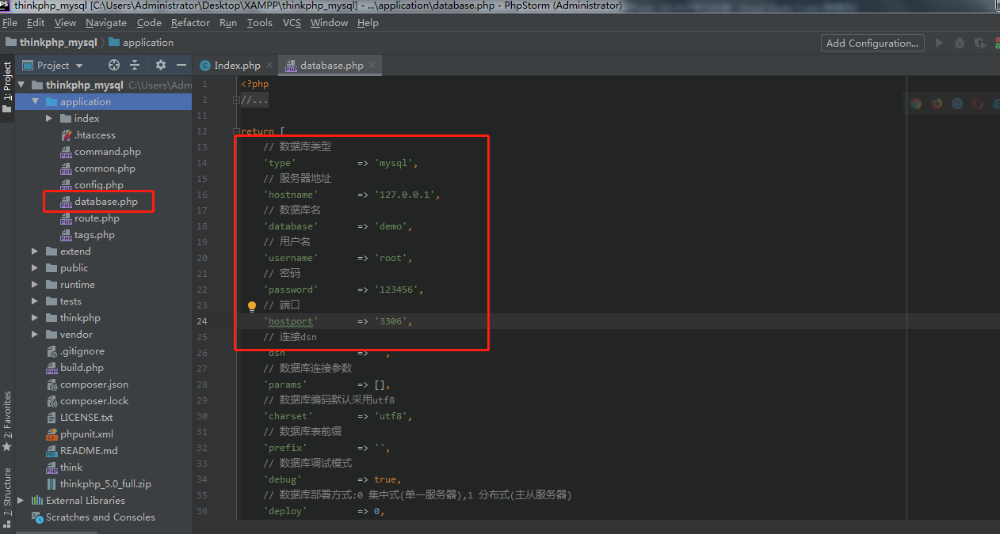
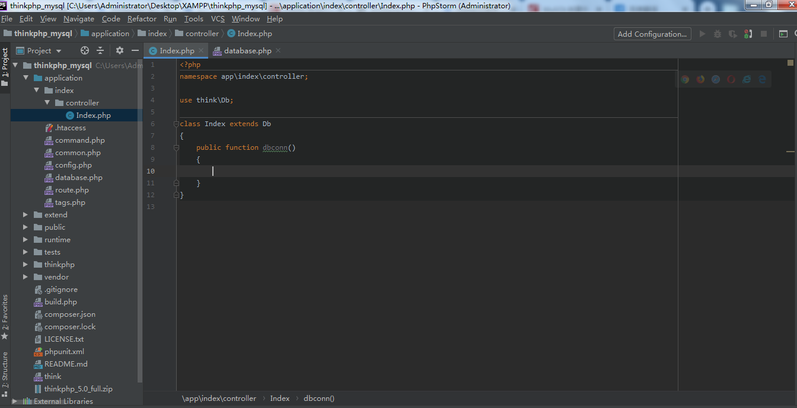
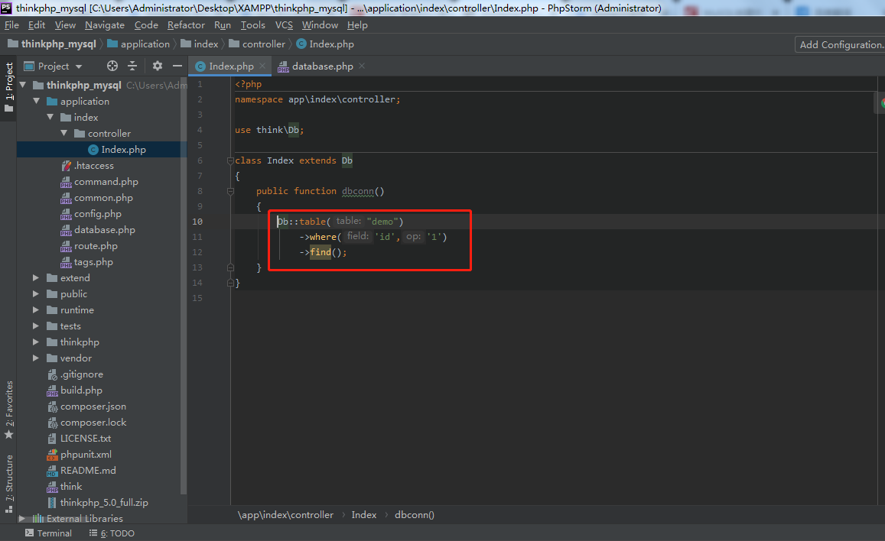
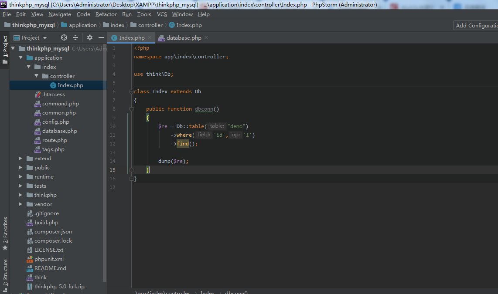
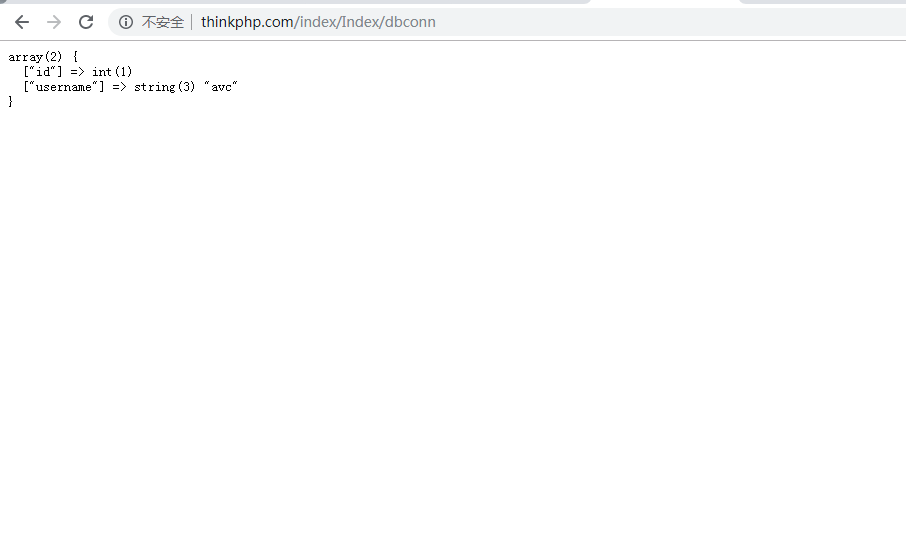

# 第06节:建立thinkphp与mysql的连接
上一节我们接少了视图的传参与模板的多种书写方式，本节我们来学习通过 thinkphp 这个框架来对 mysql 数据库进行连接

### 一、学习目标

通过配置thinkphp的方式来对mysql数据库进行连接并打印出里面的数据

### 二、thinkphp连接mysql

#### 1.找到application文件夹下的database.php

着重注意画红框的地方，要在application/database.php这个文件下修改配置

#### 2.设置数据库连接所需的参数

没有其特殊情况下默认用户名和密码是如图的内容，数据库一定要对应好，我的是demo

#### 3.在控制器中实现数据库连接的具体操作

我是用index/controller/Index模块来进行编写的，其中需要导入和继承Db这个类

注意：这里我们定义的方法为dbconn()，不是默认的index方法

#### 4.编写dbconn()的具体方法

这里我们定义的demo为我这个案例里面要操作的表，where存放的是条件，判断id为1的这条数据，fine() 方法用来返回符合条件的第一条数据

#### 5.dump()打印返回的数组

#### 6.保存文件查询打印结果

注意对应的数据库中一定要有这条数据，在mysql中创建数据库、表、插入数据在我们的[前端学习手册](http://www.xiaozhoubg.com/content/1) /MySQL这一章节中有列举的内容

### 三、总结

本节我们讲解了运用 thinkphp 来对 mysql进行连接，并把里面id为1的数据打印在页面上，注意：连接mysql的时候，配置一定要根据自己实际情况来定，如没有修改过的话，默认为我们上面图中的内容，其中数据库一项的内容要根据自己实际来定