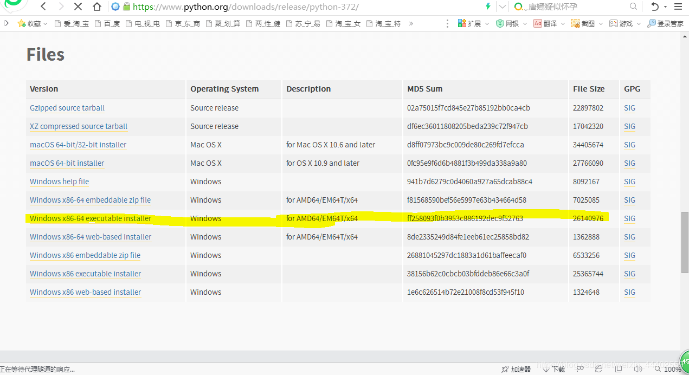
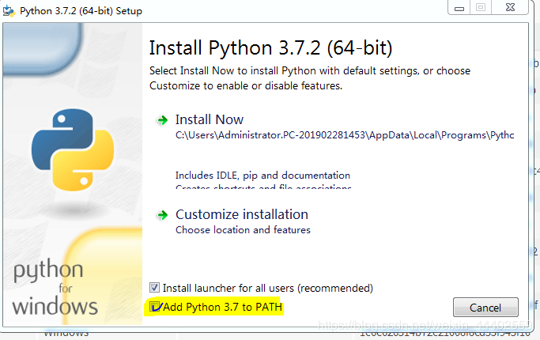
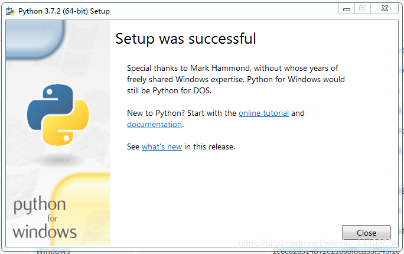
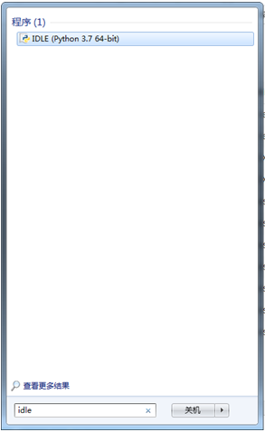
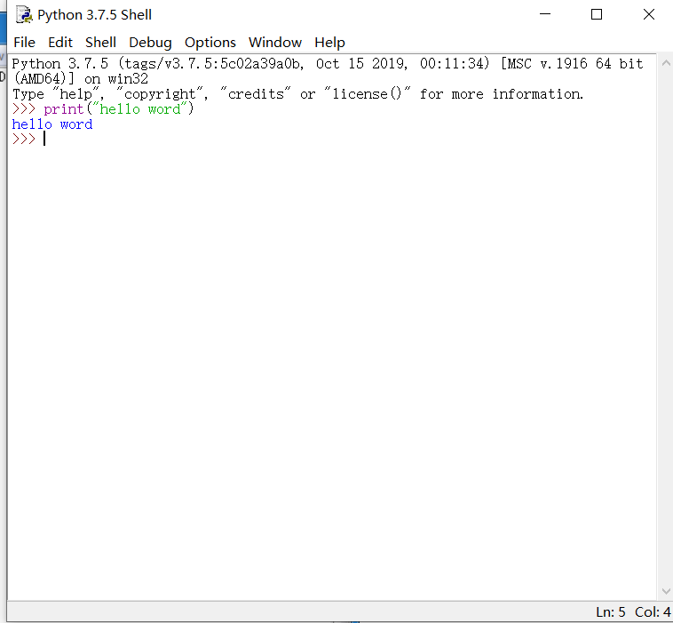

# 第02节：Python的下载和安装

本章我们来学习下载Python的解释器

### 第一步
点击：[下载地址](https://www.python.org/downloads/release/python-375/)  
进入Python3.7.5向下翻到这个位置  
选择第七个下载  
  
### 第二步：安装Python3.7.5
1.一定要勾选Add Python 3.7 to PATH（这是配置环境变量用的，不勾选的就要自己配置环境变量了）  
2.选择Install Now（默认安装到C盘下）/ Customize installation（自定义安装路径） 
  
 安装完成  
  
 ### 第三步：在开始中搜索IDLE
  
### 第四步运行第一个python程序
  
 

