# 第03节：pyCharm的下载和安装

### 一、pyCharm简介
PyCharm 是由 JetBrains 打造的一款 Python IDE，支持 macOS、 Windows、 Linux 系统。  
PyCharm 功能 : 调试、语法高亮、Project管理、代码跳转、智能提示、自动完成、单元测试、版本控制……  
### 二、下载python
[PyCharm官网下载](https://www.jetbrains.com/pycharm/download/#section=windows)
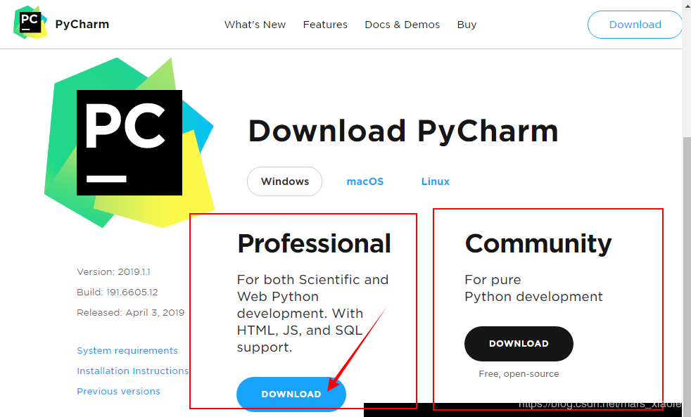   
### 三、安装PyCharm 
1、双击exe，进入“欢迎安装”界面，直接下一步  
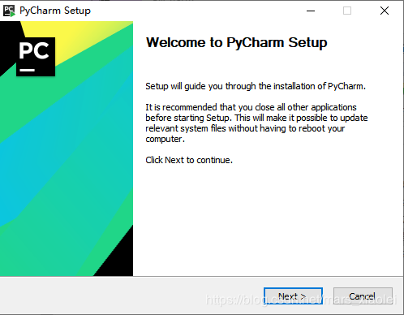  
2、进入“选择安装路径”界面，我一般不喜欢安装在系统盘，而是直接安装在软件下载文件夹中 ，选择好路径以后，下一步  
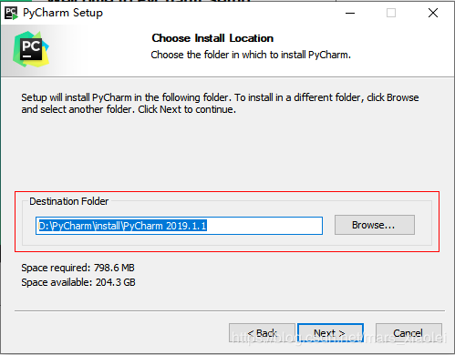  
3、 进入“安装选项”界面，按自己需求选择，我是全选，下一步  
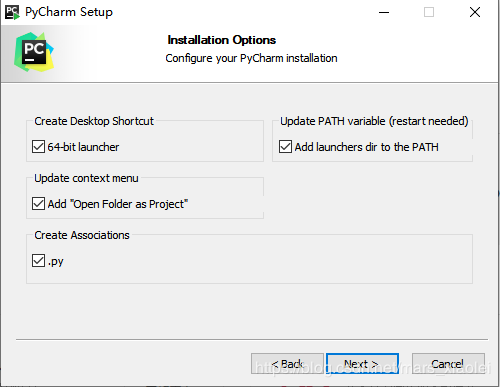  
4、进入“选择开始菜单”界面，可以重新取一个名字，下一步  
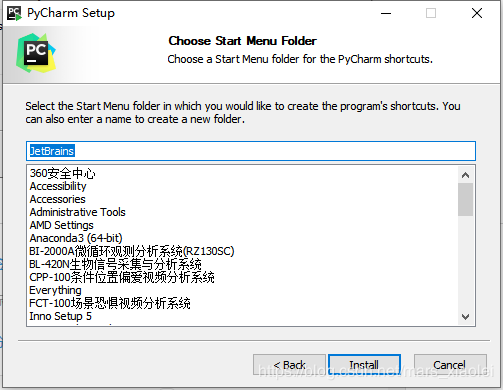  
5、进入“安装过程”界面，等一会儿，安装完后，下一步  
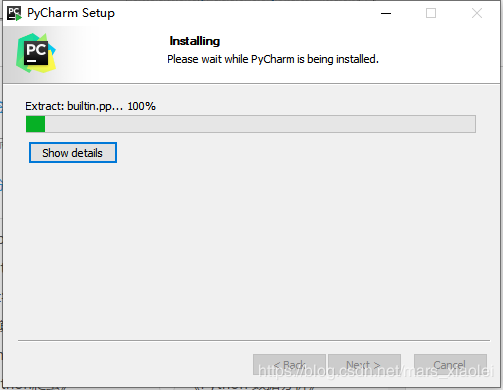  
6、选择“现在重启”还是“稍后重启”，我选“稍后重启”  
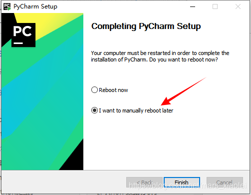  
7、如果以前没安装过，选择“不导入设置” ，点击“OK”  
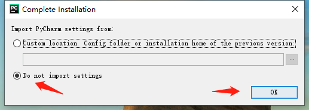  
8、 进入“许可协议”界面，选择“同意”，不同意也没办法，点击“continue”   
  
9、这个随便选，只想要你的统计数据  
  
10、这个比较重要，激活pycharm，选择“Activate”，然后选择“Activation code”，在下面的编辑框中输入激活码，这是最简单的，不过激活码有时间限制，会失效，到期就需要重新激活，另外还有两种选项自己去网上查找资料。  
激活码直接复制就可以使用： 
``` 
+AGcGz8x7ImkX9jEV9KElMxPu3tKSdF/WKo6JCONX7UtudYa/9EQum3banxci/qH7jejSrFZSN+YjWQiYTR0Q8gq4/a2RyQTgseZfpImY/nXkOWLwWArr/p+4ddp/bWQN4nLTW+Z4ZaQeLE96Z9viCdn62EKOcR02Hfr9Oju9VYQh1L8pGrTqNey5nUSv/LQUbVwo5qoYbBRos8l6ewkFNGsuC3vtOgGWSgkgChbDjWhW4Nkm4vDM2NFAphMsS1dgyPw3eJ3C+6A==-MIIElTCCAn2gAwIBAgIBCTANBgkqhkiG9w0BAQsFADAYMRYwFAYDVQQDDA1KZXRQcm9maWxlIENBMB4XDTE4MTEwMTEyMjk0NloXDTIwMTEwMjEyMjk0NlowaDELMAkGA1UEBhMCQ1oxDjAMBgNVBAgMBU51c2xlMQ8wDQYDVQQHDAZQcmFndWUxGTAXBgNVBAoMEEpldEJyYWlucyBzLnIuby4xHTAbBgNVBAMMFHByb2QzeS1mcm9tLTIwMTgxMTAxMIIBIjANBgkqhkiG9w0BAQEFAAOCAQ8AMIIBCgKCAQEAxcQkq+zdxlR2mmRYBPzGbUNdMN6OaXiXzxIWtMEkrJMO/5oUfQJbLLuMSMK0QHFmaI37WShyxZcfRCidwXjot4zmNBKnlyHodDij/78TmVqFl8nOeD5+07B8VEaIu7c3E1N+e1doC6wht4I4+IEmtsPAdoaj5WCQVQbrI8KeT8M9VcBIWX7fD0fhexfg3ZRt0xqwMcXGNp3DdJHiO0rCdU+Itv7EmtnSVq9jBG1usMSFvMowR25mju2JcPFp1+I4ZI+FqgR8gyG8oiNDyNEoAbsR3lOpI7grUYSvkB/xVy/VoklPCK2h0f0GJxFjnye8NT1PAywoyl7RmiAVRE/EKwIDAQABo4GZMIGWMAkGA1UdEwQCMAAwHQYDVR0OBBYEFGEpG9oZGcfLMGNBkY7SgHiMGgTcMEgGA1UdIwRBMD+AFKOetkhnQhI2Qb1t4Lm0oFKLl/GzoRykGjAYMRYwFAYDVQQDDA1KZXRQcm9maWxlIENBggkA0myxg7KDeeEwEwYDVR0lBAwwCgYIKwYBBQUHAwEwCwYDVR0PBAQDAgWgMA0GCSqGSIb3DQEBCwUAA4ICAQAF8uc+YJOHHwOFcPzmbjcxNDuGoOUIP+2h1R75Lecswb7ru2LWWSUMtXVKQzChLNPn/72W0k+oI056tgiwuG7M49LXp4zQVlQnFmWU1wwGvVhq5R63Rpjx1zjGUhcXgayu7+9zMUW596Lbomsg8qVve6euqsrFicYkIIuUu4zYPndJwfe0YkS5nY72SHnNdbPhEnN8wcB2Kz+OIG0lih3yz5EqFhld03bGp222ZQCIghCTVL6QBNadGsiN/lWLl4JdR3lJkZzlpFdiHijoVRdWeSWqM4y0t23c92HXKrgppoSV18XMxrWVdoSM3nuMHwxGhFyde05OdDtLpCv+jlWf5REAHHA201pAU6bJSZINyHDUTB+Beo28rRXSwSh3OUIvYwKNVeoBY+KwOJ7WnuTCUq1meE6GkKc4D/cXmgpOyW/1SmBz3XjVIi/zprZ0zf3qH5mkphtg6ksjKgKjmx1cXfZAAX6wcDBNaCL+Ortep1Dh8xDUbqbBVNBL4jbiL3i3xsfNiyJgaZ5sX7i8tmStEpLbPwvHcByuf59qJhV/bZOl8KqJBETCDJcY6O2aqhTUy+9x93ThKs1GKrRPePrWPluud7ttlgtRveit/pcBrnQcXOl1rHq7ByB8CFAxNotRUYL9IF5n3wJOgkPojMy6jetQA5Ogc8Sm7RG6vg1yow==
```
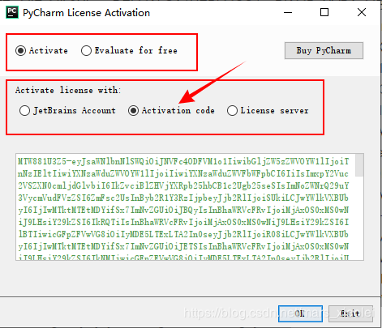   
### 四、新建一个python项目
1、我们进入该软件。  
   
2、点击Create New Project，接下来是重点  
   
Location是我们存放工程的路径,点击Project这个三角符号，可以看到pycharm已经自动获取了Python 3.5（如果你是看我教程学的就是3.7）。  
   
点击第一个...我们可以选择Location的路径，比如  
  
记住，我们选择的路径需要为空，不然无法创建，第二个Location不用动它，是自动默认的，其余不用点，然后点击Create。出现如下界面，这是Pycharm在配置环境，静静等待。最后点击close关掉提示就好了。  
   
3、建立编译环境   
   
双击untitled  
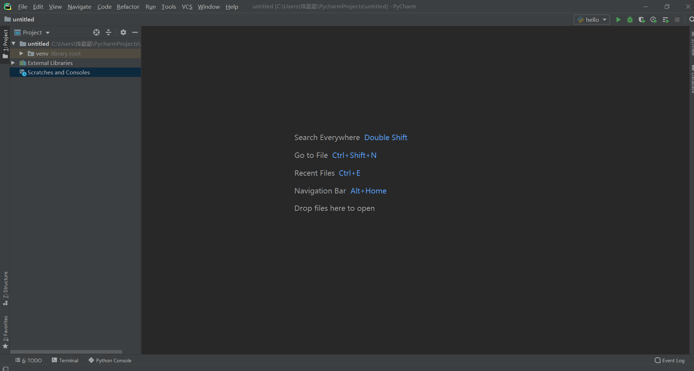  
右键点击new选择Python File，再给项目取个名字就ok了  
  
下面就是创建完成的样子  
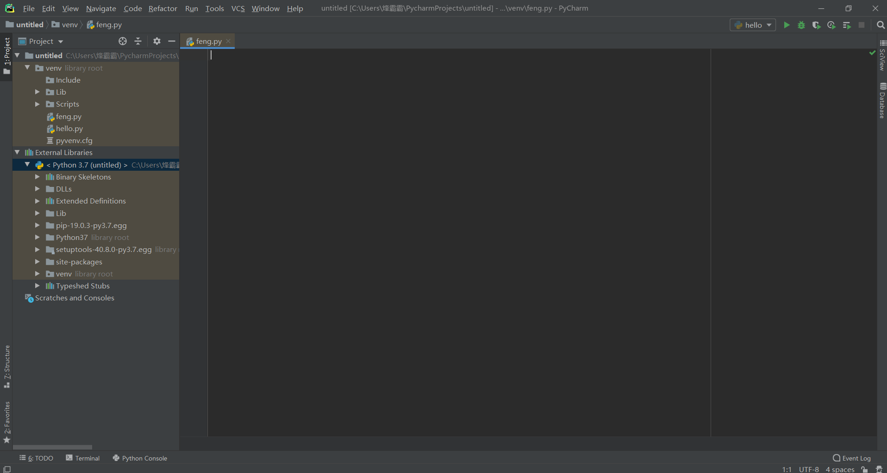  
4、输出Hello Word  
``` python  
# 输出hello word的代码：  
print("hello word")   
#可以用ctrl+shift+f10输出，也可以点击右上角的绿色三角  
```
[示例代码](https://github.com/jiaowofengbaba/python-Case/blob/master/%E7%AC%AC01%E7%AB%A0%EF%BC%9Apython%E6%A6%82%E8%BF%B0%E5%92%8C%E8%BD%AF%E4%BB%B6%E7%9A%84%E5%AE%89%E8%A3%85/Hello%20word%E6%A1%88%E4%BE%8B.md)  

成功输出  
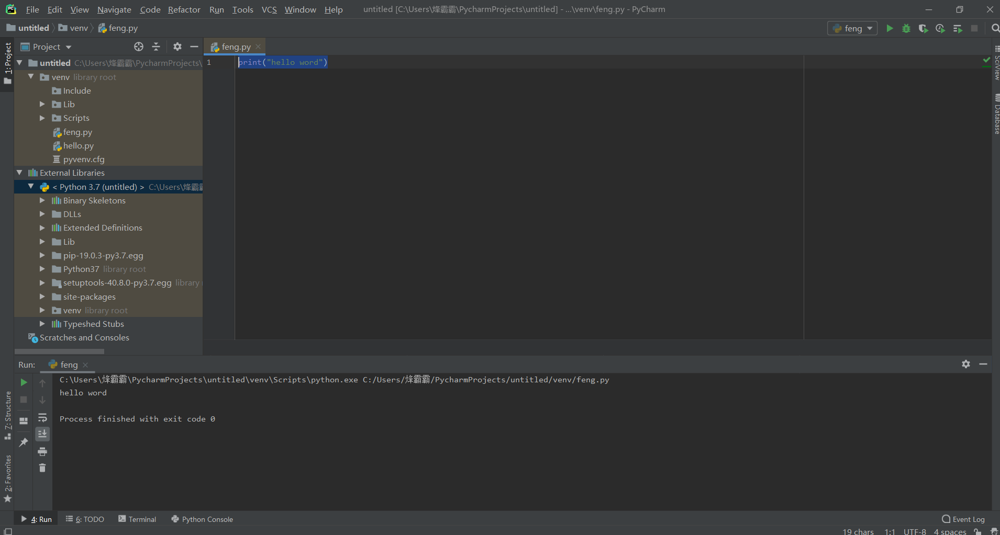  
  


