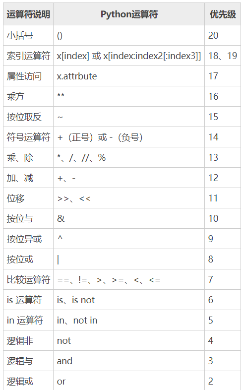

# 第05节：运算符

### 本节目标
常用的运算符只有算术、赋值、比较和逻辑运算符，本节只要熟练能掌握我上述说的4个运算符就可以了
### 一、什么是运算符
本章节主要说明Python的运算符。举个简单的例子 4 +5 = 9 。 例子中，4 和 5 被称为操作数，"+" 称为运算符。  
Python语言支持以下类型的运算符:  
- 算术运算符  
- 比较（关系）运算符  
- 赋值运算符  
- 逻辑运算符  
- 位运算符  
- 成员运算符  
- 身份运算符  
- 运算符优先级  
- 接下来让我们一个个来学习Python的运算符。  
### 二、Python算术运算符
以下假设变量a为10，变量b为21：  

|运算符|描述|实例|  
|-------|-------|-------| 
|+|                      加——两个对象相加|                                a+b输出结果为31|                  
|-|                       减——两个对象相减|                                a-b输出结果为-11|  
|* |                       乘——两个数相乘或是返回一个被重复若干次的字符串|     a*b 输出结果为210|  
|/|                        除——x 除以 y |                                   b/a输出结果为2.1|  
|%|                        取模——返回除法的余数|                             b%a输出结果为1 | 
|** |                      幂——返回x的y次幂|                                 a**b 为10的21次方|  
|// |                      取整除——向下取接近除数的整数|                      10/4=2.5    10//4=2   | 
                                                                           
实例：  
``` python
a = 21
b = 10
c = 0

c = a + b
print(c)  # 31

c = a - b
print(c) # 11

c = a * b
print(c) # 210

c = a / b
print(c) # 2.1

c = a % b
print(c) # 1

# 修改变量 a 、b 、c
a = 2
b = 3

c = a ** b
print(c) # 8

# 修改变量 a 、b 、c
a = 10
b = 4
c = a // b
print(c) # 2

```
### 三、Python比较运算符
以下假设变量a为10，变量b为20： 

|运算符|描述|实例|  
|-------|-------|-------| 
|==|等于——比较对象是否相等|(a == b) 返回 False|  
|!=|不等于——比较两个对象是否不相等|(a != b) 返回 True|  
|>|	大于——返回x是否大于y|(a > b) 返回 False|  
|<|小于——返回x是否小于y。所有比较运算符返回1表示真，返回0表示假。这分别与特殊的变量True和False等价。注意，这些变量名的大写。|(a < b) 返回 True|  
|>=|大于等于——返回x是否大于等于y。|(a >= b) 返回 True|    
|<=|小于等于——返回x是否小于等于y。|(a <= b) 返回 False|    

实例：  
``` python
a = 21
b = 10
c = 0

# 1、等于
c = a == b
print(c) # False

# 2、不等于
c = a != b
print(c) # True

# 3、大于
c = a>b
print(c) # True

# 4、小于
c = a<b
print(c) # False

# 5、大于等于
c = a>=b
print(c) # True

# 6、小于等于
c = a<b
print(c) # False

```  
### 四、Python赋值运算符
以下假设变量a为10，变量b为20：  

|运算符   |描述   |实例  |  
|-------|-------|-------|   
|=|简单的赋值运算符|c = a + b 将 a + b 的运算结果赋值为 c|  
|+=|加法赋值运算符|c += a 等效于 c = c + a|  
|-=|减法赋值运算符|c -= a 等效于 c = c - a|  
|*=|乘法赋值运算符|c *= a 等效于 c = c * a|  
|/=|除法赋值运算符|c /= a 等效于 c = c / a|  
|%=|取模赋值运算符|c %= a 等效于 c = c % a|  
|**=|幂值运算符|c **= a 等效于 c = c ** a|  
|//=|取整除赋值运算符|c //= a 等效于 c = c // a|   

以下实例演示了Python所有赋值运算符的操作：  
``` python
# 1、简单的赋值运算
a = 20
b = 10

c = a+b
print(c) # 30
# 2、加法赋值运算
a = 20
b = 10

a +=b
print(a) # 30
# 3、减法赋值运算
a = 20
b = 10

a -=b
print(a) # 10
# 4、乘法赋值运算
a = 20
b = 10

a *=b
print(a) # 200
# 5、除法赋值运算
a = 20
b = 10

a /=b
print(a) # 2.0
# 6、取模赋值运算符
a = 20
b = 10

a %=b
print(a) # 0
# 7、幂值运算符
a = 20
b = 10

a = a**b
print(a) # 10240000000000
# 8、取整除赋值运算符
a = 20
b = 10

a //=b
print(a) # 2
```
### 五、Python逻辑运算符
Python语言支持逻辑运算符，以下假设变量 a 为 10, b为 20:  

|运算符   |逻辑表达式  |描述  |实例  |  
|-------|-------|-------|-------|  
|and|x and y|布尔"与" - 如果 x 为 False，x and y 返回 False，否则它返回 y 的计算值。|(a and b) 返回 20。|   
|or|x or y|布尔"或" - 如果 x 是 True，它返回 x 的值，否则它返回 y 的计算值。|(a or b) 返回 10。|  
|not|not x|布尔"非" - 如果 x 为 True，返回 False 。如果 x 为 False，它返回 True。|not(a and b) 返回 False|  

实例：
``` python
# 1、逻辑与：都真才真
a = 20
b = 10

print(a<b and b<a) # False
print(a>b and b<a) # True
# 2、逻辑或：两边的表达式一个为真，结果就为真。都为假则是假
a = 20
b = 10

print(a>b or a<b) # True
print(a<b or b>a) # False
# 3、逻辑非：用于取反表达式，真变假，假变真
print(not(False)) # True
print(not(True)) # False

```  
### 六、Python成员运算符
除了以上的一些运算符之外，Python还支持成员运算符，测试实例中包含了一系列的成员，包括字符串，列表或元组。  

|运算符  |描述  |实例  |   
|-------|-------|-------|    
|in|如果在指定的序列中找到值返回 True，否则返回 False。|x 在 y 序列中 , 如果 x 在 y 序列中返回 True。|   
|not in	|如果在指定的序列中没有找到值返回 True，否则返回 False。|x 不在 y 序列中 , 如果 x 不在 y 序列中返回 True。|  

实例：  
``` python
# 1、in
a = 11
b = 22
list1 = [5,8,9,11,25,33]

print(a in list1) # True ------- 变量a的数据在列表中
print(b in list1) # False ------ 变量b的数据不在列表中
# 2、not in
a = 11
b = 22
list1 = [5,8,9,11,25,33]

print(a not in list1) # False  ----- 变量a的数据在列表中
print(b not in list1) # True   ----- 变量b的数据不在列表中
```  
### 七、Python身份运算符
身份运算符用于比较两个对象的存储单元：

|运算符  |描述  |实例  |  
|-------|-------|-------|   
|is|is 是判断两个标识符是不是引用自一个对象|x is y, 类似 id(x) == id(y) , 如果引用的是同一个对象则返回 True，否则返回 False|  
|is not|is not 是判断两个标识符是不是引用自不同对象|x is not y ， 类似 id(a) != id(b)。如果引用的不是同一个对象则返回结果 True，否则返回 False。|


注： id() 函数用于获取对象内存地址。  
以下实例演示了Python所有身份运算符的操作：  
``` python
a = 20
b = 20
 
if ( a is b ):
   print ("1 - a 和 b 有相同的标识")
else:
   print ("1 - a 和 b 没有相同的标识")
 
if ( id(a) == id(b) ):
   print ("2 - a 和 b 有相同的标识")
else:
   print ("2 - a 和 b 没有相同的标识")
 
# 修改变量 b 的值
b = 30
if ( a is b ):
   print ("3 - a 和 b 有相同的标识")
else:
   print ("3 - a 和 b 没有相同的标识")
 
if ( a is not b ):
   print ("4 - a 和 b 没有相同的标识")
else:
   print ("4 - a 和 b 有相同的标识")
```
以上实例输出结果：  
1 - a 和 b 有相同的标识  
2 - a 和 b 有相同的标识  
3 - a 和 b 没有相同的标识  
4 - a 和 b 没有相同的标识  
### 八、Python运算符的优先级
  

### 九、本节总结
- 算术运算符
   - 用来计算数据的加减乘除等数学运算
- 比较运算符
   - 可以用来比较变量的大小
- 赋值运算符
   - 用来给变量赋值用的
- 逻辑运算符
   - 用来判断表达式是否正确


