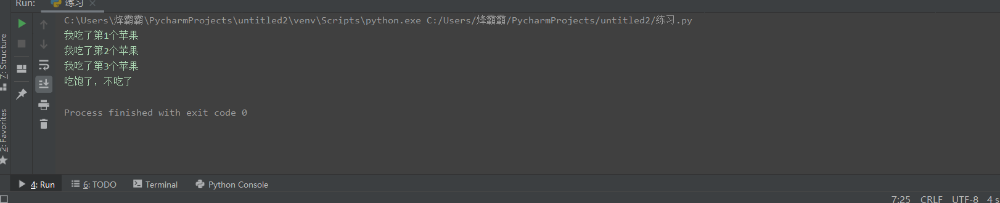
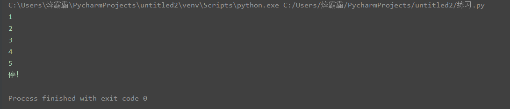
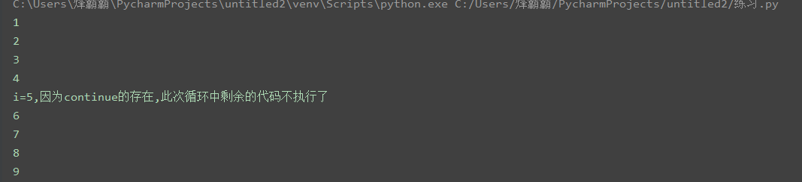
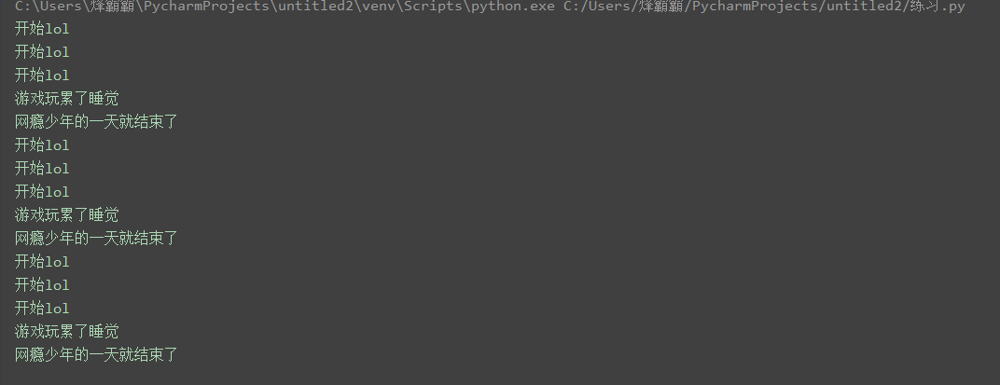
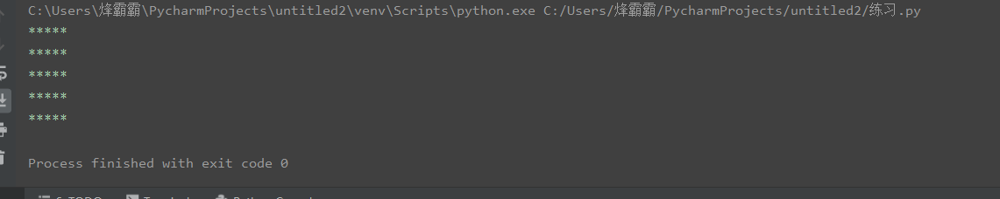
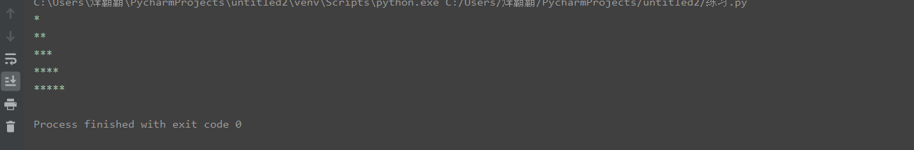
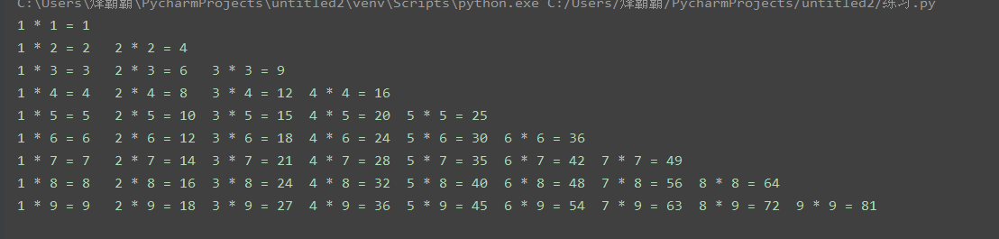
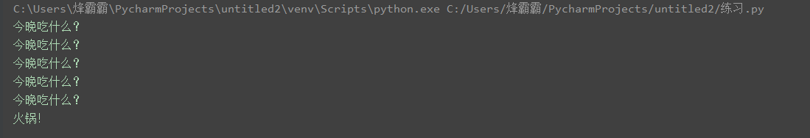
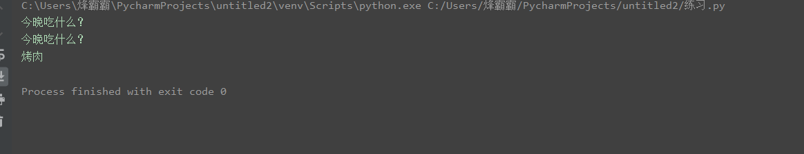
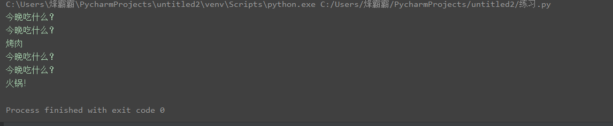

# 第07节：while循环

### 本节目标

- 了解循环
- while语法
- while应用
- break和continue
- while循环嵌套
- while循环中else的用法

### 一、了解循环
循环的作用：让代码更高效的重复执行  
在python中循环分为while循环和for循环两类，他们最终实现的效果是相同的。
### 二、while的语法
1、语法  
``` python
while 条件:
    条件成立重复执行的代码1
    条件成立重复执行的代码1
    ...
    处理条件（计数器+1）  
```
2、快速体验   
``` python
# 条件：重复执行5次"你好sao啊"
i = 0
while i<5: # 从0开始i<5最多循环5次
    print("你好sao啊") # 输出的是这行文字
    # 计数器
    i+=1 
```
### 三、循环的应用
1、计算1到100累计相加的和  
``` python
# 1、准备做加法运算的数据 增量为1
# 2、新建一个用来保存运算结果的变量
# 3、循环做加法运算
# 4、打印结果

# 准备数据
i=1
# 准备保存运算结果的变量
y=0
# 循环
while i<=100:
    y+=i # 第一次循环时i为1y为0就是0+1，下面i再自增就是y+2以此类推100封顶
    i+=1
    # print(y) # 在这里打印就变成了循环一次就输出一次
print(y) # 5050    一定要在这里打印结果
```
2、计算1到100的偶数加和  
``` python
# 1、准备做加法运算的数据
# 2、新建一个用来保存运算结果的变量
# 3、循环加法运算——如果是偶数才进行加法运算——和2取余数为0
# 4、打印结果

i = 1
y=0
while i<=100:
    # 条件语句if
    if i % 2==0:
        # 加法运算
        y+=i 
    i+=1
print(y) # 2550
```
### 四、break
1、break简介  
break和continue是循环中满足一定条件退出循环的两种不同的方式  
break的作用：跳出for和while的循环（当某些条件成立就会终止这个循环）
2、break实例  
``` python
# 实例1
i = 1
while i<=5:
    if i>3:
        print("吃饱了，不吃了")
        break
    print(f"我吃了第{i}个苹果")
    i+=1

# 实例2
a = 1
while a<=10:
    # 条件：当a>5时，输出’停‘！
    if a>5:
        print("停！")
        break
    print(a)
    a+=1
```
打印结果：   
实例1     
实例2    

### 五、continue
1、continue简介  
break和continue是循环中满足一定条件退出循环的两种不同的方式  
continue作用：跳出for和while的循环 （可以用于提前结束本轮循环,当执行到continue语句后,程序将跳到判定循环是否向下执行的条件处,进行下一轮循环是否执行的判定与后续代码的执行）  
2、continue实例  
``` python
i = 1
while i < 10:
    if i == 5:
        # 如果要使用coninue就一定要在他前面加一个计数器，否则就会陷入死循环
        i += 1
        print("i=5,因为continue的存在,此次循环中剩余的代码不执行了")
        continue
    print(i)
    i += 1
```
打印结果：  
 
### 六、while循环嵌套
#### 1、while循环嵌套的概念  
while循环中重复执行的代码又包含了另一个while循环  
#### 2、语法  
``` python
while 条件一:
    条件一成立执行的代码
    while 条件二:
        条件二成立执行的代码
```
#### 3、简单实例  
``` python
# 需求分析，打印出一个网瘾少年一天的生活内容，并且重复3天
j=0
while j<3:
    i = 0
    while i<3:
        print("开始lol")
        i+=1
    print("游戏玩累了睡觉")
    print("网瘾少年的一天就结束了")
    j+=1
```
打印结果：  
 
#### 4、打印星号（正方形）  
``` python
# 需求分析，打印出一个正方行的星号，用循环嵌套写出来

j=0
while j<5:
    # 一行星星的打印
    i=0
    while i<5:
        # 一行星星内不能换行要取消print的自动换行功能
        print("*",end="")
        i+=1
    # 每行结束要换行，这里借助一个空的print，利用print默认结束符换行
    print("")
    j+=1

# 代码执行流程：当j<5时执行j里面的内容，j里面的内容是i循环执行5次i的内容又回到了j，j<5所以j要执行5次，j每循环一次他里面的代码i就要循环5次
```
打印结果：  
 
#### 5、打印星号（三角形）  
``` python
# 需求分析，打印出一个三角形的星号
# j表示行数
j=0
while j<5:
    # 一行星星的打印
    i=0
    # i表示每行里面星星的个数，这个数字要和行数相等所以i要和j联动
    while i<=j:
        print("*",end="")
        i+=1
    print()
    j+=1

'''
代码分析：i为什么要小于等于j？
答：当j为1时j循环一次，由于i的值和j相等，所以i也只循环一次，下一次循环就变成了j为2，那同样i也为2依次类推
'''
```
打印结果：  
 
#### 6、之九九乘法表  
``` python
# 需求分析：制作一个九九乘法表

j = 1
while j <= 9:
    # 一行的表达式开始
    i = 1
    while i <= j:
        print(f'{i} * {j} = {i*j}', end='\t') # \t是制表符等同于4个空格
        i += 1
    # 一行的表达式结束
    print()
    j += 1

'''
代码分析：我们还是先创建一个变量为j的while循环让他循环9次，再在j里面再创建一个变量为i的循环，再让他
循环的次数和j相等，所i里面的代码的i <= j
'''
```
打印结果：  
 
### 七、while中else的用法
循环可以和else配合使用，else下方缩进的代码指的是当循环正常结束之后要执行的代码。   
#### 1、语法
``` python
while 条件:
    条件成立重复执行的代码
else:
    循环正常结束之后要执行的代码
```
#### 2、实例
``` python
# 需求，输出5遍今晚吃什么？，else后的代码为：火锅！

i = 1
while i<=5:
    print('今晚吃什么？')
    i +=1
else:
    print('火锅！')
```
打印结果：  
 
#### 3、while退出循环
1、break方法：  
``` python
# 输出2遍今晚吃什么？再执行if里的‘烤肉’
i = 1
while i<=5:
    if i==3:
        print('烤肉')
        break
    i+=1
    print('今晚吃什么？')
else:
    print('火锅！')
```
打印结果：  
  

> 所谓else指的是循环正常结束之后要执行的代码，即如果是break终止循环的情况，else下方缩进的代码将不执行。  

2、continue方法
``` python
# 输出2遍今晚吃什么？再执行if里面的烤肉

i = 1
while i<=5:
    if i==3:
        print('烤肉')
        i+=1
        continue
    i+=1
    print('今晚吃什么？')
else:
    print('火锅！')
```
打印结果：  
  
> 因为continue是退出当前一次循环，继续下一次循环，所以该循环在continue控制下是可以正常结束的，当循环结束后，则执行了else缩进的代码。
### 八、总结

- 循环的作用：控制代码重复执行
- while语法

``` python
while 条件:
    条件成立重复执行的代码1
    条件成立重复执行的代码2
    ......
```

- while循环嵌套语法

```python
while 条件1:
    条件1成立执行的代码
    ......
    while 条件2:
        条件2成立执行的代码
        ......
```

- while里else的语法

``` python
while 条件:
    条件成立重复执行的代码
else:
    循环正常结束之后要执行的代码
```


