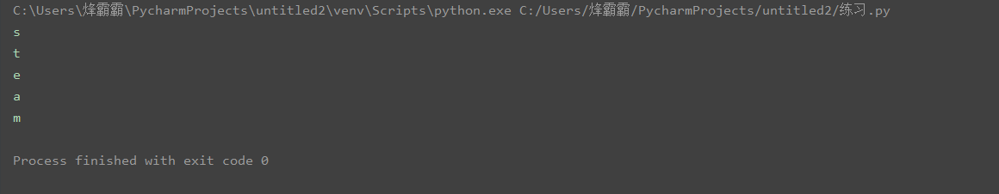
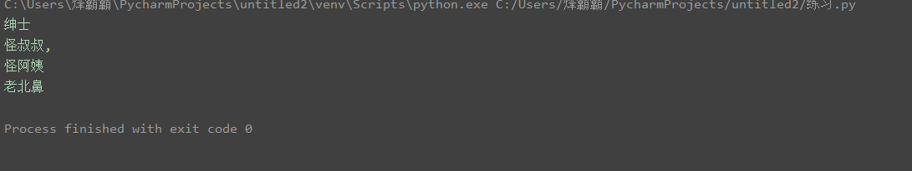
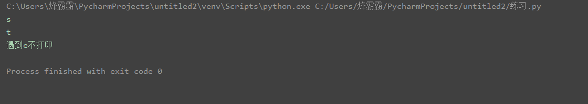
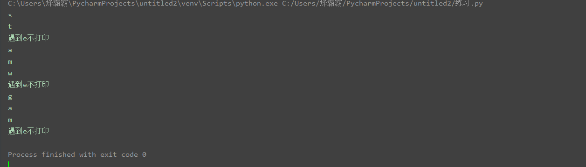
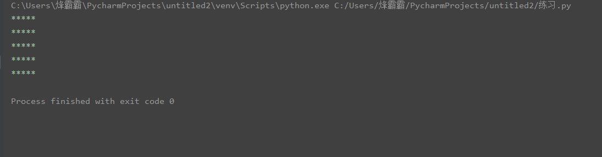
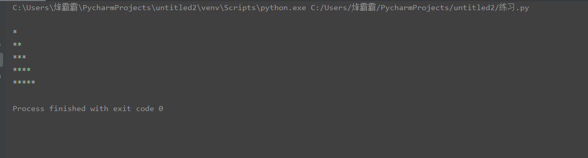
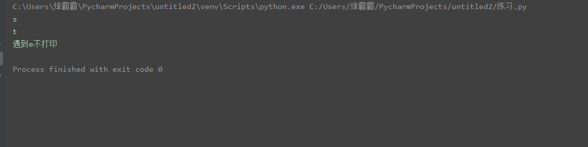
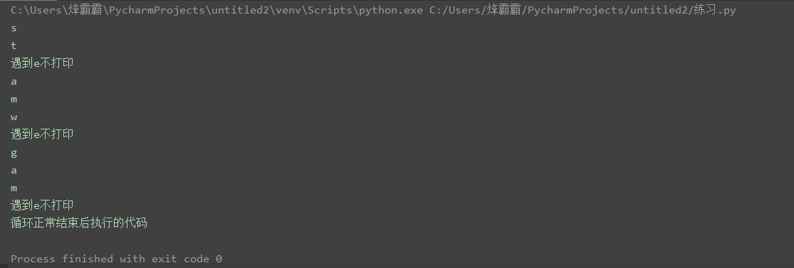

# 第08节：for循环

### 本节目标
- for的作用
- for循环语法
- for循环实例
- 在for循环中使用break和continue
- for循环嵌套
- 在for循环中使用else

### 一、for循环的作用
for循环可以遍历任何序列的项目，如一个列表或者一个字符串。  
### 二、for循环语法
``` python
for 临时变量 in 序列:
    重复执行的代码1
    重复执行的代码2
    ......
```
### 三、实例
1、for循环字符串  
``` python
num = 'steam'
for i in num: # 这里面的i就临是时变量（临时变量是由程序员自己命名的）
    print(i)
```
2、for循环数组  
``` python
python = ['绅士','怪叔叔,','怪阿姨','老北鼻']
for i in python:
    print(i)
```
打印结果：  
for循环字符串   

for循环数组   

### 四、在for循环中使用break和continue
for循环使用break和continue和while循环的原理一样，所以我就不进行详细讲解了    

#### 1、break  
``` python
# 需求：遇到e不打印

num = 'steamwegame'
for i in num:
    if i == 'e':
        print("遇到e不打印")
        break
    print(i)
```
打印结果：  

#### 2、continue  
``` python
# 需求遇到e不打印

num = 'steamwegame'
for i in num:
    if i == 'e':
        print("遇到e不打印")
        continue
    print(i)
```
打印结果：  

### 五、for循环嵌套
#### 1、range()函数
在学习嵌套之前我们先学习一下range函数。   
如果你需要遍历数字序列，可以使用内置range()函数。它会生成数列，例如:    

实例：   
``` python
# 1、range()函数的用法
for i in range(5):
    print(i)

# 2、你也可以指定这个数字的区间

for i in range(5,10):
    print(i)

# 3、也可以使range以指定数字开始并指定不同的步长

for i in range(1,5,2):
    print(i)
```
#### 2、for循环嵌套的概念
for循环嵌套的概念就是一个大的for循环里面又包涵了一个小的for循环。
#### 3、实例 
``` python
# 使用for循环打印出一个正方形

for i in range(5):
    for j in  range(5):
        print('*',end='')
    print() # 加一个print用来换行用


# 打印三角形
# 打印三角形只需要把j里面range函数的值换成i就可以了

for i in range(6):
    for j in  range(i):
        print('*',end='')
    print() 

# 打印九九乘法表
for x in range(1,10):
	for y in range(1,x+1):  # 循环第一次时i的值为1，x+1结果就为2，现在range的值就变成了(1,2)以此类推，循环一次加一个数值
		print(y,"*",x,"=",x*y,end="\t")
	print()
```
打印结果：   
正方形   
  
三角形   
  
九九乘法表   
  
### 六、for循环中使用else
#### 1、语法
``` python
for 临时变量 in 序列:
    重复执行的代码
    ...
else:
    循环正常结束之后要执行的代码
```

> else指的是循环正常结束之后要执行的代码，即如果是break终止循环的情况，else下方缩进的代码将不执行。
#### 2、实例
``` python
num1 = 'stram'
for i in num1:
    print(i)
else:
    print('循环正常结束后在执行的代码')
```
#### 3、break
``` python
sky = 'steamwegame'
for i in sky:
    if i == 'e':
        print("遇到e不打印")
        break
    print(i)
else:
    print('循环正常结束后执行的代码')

# 有break终止循环的情况下，else中的代码不会执行
```
打印结果：  
  
#### 4、continue
``` python
sky = 'steamwegame'
for i in sky:
    if i == 'e':
        print("遇到e不打印")
        continue
    print(i)
else:
    print('循环正常结束后执行的代码')

# 因为continue是退出当前一次循环，继续下一次循环，所以该循环在continue控制下是可以正常结束的，当循环结束后，则执行了else缩进的代码。
```
打印结果：   
  
### 七、总结

- for循环的作用：可以遍历任何序列的项目，如一个列表或者一个字符串。  

- for循环语法
``` python
for 临时变量 in 序列:
    重复执行的代码1
    重复执行的代码2
    ......
```

- for循环嵌套
- for循环中使用else


