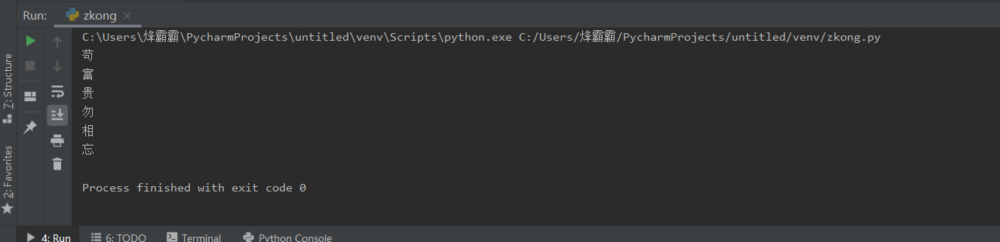

# 第02节：列表

### 本节目标
- 列表的格式
- 列表的常用操作
- 列表的循环操作
- 列表的嵌套
### 一、列表的简介
列表是最常用的Python数据类型，它可以作为一个方括号内的逗号分隔值出现。  
列表可以一次性存储多个数据，且可以为不同数据类型。  
python3中的常用序列是列表和元组 
### 二、创建列表
列表的创建很简单只需要把用逗号隔开的数据再用方括号括起来就可以。  
``` python
list1= ['天', '地', '玄', '黄']
print(list1) # 输出结果为['天', '地', '玄', '黄']

list2 = [1,2,3,4,5,6]
print(list2) # 输出结果为[1,2,3,4,5,6]

list3 = ["风","林","山",1,2,3]
print(list3) # 输出结果为 ["风","林","山",1,2,3]
```
### 三、查看列表
#### 1、列表里的索引和切片
实例：   
``` python
# 索引
list = ["天", "地", "玄", "黄"]

print(list[0]) # 输出结果为 天
print(list[1]) # 输出结果为 地
print(list[2]) # 输出结果为 玄
print(list[3]) # 输出结果为 黄

# 切片
list = ["风","林","山","火"]
print(list[1:4]) # 输出结果为["林","山","火"]
print(list[2:3]) # 输出结果为["山"]
```
#### 2、列表里的查找函数
- index()：返回指定数据所在位置的索引。
语法：  
``` python
列表序列.index(数据)
```
实例：  
``` python
list = ['仙','神','魔','鬼']

print(list.index("仙")) # 输出结果为0
# 如果查找的数据不存就会报错
```
- count()：统计指定数据在当前列表中出现的次数。
实例：  
``` python
list = ['仙','神','魔','鬼']

print(list.count("仙")) # 输出结果为1
print(list.count("鬼")) # 输出结果为2
```

- len()：访问列表长度，即列表中数据的个数。
实例：  
``` python
list = ['仙','神','魔','鬼']

print(len(list)) #输出结果为4
```
#### 3、判断列表里的数据是否存在
- in：判断指定数据在某个列表序列，如果在返回True，否则返回False
实例：  
``` python
list = ['仙','神','魔','鬼']

print("仙" in list) # 输出结果为True
print("人" in list) # 输出结果为False
```
- not in：判断指定数据不在某个列表序列，如果不在返回True，否则返回False
实例:  
``` python
list = ['仙','神','魔','鬼']

print("仙" not in list) # 输出结果为False
print("人" not in list) # 输出结果为True
```
#### 4、判断的案例
需求：查找用户输入的名字是否已经存在。  
实例：  
``` python
name_list = ['王林', '苏铭', '孟浩']
name = input('请输入您要搜索的名字：')

if name in name_list:   # 判断name里面是否有name_list的值
    print(f"您输入的名字是{name} 已存在")
else:
    print(f"您输入的名字是{name}")
```
### 四、增加列表中的数据
1、append()：列表结尾追加数据。    
语法：  
``` pyhton
列表名.append(插入的数据)
```
实例：  
``` python
list = ['王林', '苏铭', '孟浩']
list.append("白小纯")
print(list) # 结果['王林', '苏铭', '孟浩',"白小纯"]

# 也可以添加列表，不存格式要变一下
list = ['王林', '苏铭', '孟浩']
list.append(["仙逆","求魔","我欲封天"])
print(list) # 结果['王林', '苏铭', '孟浩', ['仙逆', '求魔', '我欲封天']]
```

 2、extend()：列表结尾追加数据，如果数据是一个序列，则将这个序列的数据逐一添加到列表。  
 语法：  
 ``` python
列表序列.extend(数据)
 ```
 实例：  
 ``` python
# 添加单个数据
list = ['王林', '苏铭', '孟浩']
list.extend("steam")
print(list) # 输出结果为['王林', '苏铭', '孟浩', 's', 't', 'e', 'a', 'm']

# 添加多个数据
list = ['王林', '苏铭', '孟浩']
list.extend(["A","B"])
print(list) # 输出结果为['王林', '苏铭', '孟浩', 'A', 'B']
 ```
3、insert()：指定位置新增数据。
语法：  
``` python
列表序列.insert(位置索引, 数据)
```
实例：  
``` python
list = ['临','斗','者','皆','阵','列',"在","前"]
list.insert(1,"兵") # 在索引为1的位置加上数据“兵”
print(list) # 输出1结果为['临', '兵', '斗', '者', '皆', '阵', '列', '在', '前']
```
### 五、删除列表中的数据
1、del   
可以使用del来删除列表中指定的数据  
实例：  
``` python
list = [1,2,3,4,5
del list[0]
print(list) #输出结果为[2, 3, 4, 5]
```
2、pop()  
删除指定下标的数据如果不指定数据则会默认输出最后一个，并返回该数据。 
语法：  
``` python
列表序列.pop(索引)
``` 
实例：  
``` python
list1 = [1,2,3,4,5]
list2 = list1.pop() 
print(list2) # 输出结果为5
print(list1) # 输出结果为[1, 2, 3, 4]
```
3、remove()  
remove()的效果和del差不多，只要往括里放入指定的数据就可以删除该数据  
实例：  
``` python
list = ['苟','富','贵','勿','相','忘']
list.remove("勿")
print(list) # 输出结果为['苟', '富', '贵', '相', '忘']
```
4、clear()  
clear()的作用是清空列表   
实例：  
``` python
list = ['苟','富','贵','勿','相','忘']
list.clear()
print(list) # 输出结果为一个空的列表“[]”
``` 
### 六、修改列表中的数据
列表中的数据是可以进行修改的  

1、修改指定索引下的数据  
实例：  
``` python
list = ['仙','神','魔','鬼']
list[1] = "人" # 把索引为1的“魔”改为人
print(list) # 输出结果为 ['仙', '人', '魔', '鬼']
```
2、逆置：reverse()   
逆置的意思就把可以把数据倒过来排序  
实例：  
``` python
list = ['1','2','3','4','5','6',"7","8"]
list.reverse()
print(list) # 输出结果为['8', '7', '6', '5', '4', '3', '2', '1']
```
3、排序：sort()
语法：  
``` python
列表序列.sort( key=None, reverse=False)
# key=None是降序  reverse=False是升序
# sort()函数默认是升序，所以括号里的内容可以省略不写
```
实例：  
``` python
list = ['5','4','1','8','7','9',"3"]
list.sort()
print(list) #输出结果为['1', '3', '4', '5', '7', '8', '9']
```
4、复制：copy()
实例：  
``` python
list1 = ["风","火","山","林"]
list2 =list1.copy()
print(list2)
```
复制和使=号赋值的区别
``` python
a = [1,2,3,4,5]
b = a
c = a.copy()

del a[0]
print(a) # 输出结果为[2, 3, 4, 5]
print(b) # 输出结果为[2, 3, 4, 5]
print(c) # 输出结果为[1, 2, 3, 4, 5]

del b[1]
print(a) # 输出结果为[2, 4, 5]
print(b) # 输出结果为[2, 4, 5]
print(c) # 输出结果为[1, 2, 3, 4, 5]

```
可以看出，使用=直接赋值，是引用赋值，更改一个，另一个同样会变, 例子中的a,b改变两次都影响到了对方
copy() 则顾名思义，直接复制一个副本，原值和新复制的变量互不影响 「a,c」
### 七、列表的循环遍历
需求：依次打印列表中的各个数据。  
#### 1、while循环
实例：  
``` python
list = ['苟','富','贵','勿','相','忘']
i=0  # i要和第一个索引相等所以是零
while i <len(list):   # 这里面的len代表列的长度
    print(list[i])   # 这里面的i代表随着程序推进不断变换的一个数据
    i+=1
```
  
#### 2、for循环
实例：  
``` python
list = ['苟','富','贵','勿','相','忘']
for i in list:
    print(i)
# 在遍历序列时一般都会用for循环来遍历，因为他的代码和while比起来要少很多
``` 
  
### 八、列表的截取与拼接
#### 截取：  
列表：x = ["rng","edg","ig"]  

|python表达式 |结果 |描述 |    
|-------|-------|-------|    
|x[2]|ig|读取第三个元素|  
|x{-2}|edg|反向读取；读取倒数第二个元素|  
|x[1:]|('edg', 'ig')|截取元素，从第二个开始后的所有元素。|

#### 拼接
列表也支持拼接操作  
实例：  
``` python
list = [1,2,3,4,5,6]
list +=[7,8,9,10]
print(list) # 输出结果为[1, 2, 3, 4, 5, 6, 7, 8, 9, 10]
```
### 九、列表嵌套
所谓列表嵌套指的就是一个列表里面包含了其他的子列表。   
实例：  
``` python
# 问： 如何查找到李四
list = [["小红","小明","小绿"],["老白","老金","老王"],["张三","李四","王五"]]
# 找到李四所在的列表
print(list[2])  # 这一步可以省略不写
# 从李四所在的列表里，再按照下标找到李四
print(list[2][1]) # 输出结果为李四
```
### 十、总结
- 本节我们学会了如何使用列表  

- 本节重点
  - 列表的常用操作方法
  - 列表循环
  - 列表嵌套
### 十一、作业
- 综合应用 随机分配办公室
``` python
# 需求分析：8位老师 3间办公室 要求把老师随机分配到3间办公室
"""
1、准备数据
	8位老师的数据
	3间办公室的数据 --列表嵌套
2、分配老师到办公室
	随机分配
	就是把老师的名字写入到办公室列表  --办公室列表追加老师名字数据
3、验证是否分配成功
	打印办公室详细信息：每个办公室的人数和对应的老师名字
"""
import random
# 1、准备数据
teacher = ['赵老师','钱老师','孙老师','周老师','吴老师','郑老师','王老师','佛老师']
classroom = [[],[],[]]

# 2、随机分配老师办公室
for name in teacher: # 遍历teacher列表里的数据
	num = random.randint(0,2) # 新建一个随机数的变量（因为只有三间教室，所以randint的值0，2）
	classroom[num].append(name)  # 在classroom列表中插入name（也就是teacher列表里的数据）
# print(classroom) # 现在输出的结果就已经是随机的了

# 3、验证是否分配成功
for i in  classroom:  # 遍历classromm这个列表(这里的i是一个临时变量)
	print(f"办公室人数为{len(i)},老师分别是:") # 打印办公室的人数
	for name in i: # 遍历子列表
		print(name)

```


