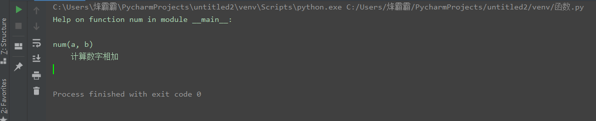
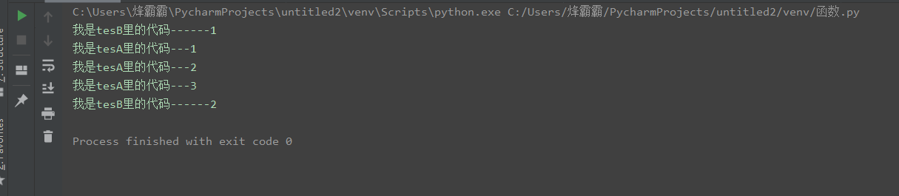

# 第01节：函数的定义、调用

### 本节目标
- 函数的作用
- 函数的使用步骤
- 函数的参数作用
- 函数的返回值作用
- 函数的说明文档
- 函数嵌套

### 一、函数的作用
函数就是将一段具有独立功能的代码块整合到一个整体并命名，在需要的位置调用这个被命名的函数块就可以完成对应的功能。  

> 函数在日后开放项目的过程中可以更高效的实现代码的重复利用  
### 二、函数的使用步骤
#### 1、定义函数
你可以自己定义一个函数，格式如下：  
``` python
def 函数名(参数):
    代码1
    代码2
    ......

# def是定义函数的关键字
```
#### 2、调用函数
调用函数很简单，只需要写下上面定义的函数名就可以。  

``` python
函数名(参数)
```
1. 参数可以省略不写，根据具体需求再决定加不加参数
2. 在Python中，函数必须先定义后使用（如果先定义则会报错）。
#### 3、体验函数
需求：使用函数输出一个列表   
实例：  
``` python
# 定义一个列表函数
def list():
    list1 = [1,2,3,4,5]
    print(list1)

# 调用这个函数
list() # 输出结果为[1, 2, 3, 4, 5]
```
#### 4、函数的执行流程
``` python
# 解释下面代码的执行流程
def log():
    print('登录')

log()

'''
第一步：def log():
第二步：log()
第三步：又回到def log():
第四步：print('登录')
第五步: 最后回到调用函数这里log()
'''
```
### 三、函数的参数

需求:使用函数计算数字的和  
``` python
def num():
    result = 1+2
    print(result)

num() # 输出结果：3
```
思考：上述函数只能完成1+2的运算，如果想让这个函数变的更灵活，可以计算任何数字的和要怎么做？   
分析：用户要在调用函数的时候指定具体数字，那么在定义函数的时候就需要接收用户指定的数字。函数调用时候指定的数字和定义函数时候接收的数字即是函数的参数。  
实例：  
``` python
# 定义函数时同时定义了接收用户数据的参数a和b， a和b被称为形参（没有具体数值的参数就是形参）
def num(a,b):
    result = a+b
    print(result)

# 调用函数时传入了真实的数据10 和 20，真实数据为被称为实参
num(22,33) # 输出结果：55
```
### 四、函数的返回值
#### 1、体验返回值
返回值的概念：例如我们去超市购物，买了一瓶水，给钱之后，售货员会返回给我们水这个商品，在函数中“烟”就代表返回值。     
``` python
def buy():
    return "烟"

# 因为上面没有写print所以直接书写函数是不会打印的，所以需要新建一个变量来保存函数的返回值
good = buy()
print(good)

'''
return作用：
1、负责函数的返回值
2、退出当前函数：return下面的代码不执行（函数体里面的）
'''
```
#### 2、返回值的应用
需求：使用return制作一个能够计算任意两个数字相加的计算器  
实例：  
``` python
def num(a,b):
    return a+b

result = num(50,30) # 接受返回值
print(result) # 输出结果为：80
```
### 五、函数说明文档
#### 1、说明文档的作用  
说明文档能够让你知道你写的这行函数是干什么的，不会出现因为写的函数太多忘记他的作用的事情。   
#### 2、说明文档的语法：  
``` python
def 函数名(参数):
    """ 说明文档的位置 """
    代码
    ......
```
> 函数的说明文档也叫函数的文档说明。
#### 3、查看函数的说明文档：  
``` python
help(函数名)
```
#### 4、实例
``` python
def num(a,b):
    '''''计算数字相加'''
    return a+b

result = num(50,30)
help(num)
```

  
### 六、函数的嵌套调用
函数嵌套调用指的就是一个函数里面又调用了另一个函数  

实例：  
``` python
def tesA():
    print("我是tesA里的代码---1")
    print("我是tesA里的代码---2")
    print("我是tesA里的代码---3")

def tesB():
    print("我是tesB里的代码------1")
    tesA()
    print("我是tesB里的代码------2")

tesB()
```
输出结果：  

  

执行流程：     
> 如果函数B中，调用了另外一个函数A，那么先把函数A中的任务都执行完毕之后才会回到上次 函数B执行的位置。  
### 七、总结

- 函数的作用：封装代码，更高效的实现代码的重复利用

- 函数的参数：定义函数时使用形参，调用函数时使用实参传入真实的数据，极大的提升了函数的灵活性

- 函数的返回值：调用函数后，返回计算的结果

- 函数的说明文档：可以让你快速的指定这函数的作用

- 函数的嵌套：就是一个函数里又包涵了另一函数
### 八、作业
1、用‘-’打印20次成为一个横线
2、打印多条横线
3、使用函数求3个数的和
4、使用函数求3个数的平均值

参考答案   
``` python
# 第一题代码
def print_line():
    print("-" * 20)
print_line()

# 第二题代码
def print_line():
    print("-" * 20)

def print_lines(num):
    i = 0
    while i < num:
        print_line()
        i += 1
print_lines(5)

# 第三题代码
def num(a,b,c):
    return a+b+c

num1 = num(22,33,44)
print(num1)

# 第四题代码
def num(a,b,c):
    result = a+b+c
    return result/3

num1 = num(40,40,20)
print(num1)
```


