# 第02节:Go语言环境安装

上节我们讲述了go语言的发展史和Go语言的是做什么的，那么这节我们将安装Go语言环境;

##### 那么为什么要安装Go呢

特别简单，如果不安装Go的话是无法运行Go项目的所以说这节我们来安装Go语言环境;

#### Go语言环境开发支持以下系统

* Linux
* Mac OS X（也称为 Darwin）
* Windows

### 一、Windows下载地址

Go官方下载地址: [Go语言环境安装下载地址](https://golang.org/dl/)
Go官方镜像下载地址: [Go语言官方镜像安装下载地址(推荐)](https://golang.google.cn/dl/)

各个系统对应的包名：
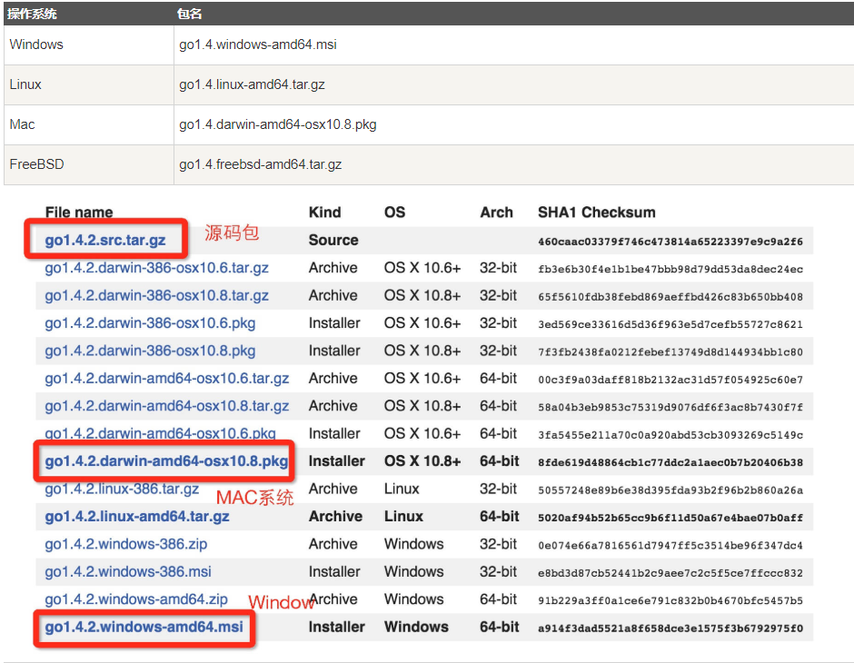

### 二、安装

此安装实例以 `64位Win10`系统安装 `Go1.11.5`可执行文件版本为例。
将上一步选好的安装包下载到本地。

双击下载好的软件

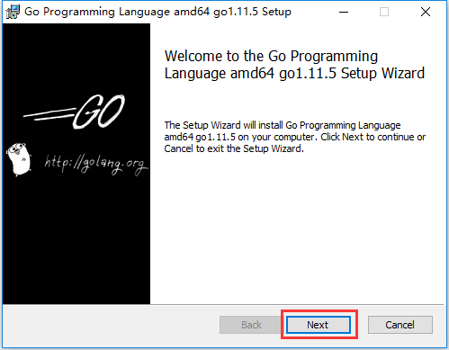

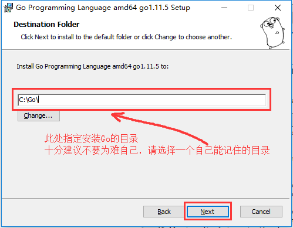

### 三、Linux安装

我们在版本选择页面选择并下载`go1.11.5.linux-amd64.tar.gz`文件：

> `wget https://dl.google.com/go/go1.11.5.linux-amd64.tar.gz`

将下载好的文件解压到/usr/local目录下：

> `mkdir -p /usr/local/go  # 创建目录`
`tar -C /usr/lcoal/go zxvf  go1.11.5.linux-amd64.tar.gz. # 解压`

如果提示没有权限，加上`sudo`以root用户的身份再运行。执行完就可以在`/usr/local/`下看到go目录了。

配置环境变量： Linux下有两个文件可以配置环境变量，其中`/etc/profile`是对所有用户生效的；`$HOME/.profile`是对当前用户生效的，根据自己的情况自行选择一个文件打开，添加如下两行代码，保存退出。

> `export GOROOT=/usr/local/go`
>  `export PATH=$PATH:$GOROOT/bin`

修改`/etc/profile`后要重启生效，修改`$HOME/.profile`后使用source命令加载`$HOME/.profile`文件即可生效。 检查：

>` go version`
>`go version go1.11.5 linux/amd64`

### 四、Mac下安装

下载可执行文件版，直接点击下一步安装即可，默认会将go安装到`/usr/local/go`目录下。

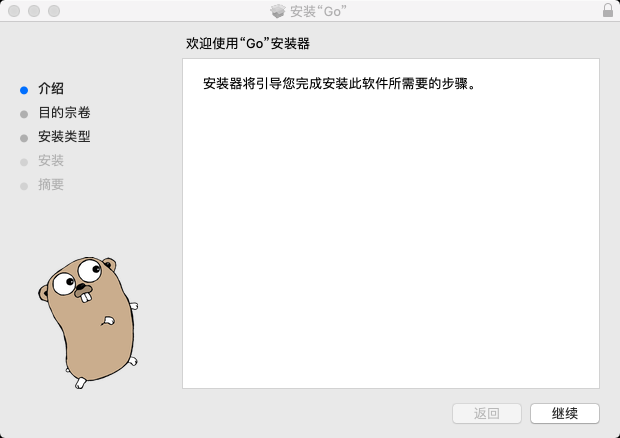

检查

上一步安装过程执行完毕后，可以打开终端窗口，输入`go version`命令，查看安装的Go版本。

### 五、配置Go语言环境变量

1. `GOPATH`是一个环境变量，用来表明你写的go项目的存放路径（工作目录）。
2. `GOPATH`路径最好只设置一个，所有的项目代码都放到`GOPATH`的`src`目录下。
3. 补充说明：Go1.11版本之后，开启`go mod`模式之后就不再强制需要配置GOPATH了。
4. windows平台按下面的步骤将D:\code\go添加到环境变量：

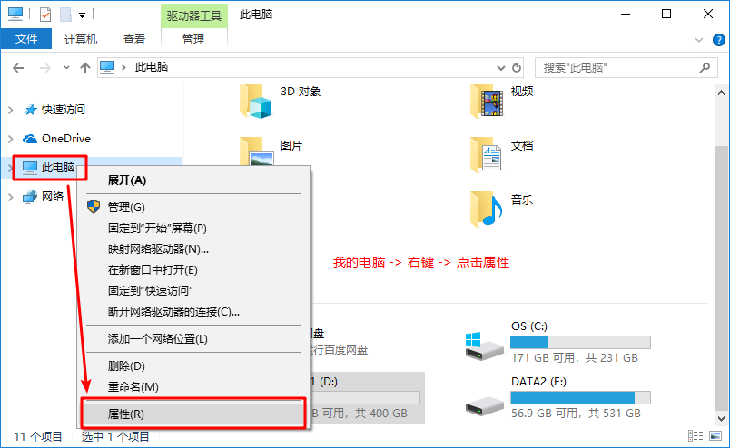

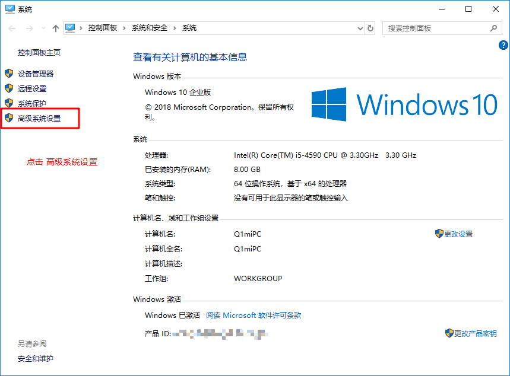

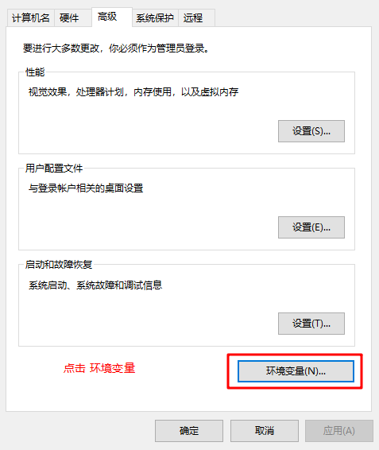

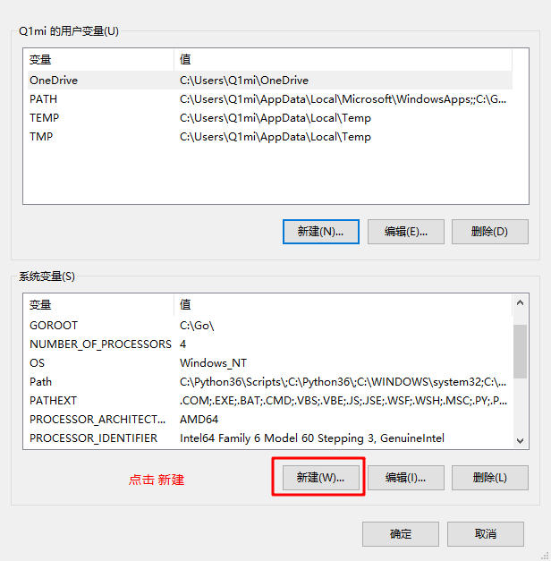

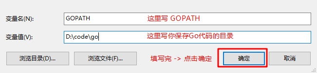

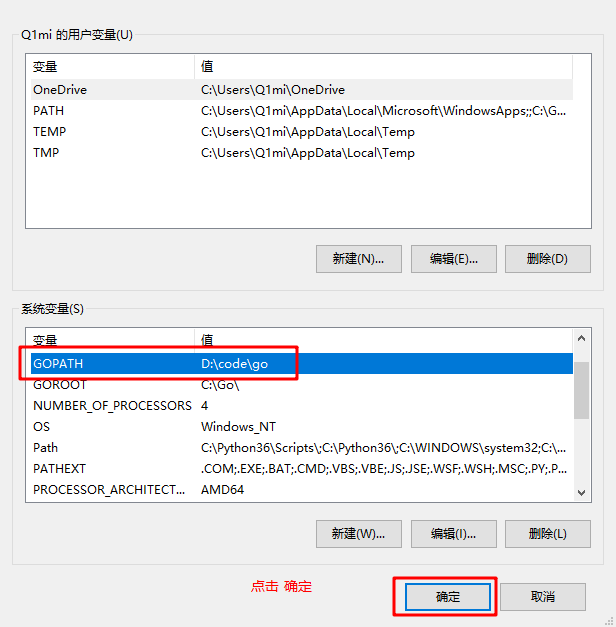

5. 使用cmd命令`go version`与`go env`测试安装包与环境变量是否安装成功。

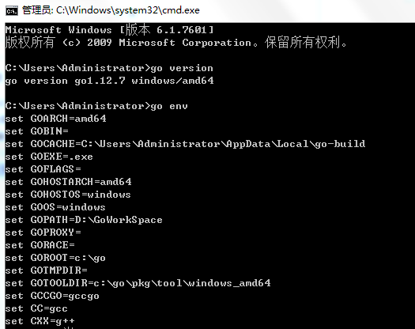

6. 如上图所示则表示安装成功！

### 六、总结

通过这节我们了解了各个系统安装Go的方法，还有配置Go的环境变量，如何用cmd来测试是否安装成功！

那么光安装Go是用什么来编写呢？其实用`记事本.txt`也可以，但是会影响开发的效率，所以下一节我们来讲解如何安装Go的开发软件！