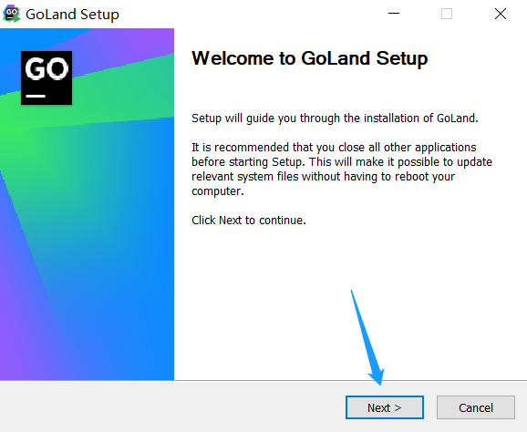
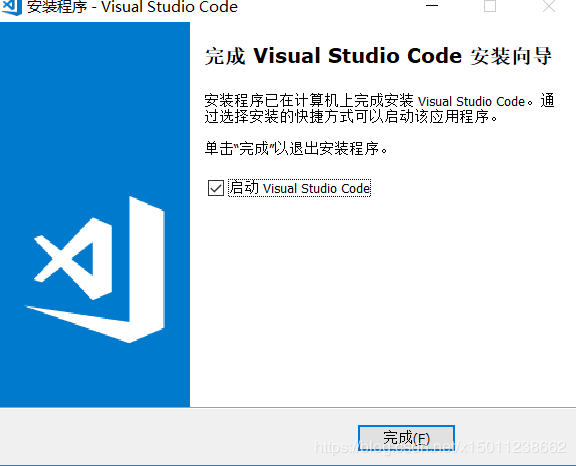
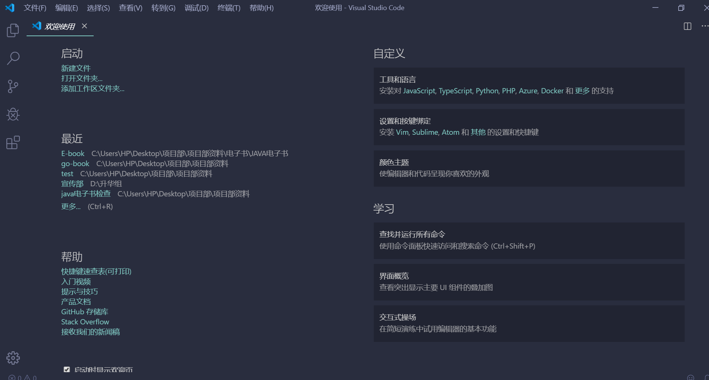
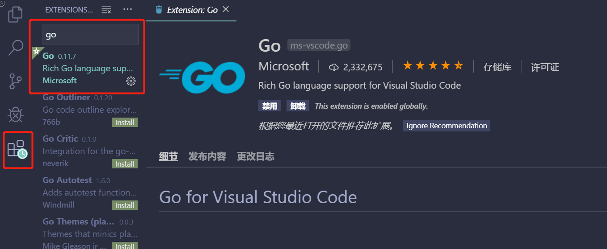

# 第03节：Go语言开发工具安装

上节我们安装了Go语言环境安装，那么这节我们将讲述go开发工具的下载及安装;

##### 那么好我们要用什么软件来开发Go呢？为什么要用这软件呢？

这里我们推荐使用 `vscode` 全称 `Visual Studio Code` 是微软开源的第一款 `免费` 现代轻量级代码编辑器支持几乎所有主流的开发语言的语法高亮、智能代码补全、自定义热键、括号匹配、代码片段、代码对比 Diff、GIT 等特性，支持插件扩展，支持 Win、Mac 以及 Linux平台。
虽然不如某些IDE功能强大，但是它添加Go扩展插件后已经足够胜任我们日常的Go开发。所以我们从 `vs code`开始;

### 一、vscode下载
 
1. [vscode下载地址](https://code.visualstudio.com/)
2. 选择vscode版本（根据自己的操作系统选择相应的版本）

3. 把vscode安装文件准备好：我使用的是64位的操作系统;

4. 傻瓜式安装，一直下一步，直接到完成

5. 环境变量（这步骤也是默认的，因为改编辑器是微软提供的，会自动配置path）

6. 安装成功

7. 安装结束后它会默认打开vscode 进入首界面如下图

8. 点击上图中的图标，进入插件搜索界面，然后器安装Go扩展插件，让它支持Go语言开发。

9.因为国内网的原因很可能会安装失败所以我们进行手动安装，这里直接下载我编译过的文件到你的`Go`文件夹下的`bin`目录里,然后重启vacode即可;

[go-tools网盘地址](https://pan.baidu.com/s/1dJy6EHvcwFRvyKXrx-c0UQ) 

提取码：9shc 

##### 安装vs code中文插件

点击左侧菜单栏最后一项管理扩展，在搜索框中输入`chinese` ，选中结果列表第一项，点击`install`安装。

安装完毕后右下角会提示`重启VS Code`，重启之后你的VS Code就显示中文啦！

### 二、总结

到现在为止我们已经安装好了Go语言的开发软件，也配置好了Go语言的环境，现在可以开始我们的Go语言之旅了，本章的最后一节将会讲述我们的第一个案例  ` Hello_word` !