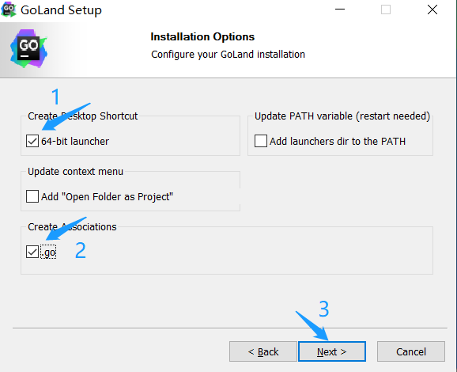
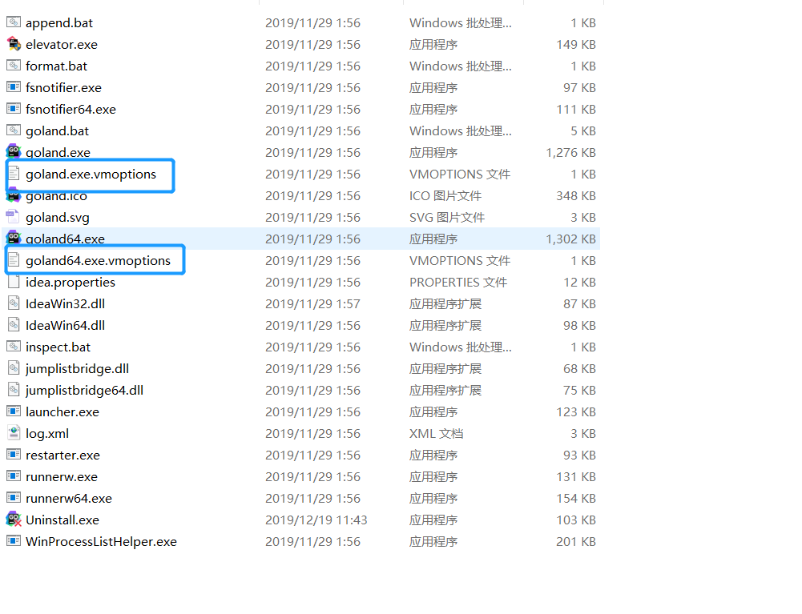
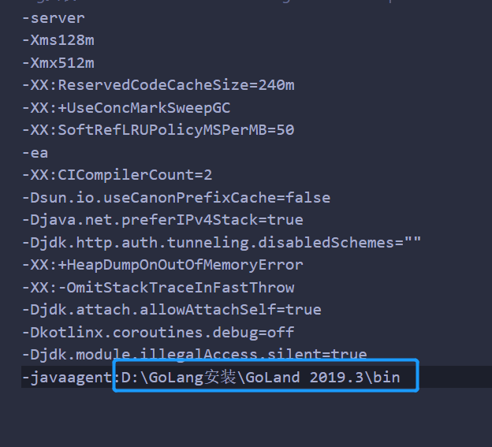
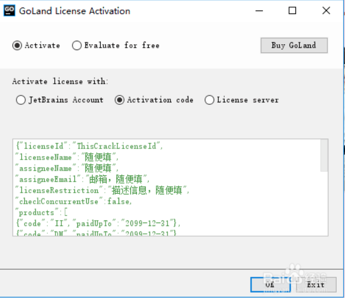

# 第03节：Go语言开发工具安装

上节我们安装了Go语言环境安装，那么这节我们将讲述go开发工具的下载及安装;

##### 那么好我们要用什么软件来开发Go呢？为什么要用这软件呢？

<<<<<<< HEAD
这里我们推荐使用Goland,jetBrains公司开发了一系列编程语言集成开发环境，这些开发环境都非常优秀，一旦使用上就会爱不离手，还没用过的小伙伴们赶紧下载吧。接下来给大家介绍一下JetBrains GoLand的安装方法。

### 一、JetBrains GoLand下载
 
1.  [JetBrains GoLand 下载地址](https://www.jetbrains.com/go/)

2. 进入JetBrains GoLand官网，下载Goland安装程序

3. 选择暗转地址之后，点击next，我的安装目录是: D:\GoLang安装

4. 点击next之后，还要创建桌面快捷方式，我选择的是64位并且关联了.go文件。

5. 后面一路install,next就好了，安装结束以后先不要启动，点击Finish结束安装过程。

### 二、破解

由于Goland是由国外开发的，所以下载正版是要收费的，如果能力的话可以在官网购买。

1. 先下载JetbrainsCrack-4.2-release-enc.jar补丁，把他放在你安装Goland软件下的bin目录下，我安装的位置是:D:\GoLang安装\GoLand 2019.3\bin

[JetbrainsCrack-4.2-release-enc.jar网盘下载地址](https://pan.baidu.com/s/1owILDdk6B6X82Zp2qCUhaw)

> 提取码：gg98

2. 进入到安装目录的bin目录下：D:\DevelopSoftware\JetBrains\GoLand 2018.2.3\bin。用Sublime Text（或其他任意文本编辑器）分别打开goland.exe.vmoptions和goland64.exe.vmoptions。

3.在最后添加一句：`-javaagent:D:\DevelopSoftware\JetBrains\GoLand 2018.2.3\lib\JetbrainsCrack-3.1-release-enc.jar。`添加的格式必须与下图一致（包括空行），其中蓝色下划线部分是你的补丁放置位置。

4. 重新启动Goland
    修改完成后保存关闭。双击桌面GoLand程序的快捷方式以启动程序，前几个选择默认设置，直到License选项，按下图设置。选择Activate->Activation code，填入下列代码：

{"licenseId":"ThisCrackLicenseId", "licenseeName":"go", "assigneeName":"go", "assigneeEmail":"go@163.com", "licenseRestriction":"go", "checkConcurrentUse":false, "products":[ {"code":"II","paidUpTo":"2099-12-31"}, {"code":"DM","paidUpTo":"2099-12-31"}, {"code":"AC","paidUpTo":"2099-12-31"}, {"code":"RS0","paidUpTo":"2099-12-31"}, {"code":"WS","paidUpTo":"2099-12-31"}, {"code":"DPN","paidUpTo":"2099-12-31"}, {"code":"RC","paidUpTo":"2099-12-31"}, {"code":"PS","paidUpTo":"2099-12-31"}, {"code":"DC","paidUpTo":"2099-12-31"}, {"code":"RM","paidUpTo":"2099-12-31"}, {"code":"CL","paidUpTo":"2099-12-31"}, {"code":"PC","paidUpTo":"2099-12-31"}, {"code":"DB","paidUpTo":"2099-12-31"}, {"code":"GO","paidUpTo":"2099-12-31"}, {"code":"RD","paidUpTo":"2099-12-31"} ], "hash":"2911276/0", "gracePeriodDays":7, "autoProlongated":false}

最后点击ok就算是安装完成了!
=======
这里我们推荐使用 `vscode` 全称 `Visual Studio Code` 是微软开源的第一款 `免费` 现代轻量级代码编辑器支持几乎所有主流的开发语言的语法高亮、智能代码补全、自定义热键、括号匹配、代码片段、代码对比 Diff、GIT 等特性，支持插件扩展，支持 Win、Mac 以及 Linux平台。
虽然不如某些IDE功能强大，但是它添加Go扩展插件后已经足够胜任我们日常的Go开发。所以我们从 `vs code`开始;

### 一、vscode下载
 
1.  [vscode下载地址](https://code.visualstudio.com/)
2. 选择vscode版本（根据自己的操作系统选择相应的版本）

3. 把vscode安装文件准备好：我使用的是64位的操作系统

4. 傻瓜式安装，一直下一步，直接到完成

5. 环境变量（这步骤也是默认的，因为改编辑器是微软提供的，会自动配置path）

6. 安装成功

7. 安装结束后它会默认打开vscode 进入首界面如下图

8. 点击上图中的图标，进入插件搜索界面，然后器安装Go扩展插件，让它支持Go语言开发。

##### 安装vs code中文插件

点击左侧菜单栏最后一项管理扩展，在搜索框中输入`chinese` ，选中结果列表第一项，点击`install`安装。

安装完毕后右下角会提示`重启VS Code`，重启之后你的VS Code就显示中文啦！

### 二、总结

到现在为止我们已经安装好了Go语言的开发软件，也配置好了Go语言的环境，现在可以开始我们的Go语言之旅了，本章的最后一节将会讲述我们的第一个案例  ` Hello_word` !
>>>>>>> liaofeng
