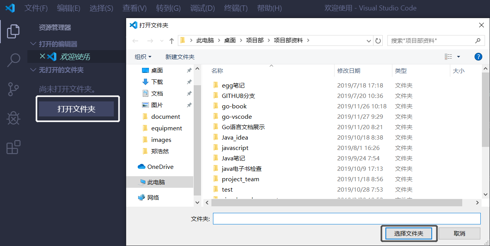
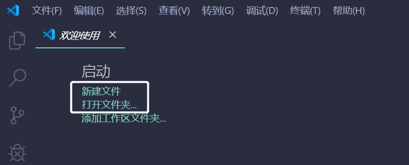
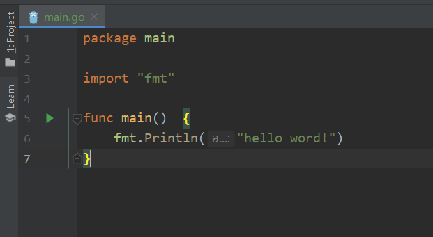
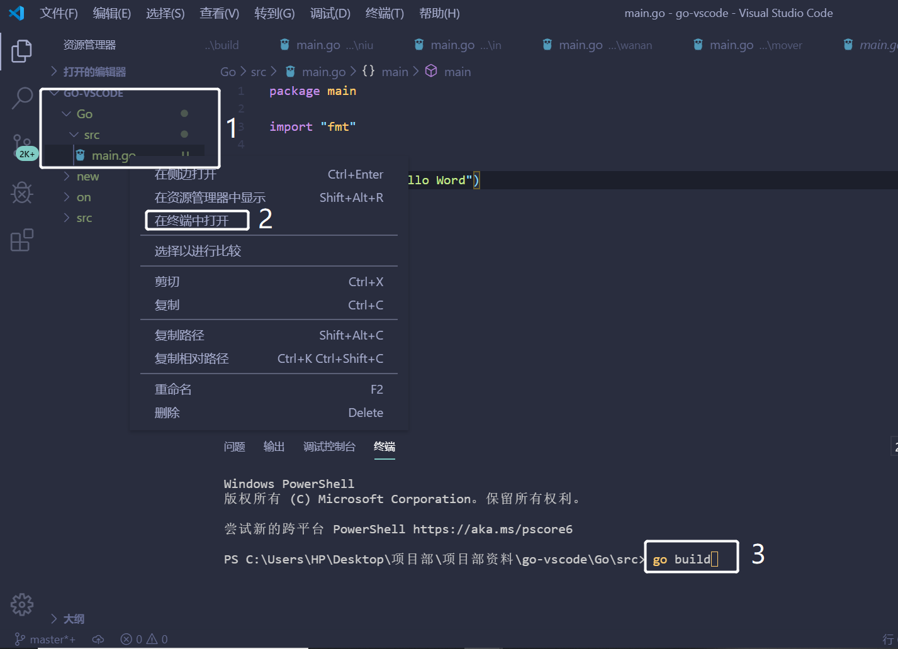
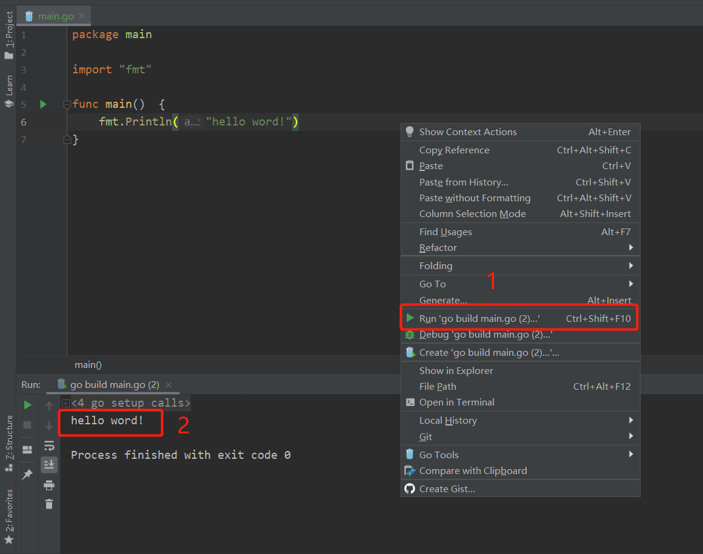

# 第04节：Hello_Word

前三节讲述了如何下载Go和安装Go开发工具那么接下来就来讲解我们第一个案例:Hello_Word;


#### Go 语言的基础组成有以下几个部分：

* 包声明
* 引入包
* 函数
* 变量
* 语句 & 表达式
* 注释

### 一、创建Hello Word及运行项目

1. 打开vscode软件 创建Hell Word项目



2. 选择文件夹之后点击新建文件！



3. 新建后给项目命名为`main`，将项目保存为go文件，点击保存即可


4.写入代码 

```go
package main  // 声明 main 包，表明当前是一个可执行程序

import "fmt"  // 导入内置 fmt 包

func main(){  // main函数，是程序执行的入口
	fmt.Println("Hello World!")  // 在终端打印 Hello World!
}
```



5. 右键文件夹 使用终端打开 输入输出命令`go build`进行编译 



6. 编译通过后开始执行命令` go run main.go `最后输出Hello Word！ 




### 二、代码讲解

[案例链接](https://github.com/Yan-Yan0129/Go-example/blob/master/%E7%AC%AC01%E7%AB%A0%EF%BC%9AGo%E8%AF%AD%E8%A8%80%E6%A6%82%E8%BF%B0/%E7%AC%AC04%E8%8A%82%EF%BC%9AHello_Word/demo01.md)

```go
    package main

    import "fmt"

    func main() {
        /* 这是我的第一个简单的程序 */
       fmt.Println("Hello, World!")
 }

```

* 一行代码 package main 定义了包名。你必须在源文件中非注释的第一行指明这个文件属于哪个包，如：package main。package main表示一个可独立执行的程序，每个 Go 应用程序都包含一个名为 main 的包。

* 下一行 import "fmt" 告诉 Go 编译器这个程序需要使用 fmt 包（的函数，或其他元素），fmt 包实现了格式化 IO（输入/输出）的函数。

* 下一行 func main() 是程序开始执行的函数。main 函数是每一个可执行程序所必须包含的，一般来说都是在启动后第一个执行的函数（如果有 init() 函数则会先执行该函数）。

* 下一行 /*...*/ 是注释，在程序执行时将被忽略。单行注释是最常见的注释形式，你可以在任何地方使用以 // 开头的单行注释。多行注释也叫块注释，均已以 /* 开头，并以 */ 结尾，且不可以嵌套使用，多行注释一般用于包的文档描述或注释成块的代码片段。

* 下一行 fmt.Println(...) 可以将字符串输出到控制台，并在最后自动增加换行字符 \n。
使用 fmt.Print("hello, world\n") 可以得到相同的结果。
Print 和 Println 这两个函数也支持使用变量，如：fmt.Println(arr)。如果没有特别指定，它们会以默认的打印格式将变量 arr 输出到控制台。

* 当标识符（包括常量、变量、类型、函数名、结构字段等等）以一个大写字母开头，如：Group1，那么使用这种形式的标识符的对象就可以被外部包的代码所使用（客户端程序需要先导入这个包），这被称为导出（像面向对象语言中的 public）；标识符如果以小写字母开头，则对包外是不可见的，但是他们在整个包的内部是可见并且可用的（像面向对象语言中的 protected ）。

### 三、总结

通过前面的几节到现在我们已经初步学习了Go语言，那么我们以后的章节还会对Go语言的各个知识点来进行讲解, 生命不止，继续gogogo!

### 四、作业

1. 通过本节的讲解练习我们的第一个案例: Hello word!