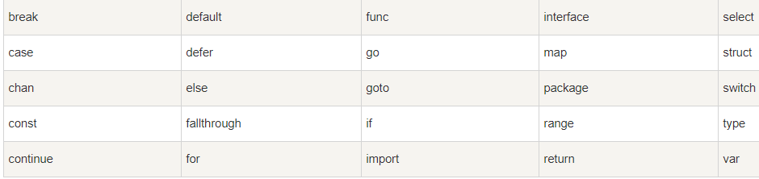
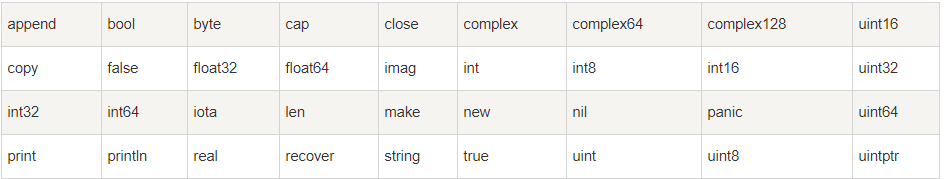

# 第01节：Go语言基础语法

##### 上一章节我们已经了解了 Go 语言的基本组成结构，本章节我们将正式学习 Go 语言的基础语法!

### 一、学习目标

本节我们的学习目标是学习Go语言的基础语法和格式，避免以后学习中入坑;

### 二、Go语言标记

Go 程序可以由多个标记组成，可以是关键字，标识符，常量，字符串，符号。如以下 GO 语句由 6 个标记组成：

```go
fmt.Println("Hello, World!")
```

6 个标记是(每行一个):

```go
 1. fmt
 2. .
 3. println
 4. (
 5. "Hello, World!"
 6. )
```

### 三、行分隔符

在 Go 程序中，一行代表一个语句结束。每个语句不需要像 C 家族中的其它语言一样以分号 ; 结尾，因为这些工作都将由 Go 编译器自动完成。
如果你打算将多个语句写在同一行，它们则必须使用 `;` 人为区分，但在实际开发中我们并不鼓励这种做法。
以下为两个语句：

```go
fmt.Println("Hello, World!")
fmt.Println("go语言开发手册")
```

### 四、注释

注释不会被编译，每一个包应该有相关注释。
单行注释是最常见的注释形式，你可以在任何地方使用以 // 开头的单行注释。多行注释也叫块注释，均已以 /* 开头，并以 */ 结尾。如：

```go
// 这是单行注释

/*
 你好！
 这是多行注释
 */
```

### 五、标识符

标识符用来命名变量、类型等程序实体。一个标识符实际上就是一个或是多个字母(A ~ Z和a ~ z)数字( 0 ~ 9)、下划线_组成的序列，但是第一个字符必须是字母或下划线而不能是数字。
以下是有效的标识符：

```go
mahesh   kumar   abc   move_name   a_123
myname50   _temp   j   a23b9   retVal
```

 以下是无效的标识符：

* 1ab（以数字开头）
* case（Go 语言的关键字）
* a+b（运算符是不允许的）

### 六、字符串连接

[案例链接](https://github.com/Yan-Yan0129/Go-example/blob/master/%E7%AC%AC02%E7%AB%A0%EF%BC%9AGo%E8%AF%AD%E8%A8%80%E5%9F%BA%E7%A1%80/%E7%AC%AC01%E8%8A%82%EF%BC%9AGo%E8%AF%AD%E8%A8%80%E5%9F%BA%E7%A1%80%E8%AF%AD%E6%B3%95/demo01.md)

Go 语言的字符串可以通过 `+` 实现:

```go
package main
import "fmt"
func main() {
    fmt.Println("Google" + "Runoob")
}
```

以上案例输出结果为：GoogleRunoob

### 七、关键字

下面列举了 Go 代码中会使用到的 25 个关键字或保留字：



除了以上介绍的这些关键字，Go 语言还有 36 个预定义标识符：



* 程序一般由关键字、常量、变量、运算符、类型和函数组成。

* 程序中可能会使用到这些分隔符：括号 `()`，中括号 `[]` 和大括号 `{}`。

* 程序中可能会使用到这些标点符号：`.`、`,`、`;`、`:` 和`…`

### 八、Go语言的空格

Go 语言中变量的声明必须使用空格隔开，如：

```go
var age int;
```

语句中适当使用空格能让程序更易阅读。
无空格：

```go
fruit=apples+oranges;
```

在变量与运算符间加入空格，程序看起来更加美观，如：

```go
fruit = apples + oranges; 
```

### 九、总结

通过本节学习我们对这些基础语法有了一个大致的一个认知，那么接下来我们来学习Go语言的数据类型;